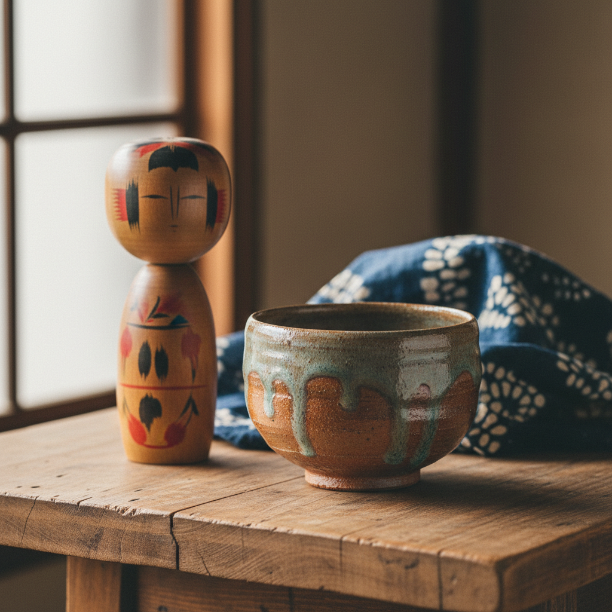

# Mingei 民藝 | 日本民间工艺

> **"无名工匠的美——柳宗悦在日用器物中发现了最高的艺术。"**

## 概述

民藝（Mingei / みんげい）是日本的民间工艺运动和美学哲学，由柳宗悦（Yanagi Sōetsu）于1926年提出。"民藝"是"民衆的工藝"的缩写，指由无名工匠为日常使用而制作的手工艺品。柳宗悦认为，真正的美不在于个人天才的艺术品，而在于普通人为日常生活制作的实用器物中——陶器、纺织品、漆器、木工、金工等。这种美是"健康的美"（健全な美），源自材料的诚实、功能的忠实和传统的延续。

## 核心理念

| 理念 | 含义 |
|------|------|
| 用の美 | 使用之美，功能产生美 |
| 無名の美 | 无名之美，不追求个人表现 |
| 健全な美 | 健康之美，朴素自然 |
| 他力の美 | 他力之美，超越个人意志 |
| 伝統の美 | 传统之美，集体智慧的结晶 |

## 主要工艺类型

| 类型 | 代表 |
|------|------|
| 陶器 | 益子烧、小鹿田烧、唐津烧 |
| 纺织 | 芭蕉布、紅型、絣 |
| 漆器 | 会津漆器、轮岛涂 |
| 木工 | 曲げわっぱ、こけし |
| 染色 | 型染、藍染 |
| 金工 | 南部铁器 |

## 核心特征

- **实用性**：为日常使用而制作
- **无名性**：不追求个人署名
- **手工制作**：手工而非机器生产
- **传统技法**：延续地方传统
- **自然材料**：使用当地自然材料
- **朴素之美**：不追求华丽装饰

## 视觉特征

- 朴素自然的色彩
- 手工制作的温暖质感
- 功能决定的简洁造型
- 自然材料的本色
- 重复使用产生的光泽
- 不完美中的美

## 与其他风格的关系

| 风格 | 关系 |
|------|------|
| 英国Arts & Crafts | 共享反工业化的手工艺理念 |
| 侘寂 Wabi-sabi | 共享不完美之美 |
| 北欧设计 | 共享功能主义和自然材料 |
| 包豪斯 | 共享"形式追随功能" |
| 当代慢生活运动 | Mingei是慢生活的先驱 |

## 概念图

---

*浮光艺志 | Chronicle of Artistry*
