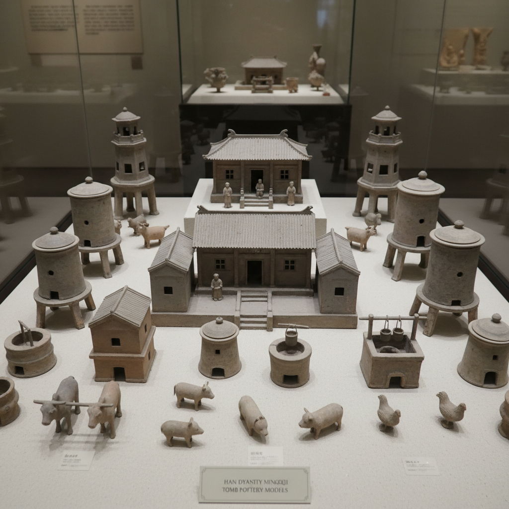

# Mingqi Art 明器艺术

> "Mingqi are the possessions of the dead made visible — ceramic models of houses, servants, animals, and treasures placed in tombs so the departed might enjoy in the afterlife what they possessed in life, a tradition spanning millennia where potters became architects of miniature worlds, each tomb a complete household frozen in clay." — Unknown

## 概述

明器艺术（Mingqi Art）是中国古代专为殉葬而制作的陶瓷器物艺术，包括各种陶制模型——房屋、仓廪、灶台、井、车马、人俑、动物俑等。明器（又称冥器）是中国丧葬文化的重要组成部分——它们替代真实的物品和活人殉葬，为死者在来世提供所需的一切。明器是了解中国古代社会生活的珍贵资料——通过这些微缩模型，我们可以看到古人的建筑、交通、饮食和日常生活。

明器艺术的核心要素包括：1）殉葬功能——专为墓葬制作；2）模型化——真实物品的微缩模型；3）生活再现——再现死者生前的生活；4）社会等级——反映墓主的社会地位；5）时代特征——反映各时代的社会面貌；6）工艺多样——从粗陶到精美彩绘；7）文化信仰——反映灵魂不灭的信仰。

## 核心特征

| 特征 | 描述 |
|------|------|
| 殉葬功能 | 专为墓葬制作 |
| 模型化 | 真实物品微缩模型 |
| 生活再现 | 再现死者生前生活 |
| 社会等级 | 反映社会地位 |
| 时代特征 | 反映时代社会面貌 |
| 文化信仰 | 灵魂不灭信仰 |

## 视觉特征

- **微缩模型**：建筑、器物的微缩
- **人物俑**：各种身份的人物陶俑
- **动物俑**：马、牛、鸡、狗等
- **建筑模型**：房屋、仓廪、望楼
- **彩绘装饰**：鲜艳的彩绘
- **生活场景**：完整的生活场景

## 代表作品

| 作品 | 艺术家/文化 | 年代 | 意义 |
|------|-------------|------|------|
| *汉代陶楼* | 汉代 | 前206-220年 | 汉代建筑模型 |
| *唐三彩骆驼* | 唐代 | 618-907年 | 丝路贸易的象征 |
| *汉代陶灶* | 汉代 | 前206-220年 | 汉代饮食文化 |
| *北朝陶牛车* | 北朝 | 386-581年 | 交通工具模型 |
| *宋代陶院落* | 宋代 | 960-1279年 | 宋代建筑模型 |

## 历史时间线

| 时期 | 事件 |
|------|------|
| 商周 | 明器传统的起源 |
| 战国 | 明器替代活人殉葬 |
| 汉代 | 明器艺术的鼎盛期 |
| 唐代 | 唐三彩明器的辉煌 |
| 宋元以后 | 纸扎逐渐替代陶制明器 |

## 中国语境

明器是中国独特的丧葬艺术传统。中国古代"事死如事生"的观念催生了明器的制作——人们相信死者在来世需要与生前相同的物质条件。汉代是明器艺术的黄金时代——汉墓中出土了大量精美的陶制建筑模型、人物俑和动物俑，为我们提供了了解汉代社会的珍贵窗口。唐代的三彩明器将这一传统推向了艺术的巅峰——色彩斑斓的三彩骆驼、马匹和胡人俑生动地再现了丝绸之路的繁荣景象。明器的制作反映了中国古代的社会等级制度——不同等级的墓主使用不同规格和数量的明器。宋代以后，纸扎（纸制冥器）逐渐替代了陶制明器——但陶制明器作为中国古代艺术的重要组成部分，其艺术价值和历史价值永远不会消失。

## AI生成概念图

## 与其他风格的关系

- **Terracotta Warrior** → 兵马俑
- **Tang Sancai** → 唐三彩
- **Funerary Art** → 丧葬艺术
- **Spirit Vessel** → 魂瓶
- **Chinese Sculpture** → 中国雕塑
- **Archaeological Art** → 考古艺术

---

*浮光艺志 | Chronicle of Artistry*
