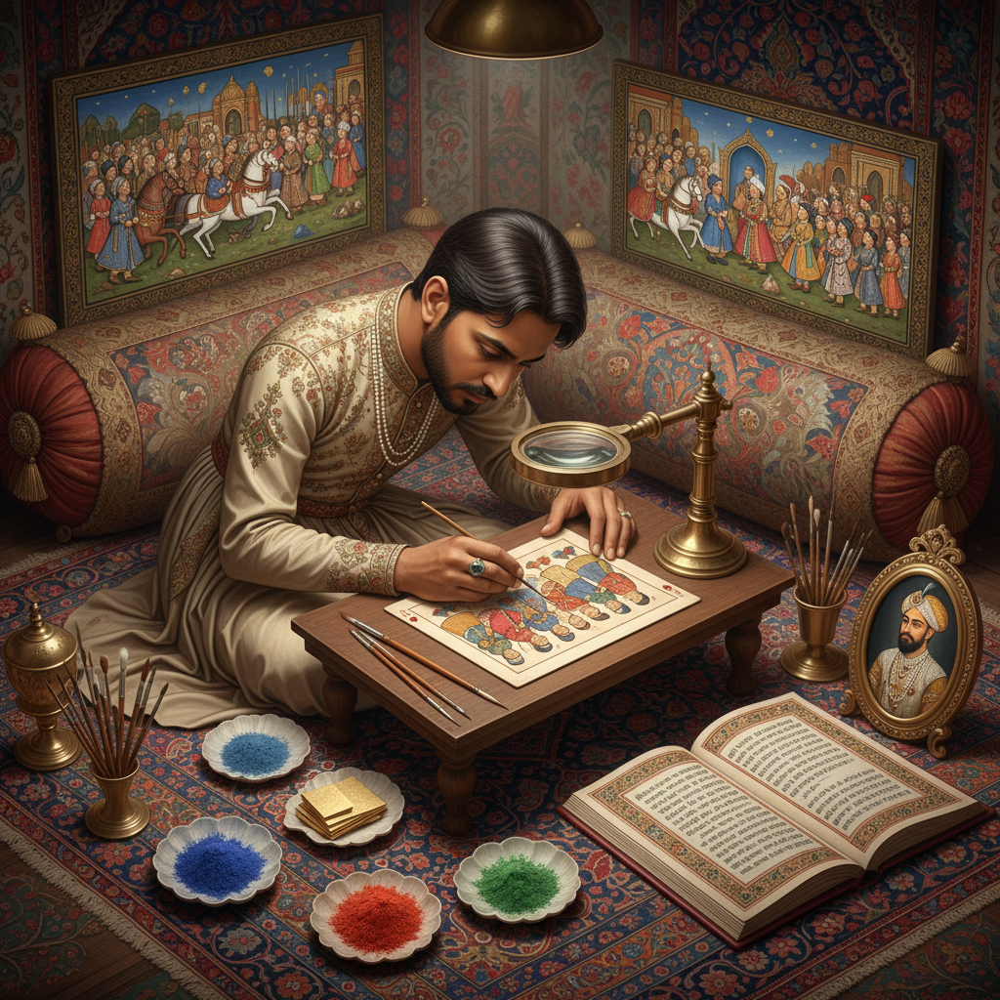

# Miniature Painting Art 细密画艺术

> "A miniature painting is a world compressed — an entire landscape, a court scene with dozens of figures, a battle with hundreds of horses, all contained within a space smaller than a human hand. The miniaturist works with a single-hair brush, painting details invisible to the naked eye, creating images that reward the closest possible inspection. It is art that demands intimacy." — Unknown

## 概述

细密画艺术（Miniature Painting Art）是在极小尺幅上进行精细绘画创作的艺术形式——使用极细的画笔（有时仅一根毛发）在纸张、象牙、羊皮纸或其他材料上绘制高度精细的图像。细密画是波斯、印度莫卧儿、奥斯曼和欧洲中世纪手抄本中最重要的绘画传统之一。

细密画艺术的实践包括：1）波斯细密画——伊朗传统的精细绘画；2）莫卧儿细密画——印度莫卧儿帝国的宫廷绘画；3）奥斯曼细密画——土耳其的细密画传统；4）欧洲肖像细密画——欧洲的微型肖像画；5）手抄本插图——中世纪手抄本中的细密画；6）拉贾斯坦细密画——印度拉贾斯坦邦的绘画传统；7）当代细密画——现代艺术家对细密画传统的重新诠释。

## 核心特征

| 特征 | 描述 |
|------|------|
| 微型 | 极小的尺幅 |
| 精细 | 极其精细的笔触 |
| 色彩 | 鲜艳的矿物颜料 |
| 叙事 | 丰富的叙事内容 |
| 装饰 | 精美的装饰边框 |
| 传统 | 深厚的文化传统 |

## 视觉特征

- **精细**：极其精细的细节
- **平面**：相对平面的构图
- **色彩**：鲜艳饱和的色彩
- **金色**：大量使用金色
- **边框**：精美的装饰边框
- **叙事**：复杂的叙事场景

## 代表作品

| 作品 | 艺术家 | 年代 | 意义 |
|------|--------|------|------|
| *Shahnameh illustrations* | Various | 14-16世纪 | 波斯史诗细密画 |
| *Padshahnama* | 莫卧儿画师 | 17世纪 | 莫卧儿宫廷细密画 |
| *Book of Kells* | 爱尔兰僧侣 | 约800年 | 中世纪手抄本 |
| *Très Riches Heures* | Limbourg Brothers | 1412-16 | 欧洲时祷书 |
| *Contemporary miniatures* | Shahzia Sikander | 当代 | 当代细密画 |

## 历史时间线

| 时期 | 事件 |
|------|------|
| 古代 | 早期手抄本插图 |
| 中世纪 | 欧洲和伊斯兰手抄本细密画 |
| 15-17世纪 | 波斯和莫卧儿细密画的黄金时代 |
| 18-19世纪 | 欧洲肖像细密画的流行 |
| 当代 | 细密画传统的当代重新诠释 |

## 中国语境

细密画艺术在中国有独特的对应传统——中国的工笔画在某种程度上与细密画有相似之处，都强调精细的笔触和丰富的细节。中国传统的册页画和扇面画也是在小尺幅上进行精细创作的形式。中国的鼻烟壶内画是一种独特的微型绘画艺术——在鼻烟壶内壁用极细的笔反向绘画，是中国特有的细密画形式。中国与波斯和中亚有历史上的文化交流——丝绸之路上的艺术交流使中国接触到了伊斯兰细密画传统。中国当代的一些艺术家在探索细密画与中国传统绘画的融合——创造新的微型绘画形式。中国的微雕和微刻艺术也与细密画有精神上的联系——都追求在极小空间内创造极大的艺术表现力。

## AI生成概念图

## 与其他风格的关系

- **Persian Art** → 波斯艺术
- **Mughal Art** → 莫卧儿艺术
- **Illuminated Manuscript** → 泥金手抄本
- **Chinese Gongbi** → 中国工笔画
- **Portrait Miniature** → 微型肖像画
- **Calligraphy** → 书法艺术

---

*浮光艺志 | Chronicle of Artistry*
