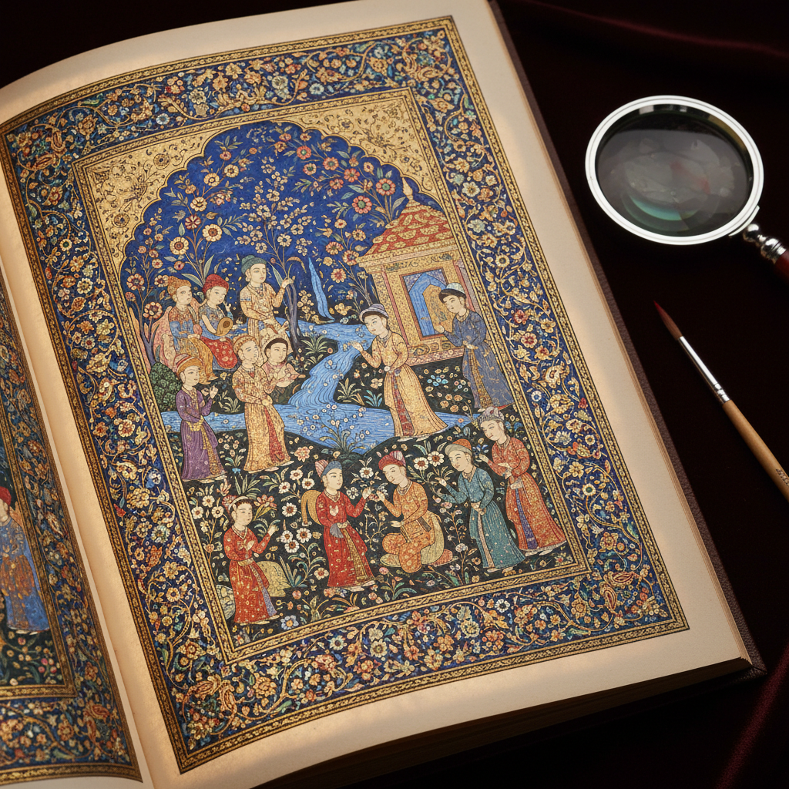

# Miniature Painting 细密画

> "In miniature painting, the entire universe is contained within the space of a palm." — Persian proverb

## 概述

细密画（Miniature Painting）是在极小尺幅上以极精细的笔触创作的绘画形式。从波斯细密画到印度莫卧儿细密画，从中世纪欧洲的手抄本装饰到奥斯曼帝国的宫廷绘画，细密画是人类精细技艺的极致展现。

细密画的魅力在于它的悖论——在最小的空间中容纳最丰富的细节，用最精细的笔触讲述最宏大的故事。

## 核心特征

| 特征 | 描述 |
|------|------|
| 微型尺幅 | 通常只有手掌大小 |
| 极精细 | 使用单根毛发般的细笔 |
| 高密度 | 极高的信息密度 |
| 平面性 | 不使用透视——装饰性构图 |
| 叙事性 | 讲述文学、宗教或历史故事 |
| 宝石色 | 使用矿物颜料——宝石般的色彩 |

## 视觉特征

- **细节**：肉眼难以辨认的精细细节
- **色彩**：矿物颜料的宝石般饱和色彩
- **金色**：大量使用金箔和金粉
- **平面**：无透视的装饰性空间
- **边框**：精美的装饰边框
- **图案**：密集的花卉和几何图案

## 代表作品

| 作品 | 传统/艺术家 | 年代 | 意义 |
|------|-------------|------|------|
| *Shahnameh illustrations* | 波斯 | 14-16世纪 | 波斯细密画的巅峰 |
| *Book of Kells* | 爱尔兰 | ~800 | 中世纪手抄本的极致 |
| *Mughal miniatures* | 印度莫卧儿 | 16-18世纪 | 印度细密画的黄金时代 |
| *Très Riches Heures* | Limbourg Brothers | 1416 | 欧洲细密画的杰作 |
| *Ottoman miniatures* | 奥斯曼帝国 | 15-17世纪 | 伊斯兰细密画传统 |
| *Rajput miniatures* | 印度拉杰普特 | 17-19世纪 | 印度教题材的细密画 |

## 历史时间线

| 时期 | 事件 |
|------|------|
| 7世纪 | 早期伊斯兰手抄本装饰 |
| 8-9世纪 | 凯尔经等中世纪手抄本 |
| 13-16世纪 | 波斯细密画的黄金时代 |
| 15世纪 | 欧洲时祷书的精美装饰 |
| 16-18世纪 | 莫卧儿细密画的繁荣 |
| 19世纪 | 细密画传统的衰落 |
| 20世纪-至今 | 当代艺术家对细密画的重新诠释 |

## 中国语境

中国传统绘画中也有精细的小品传统——宋代的册页、扇面、团扇画等在小尺幅中展现精湛技艺。中国的工笔画在精细程度上与细密画有相似之处。当代中国艺术家如邱志杰等在微型绘画方面有独特探索。中国与波斯、印度的文化交流也使细密画传统有所交融。

## AI生成概念图

## 与其他风格的关系

- **Illuminated Manuscript** → 手抄本装饰是细密画的重要载体
- **Islamic Art** → 伊斯兰艺术是细密画的核心传统
- **Decorative Arts** → 细密画的装饰性
- **Calligraphy Art** → 书法与细密画在手抄本中共存
- **Realism** → 细密画追求极致的细节写实
- **Folk Art** → 民间细密画传统

---

*浮光艺志 | Chronicle of Artistry*
