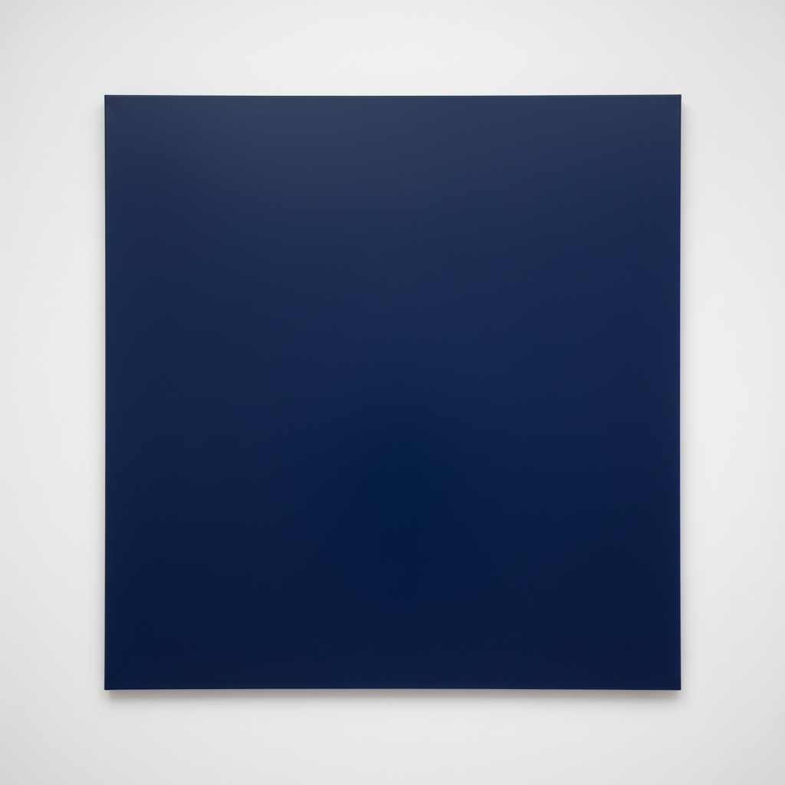

# Minimalism Painting 极简主义绘画

> **时期：** 1960年代–1970年代  
> **关键词：** 少即是多、去除表达、工业材料、系列重复、客观性

## 概述

Minimalism Painting（极简主义绘画）是1960年代对抽象表现主义情感泛滥的冷静回应——画家们追求最少的手段和最纯粹的视觉体验。弗兰克·斯特拉的条纹画布、阿格尼丝·马丁的铅笔网格——极简主义相信：当你去除一切叙事、象征、情感和幻觉之后，剩下的纯粹物质存在本身就足够了。画布就是画布，颜色就是颜色，不多也不少。

## 风格特征

- **几何纯粹**：条纹、网格、单色
- **去除表达**：没有情感、没有叙事
- **系列重复**：规则性的图案排列
- **平面性**：完全消除深度幻觉
- **工业精度**：机械般的执行质量

## 代表人物与作品

- 弗兰克·斯特拉 黑色条纹画
- 阿格尼丝·马丁 铅笔网格
- 罗伯特·赖曼 白色绘画
- 布莱斯·马登 单色画

## 概念图

