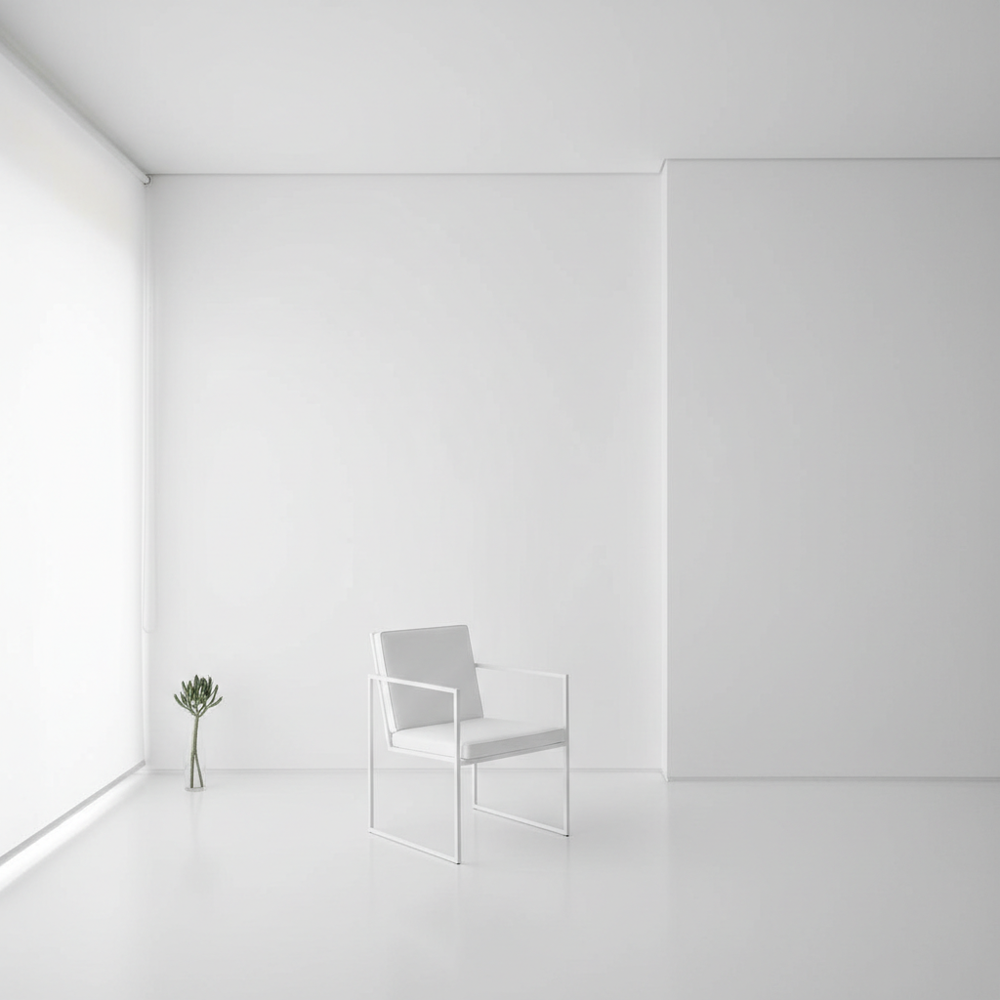

# Minimalism 极简主义



> **"少即是多——当你去掉一切多余，剩下的就是本质。"**

## 概述

| 维度 | 描述 |
|------|------|
| 时期 | 1960s 艺术运动 / 2010s 生活方式主流化 |
| 别名 | Minimalism, Less is More, Essentialism |
| 核心色彩 | 白色、黑色、灰色、米色 |
| 关键元素 | 留白、几何、单色、无装饰、功能性 |
| 代表人物 | Donald Judd、Dieter Rams、Jony Ive |
| 关联风格 | Flat Design, Japandi, Wabi-Sabi, Brutalism |

---

## 历史脉络

### 从艺术到生活方式

| 年份 | 事件 |
|------|------|
| 1960s | 极简主义艺术运动（Donald Judd、Dan Flavin） |
| 1970s | Dieter Rams "十条好设计原则" |
| 1990s | 无印良品——极简生活方式商业化 |
| 2007 | iPhone——极简产品设计的巅峰 |
| 2014 | Marie Kondo《怦然心动》——极简生活运动 |
| 2015 | "极简主义者"成为一种身份 |
| 2020s | 被 Cluttercore/Maximalism 反叛 |

### 核心哲学

Minimalism 的精神是**"去掉一切不必要的，直到无法再减"**：
- 每个元素都必须有存在的理由
- 空间本身就是设计元素
- 功能 > 装饰
- "少"不是贫乏——是精炼
- Dieter Rams: "好的设计是尽可能少的设计"

---

## 视觉语法

### 色彩系统

```
主色：
  白色 (#FFFFFF) — 空间、纯粹
  黑色 (#000000) — 对比、文字
  灰色 (#808080) — 层次
  米色 (#F5F5DC) — 温暖极简

规则：
  - 单色或双色
  - 大量留白
  - 不用装饰色
  - 色彩克制到极致
  - 材质差异创造层次

质感：
  光滑 — 金属、玻璃
  哑光 — 混凝土、纸
  天然 — 木、石
```

### 标志性元素

| 类别 | 元素 |
|------|------|
| 空间 | 大量留白、几何家具、隐藏收纳 |
| 产品 | iPhone、无印良品、Braun |
| 字体 | Helvetica、无衬线、大量留白 |
| 建筑 | 白墙、玻璃、几何体块 |
| 生活 | 断舍离、胶囊衣橱、数字极简 |

---

## 与千禧怀旧的关系

### 2010s 的时代精神
- "极简生活"成为千禧一代的身份标签
- 对消费主义的反思
- 但也被批评为"中产阶级特权"
- 2020s 开始被 Maximalism 反叛

---

## 中国语境

- "极简风"/"性冷淡风"在中国的流行
- 无印良品在中国的文化影响
- 与"断舍离"/"少即是多"的生活方式
- 对"精装修"/"欧式豪华"的反叛

---

## 设计应用

| 场景 | 应用方式 |
|------|----------|
| 品牌 | 大量留白+细字体+单色+几何 |
| 空间 | 白墙+隐藏收纳+几何家具+天然材质 |
| 产品 | 去掉一切装饰+功能优先+触感 |
| 数字 | 留白+细线+单色+极简交互 |

---

## 相关风格

← [Flat Design 扁平设计](flat-design.md) | [Wabi-Sabi 侘寂](wabi-sabi.md) →

↑ [返回千禧怀旧目录](README.md) | [返回总目录](../README.md)
