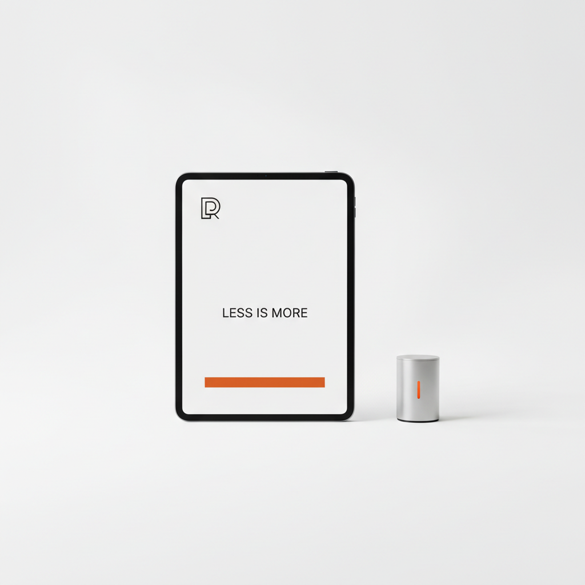

# Minimalist Digital 数字极简



> **"一个颜色、一种字体、大量留白——当'少即是多'成为数字时代的信仰。"**

## 概述

| 维度 | 描述 |
|------|------|
| 时期 | 2010s–至今 |
| 别名 | Digital Minimalism, Clean Design, White Space Design |
| 核心色彩 | 白色、黑色、一种强调色 |
| 关键元素 | 大量留白、极简字体、单色调、几何图形 |
| 代表人物 | Apple、Dieter Rams、Jony Ive、无印良品 |
| 关联风格 | Flat Design, Japandi, Normcore, Scandinavian |

---

## 历史脉络

### 从包豪斯到 Apple

| 时代 | 极简主义表现 |
|------|-------------|
| 1920s | 包豪斯："形式追随功能" |
| 1960s | 极简主义艺术运动 |
| 1970s–80s | Dieter Rams 的十条设计原则 |
| 1997 | Steve Jobs 回归 Apple，开始极简化 |
| 2007 | iPhone 定义了数字极简的标准 |
| 2013 | iOS 7 + Flat Design = 极简的胜利 |
| 2015–至今 | 极简成为"默认"设计语言 |

### Dieter Rams 的十条原则

1. 好的设计是创新的
2. 好的设计使产品有用
3. 好的设计是美的
4. 好的设计使产品易于理解
5. 好的设计是不引人注目的
6. 好的设计是诚实的
7. 好的设计是持久的
8. 好的设计考虑到每个细节
9. 好的设计是环保的
10. **好的设计是尽可能少的设计**

### 核心哲学

数字极简的信条：**"Less, but better"**
- 去掉一切不必要的元素
- 每个像素都有存在的理由
- 留白不是"空"，是"呼吸"
- 简单不是简陋，是提炼

---

## 视觉语法

### 色彩系统

```
主色：
  白色 (#FFFFFF) — 背景、留白
  黑色 (#000000) — 文字、线条
  一种强调色 — 品牌色/功能色

规则：
  - 最多3种颜色
  - 大面积留白
  - 强调色用于关键交互
  - 灰色层级创造深度

质感：
  无 — 极简的核心
  （偶尔的微妙阴影或渐变）
```

### 标志性元素

| 类别 | 元素 |
|------|------|
| 留白 | 大量、有意识的空白空间 |
| 字体 | 一种无衬线字体、清晰层级 |
| 图形 | 极简线条图标、几何形状 |
| 布局 | 网格、对齐、呼吸感 |
| 图片 | 高质量、少量、有意义 |
| 动效 | 微妙、功能性、不抢眼 |

---

## 与千禧怀旧的关系

### Apple 的千禧记忆
- iPod → iPhone → iPad = 千禧一代的成长伴侣
- Apple 的设计语言 = 这一代人的"美"的标准
- "极简 = 高级" 的观念深入人心

### 极简疲劳
- 2020s 开始出现对极简的反叛
- Maximalism、Cluttercore、Dopamine Dressing 的兴起
- "极简主义变成了另一种消费主义"的批评
- 但极简作为"基础设施"仍然统治着数字设计

---

## 中国语境

- "极简风"/"性冷淡风"的流行
- 无印良品在中国的文化影响
- "断舍离"生活方式
- 与"新中式极简"的交叉
- 小红书上的"极简家居"/"极简穿搭"

---

## 设计应用

| 场景 | 应用方式 |
|------|----------|
| 品牌 | 单色logo+大量留白+极简字体 |
| UI | 白色背景+清晰层级+微妙交互 |
| 空间 | 白墙+少量家具+自然光+一个焦点 |
| 包装 | 白色+极简标签+一种颜色 |

---

## 相关风格

← [Flat Design 扁平设计](flat-design.md) | [Japandi 日式北欧](japandi.md) →

↑ [返回千禧怀旧目录](README.md) | [返回总目录](../README.md)
