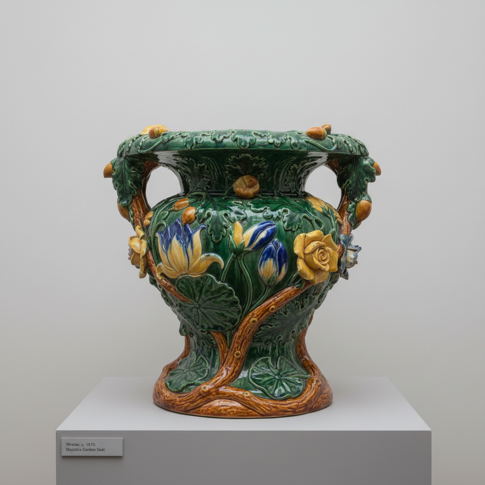

# Minton Art 明顿艺术

> "Minton is Victorian ambition in ceramic form — a factory that mastered every technique from majolica to pate-sur-pate, from encaustic tiles to bone china, supplying the Crystal Palace exhibition and paving the floors of Parliament, a company whose technical range and artistic ambition made it the most versatile ceramic manufacturer of the nineteenth century." — Unknown

## 概述

明顿艺术（Minton Art）是19世纪英国最具技术多样性的陶瓷制造商之一，由Thomas Minton于1793年创立。明顿以其惊人的技术范围著称——从骨瓷到马约利卡、从嵌花砖到堆白（pâte-sur-pâte）、从仿塞夫勒到艺术陶瓷，几乎掌握了所有已知的陶瓷技术。明顿在维多利亚时代的国际博览会上屡获大奖——成为英国陶瓷工业的骄傲。

明顿艺术的核心要素包括：1）技术全面——掌握几乎所有陶瓷技术；2）马约利卡——色彩斑斓的马约利卡陶器；3）堆白技法——精美的pâte-sur-pâte；4）嵌花砖——维多利亚时代的地砖；5）博览会明星——国际博览会的常胜军；6）维多利亚时代——维多利亚时代的代表；7）艺术总监——聘请顶级艺术总监。

## 核心特征

| 特征 | 描述 |
|------|------|
| 技术全面 | 掌握几乎所有陶瓷技术 |
| 马约利卡 | 色彩斑斓马约利卡 |
| 堆白技法 | 精美pâte-sur-pâte |
| 嵌花砖 | 维多利亚时代地砖 |
| 博览会明星 | 国际博览会常胜军 |
| 维多利亚时代 | 维多利亚时代代表 |

## 视觉特征

- **色彩丰富**：马约利卡的丰富色彩
- **浮雕精细**：堆白技法的精细浮雕
- **几何图案**：嵌花砖的几何图案
- **自然主义**：自然主义的装饰风格
- **金彩华丽**：华丽的金彩装饰
- **技术多样**：多种技术的展示

## 代表作品

| 作品 | 艺术家/文化 | 年代 | 意义 |
|------|-------------|------|------|
| *马约利卡花园陶器* | Minton | 1850年代 | 马约利卡代表 |
| *堆白花瓶* | Marc-Louis Solon | 1870年代 | 堆白技法巅峰 |
| *国会大厦地砖* | Minton | 1840年代 | 嵌花砖代表 |
| *1851年水晶宫展品* | Minton | 1851年 | 博览会展品 |
| *仿塞夫勒瓷器* | Minton | 19世纪 | 仿法国风格 |

## 历史时间线

| 时期 | 事件 |
|------|------|
| 1793年 | Thomas Minton创立工厂 |
| 1840年代 | 嵌花砖的成功 |
| 1851年 | 水晶宫博览会大放异彩 |
| 1870年代 | 堆白技法的引入 |
| 1968年 | 并入Royal Doulton |

## 中国语境

明顿与中国陶瓷的关系主要体现在技术学习和风格借鉴上。明顿早期生产的骨瓷和蓝色转印瓷器明显受到中国瓷器的影响——但明顿很快发展出了自己的多元化路线。明顿的马约利卡陶器借鉴了意大利和伊斯兰的传统——而非中国风格。明顿的堆白技法（pâte-sur-pâte）虽然与中国的堆塑技法有表面相似——但实际上是从法国塞夫勒引入的技术。明顿的嵌花砖（encaustic tiles）则完全是欧洲中世纪的传统——与中国陶瓷无关。明顿的成功证明了19世纪欧洲陶瓷工业已经完全摆脱了对中国的依赖——发展出了自己丰富多样的技术和美学体系。

## AI生成概念图

## 与其他风格的关系

- **Wedgwood** → 韦奇伍德
- **Majolica** → 马约利卡
- **Pate-sur-Pate** → 堆白
- **Encaustic Tile** → 嵌花砖
- **Victorian Art** → 维多利亚艺术
- **Sevres** → 塞夫勒

---

*浮光艺志 | Chronicle of Artistry*
