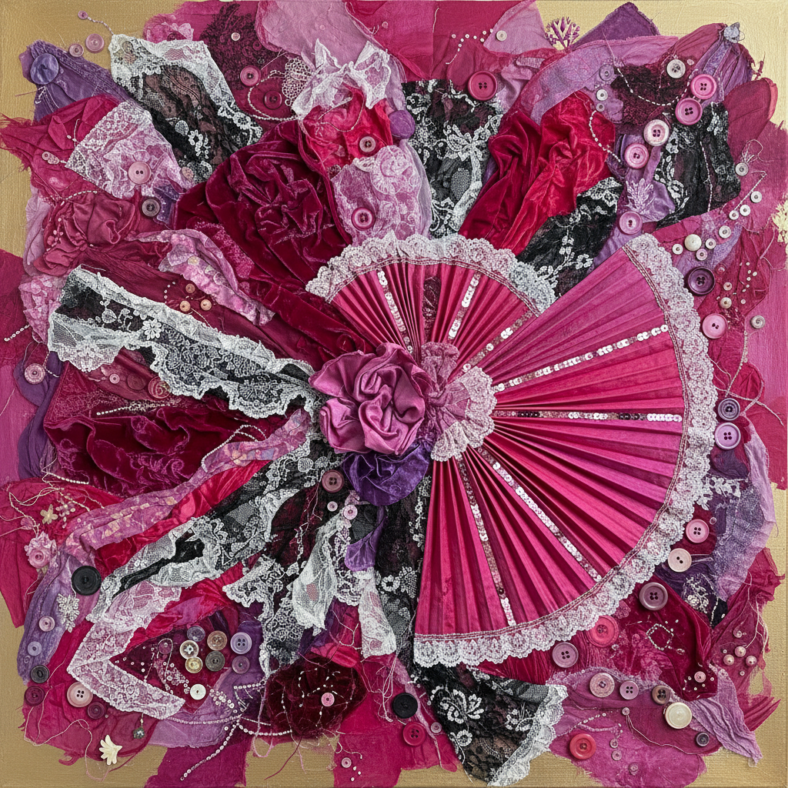

# Miriam Schapiro 米里亚姆·夏皮罗

> **时期：** 1923–2015  
> **关键词：** 拼贴画（Femmage）、图案与装饰运动、女性主义抽象、织物拼贴

## 概述

Miriam Schapiro 是美国画家，女性主义艺术运动和"图案与装饰"运动的核心人物。她创造了"Femmage"（女性拼贴）这一术语，将传统女性手工艺——织物、蕾丝、纽扣、亮片——融入大尺幅的抽象绘画中，挑战了现代主义对装饰性的贬低和对女性创造力的忽视。

## 风格特征

- **Femmage**：将织物、蕾丝、纽扣等女性手工材料融入绘画
- **装饰性的解放**：拥抱图案、花纹和装饰，拒绝极简主义的禁欲
- **扇形和心形**：标志性的扇子和心形图案作为女性符号
- **大尺幅**：将"小"的女性工艺放大到纪念碑性的规模
- **色彩丰富**：热烈的粉红、紫色和金色，拒绝"严肃"的中性色调

## 代表作品

- *Anatomy of a Kimono*（1976）
- *Barcelona Fan*（1979）
- *Wonderland*（1983）
- *Master of Ceremonies*（1985）

## 历史意义

Schapiro 与Judy Chicago共同创立了第一个女性主义艺术项目（CalArts，1971），她的Femmage概念为后来的纤维艺术和混合媒介创作奠定了理论基础。她证明了装饰不是肤浅的，而是一种被性别政治压制的深刻传统。

## 概念图

