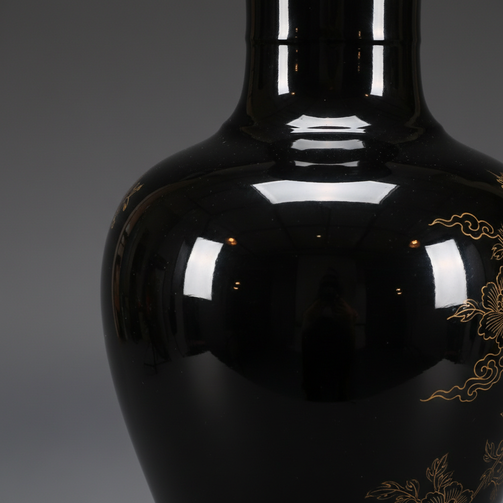

# Mirror Black Art 乌金釉艺术

> "Mirror black is darkness made luminous — a glaze so deeply pigmented with iron and manganese that it absorbs nearly all light yet reflects it back from its glassy surface like a pool of obsidian, the paradox of a color that is the absence of color yet possesses a depth and richness that no other glaze can match, a void that is somehow full." — Unknown

## 概述

乌金釉艺术（Mirror Black Art）是一种以极深的黑色光亮釉面为特征的陶瓷釉色艺术。乌金釉因其釉面如同黑色镜面般光亮深沉而得名——在英文中被称为"Mirror Black"，形容其如镜子般的反射光泽。乌金釉的呈色来自高含量的铁和锰氧化物，在氧化气氛中烧成后产生极深的黑色，釉面光滑如镜，具有极高的光泽度。

乌金釉艺术的核心要素包括：1）极深黑色——纯净深沉的黑色；2）镜面光泽——如镜子般的高光泽；3）铁锰呈色——高铁锰含量的呈色；4）氧化烧成——在氧化气氛中烧成；5）深沉之美——黑色的深沉美感；6）对比装饰——常与金彩形成对比；7）庄重典雅——庄重典雅的气质。

## 核心特征

| 特征 | 描述 |
|------|------|
| 极深黑色 | 纯净深沉的黑色 |
| 镜面光泽 | 如镜子般高光泽 |
| 铁锰呈色 | 高铁锰含量 |
| 氧化烧成 | 氧化气氛烧成 |
| 深沉之美 | 黑色的深沉美感 |
| 庄重典雅 | 庄重典雅气质 |

## 视觉特征

- **纯黑色**：极其纯净的深黑色
- **镜面反射**：如镜子般反射光线
- **玻璃质感**：光滑的玻璃质表面
- **深沉感**：如深潭般的深沉
- **金彩对比**：常配以金色装饰
- **庄重感**：庄重肃穆的视觉感受

## 代表作品

| 作品 | 艺术家/文化 | 年代 | 意义 |
|------|-------------|------|------|
| *康熙乌金釉* | 中国清代 | 康熙 | 乌金釉的巅峰 |
| *乌金釉描金* | 中国清代 | 各时期 | 黑金对比的经典 |
| *建窑黑釉* | 中国宋代 | 宋代 | 黑釉的早期传统 |
| *天目茶碗* | 日本 | 各时期 | 黑釉茶碗传统 |
| *当代黑釉* | 各地陶艺家 | 当代 | 黑釉的当代探索 |

## 历史时间线

| 时期 | 事件 |
|------|------|
| 宋代 | 建窑黑釉的辉煌 |
| 明代 | 乌金釉的发展 |
| 清康熙 | 乌金釉的巅峰成就 |
| 清代 | 乌金釉描金的流行 |
| 当代 | 黑釉在当代陶艺中的应用 |

## 中国语境

乌金釉是中国陶瓷中最庄重典雅的釉色之一。中国黑釉传统可以追溯到东汉——但真正的乌金釉（Mirror Black）是清代康熙时期景德镇的杰作。康熙乌金釉以其纯净深沉的黑色和完美的镜面光泽著称——常在黑色底釉上施以金彩装饰，形成"乌金描金"的经典样式。中国传统文化中，黑色代表庄重、深沉和神秘——乌金釉器物常用于祭祀和宫廷陈设。宋代建窑的黑釉茶碗虽然机理不同，但同样体现了中国对黑色之美的追求。乌金釉证明了中国陶瓷不仅擅长青白彩色，在黑色的表现上同样达到了极致。

## AI生成概念图

## 与其他风格的关系

- **Tenmoku** → 天目
- **Jian Ware** → 建窑
- **Monochrome Glaze** → 单色釉
- **Gold Decoration** → 金彩装饰
- **Chinese Imperial** → 中国官窑
- **Noir Aesthetics** → 黑色美学

---

*浮光艺志 | Chronicle of Artistry*
