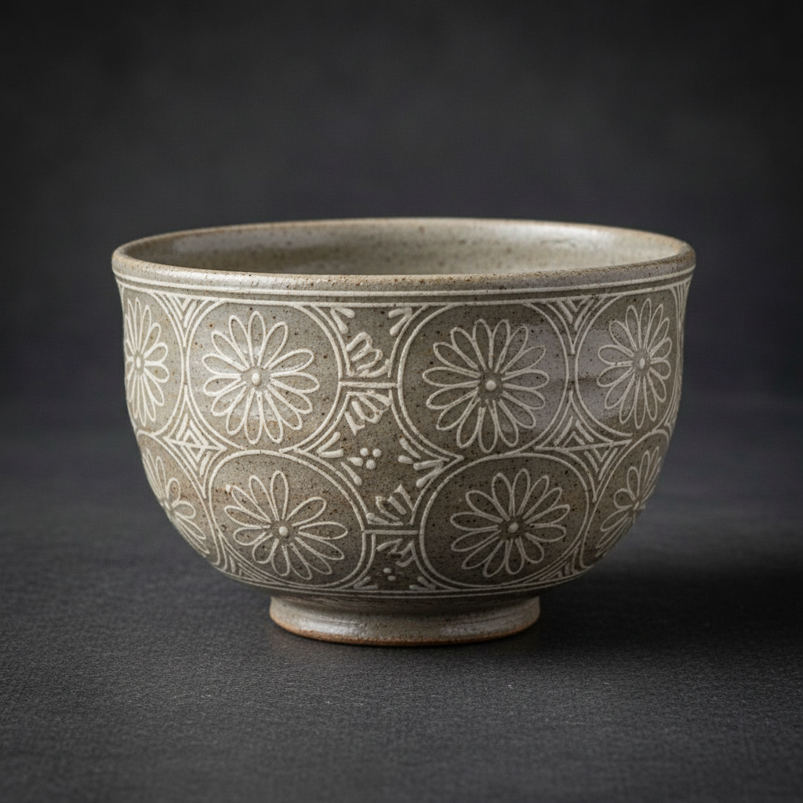

# Mishima Art 三岛手陶艺

> "Mishima is inlay in clay — lines are incised or stamped into leather-hard pottery, then filled with contrasting slip and scraped clean so that the design appears as if drawn into the surface with a different colored pen. The technique creates patterns of extraordinary precision and delicacy, where dark lines on light ground or light lines on dark ground seem to float within the clay itself rather than sitting on its surface." — Unknown

## 概述

三岛手陶艺（Mishima Art）是一种在半干的陶坯上刻出或压出线条图案，然后用对比色的泥浆填充凹槽，最后刮去多余泥浆使图案与表面平齐的陶瓷镶嵌装饰技法。Mishima（三岛）这个名称源自日本——日本茶人将这种来自朝鲜半岛的技法命名为"三岛手"，因为其细密的印花图案让人联想到三岛大社的历书印刷。

三岛手陶艺的实践包括：1）刻线镶嵌——用刻刀刻出线条后填充泥浆；2）印花镶嵌——用印章压出图案后填充；3）绳纹镶嵌——用绳子压出纹理后填充；4）多色镶嵌——使用多种颜色的泥浆；5）反向三岛——在深色坯体上填充浅色泥浆；6）刮平——刮去多余泥浆使表面平整；7）当代三岛手——将传统技法与现代设计结合的创作。

## 核心特征

| 特征 | 描述 |
|------|------|
| 镶嵌 | 泥浆镶嵌的技法 |
| 对比 | 色彩的对比效果 |
| 精密 | 精密的线条图案 |
| 平整 | 与表面平齐的装饰 |
| 朝鲜 | 源自朝鲜半岛 |
| 茶道 | 与日本茶道相关 |

## 视觉特征

- **线条**：精细的镶嵌线条
- **对比**：深浅色的对比
- **平整**：与表面平齐的图案
- **精密**：精密规律的图案
- **优雅**：优雅含蓄的美感
- **内敛**：内敛深沉的气质

## 代表作品

| 作品 | 艺术家/文化 | 年代 | 意义 |
|------|-------------|------|------|
| *Korean buncheong ware* | 朝鲜 | 15-16世纪 | 粉青沙器 |
| *Mishima tea bowls* | 日本 | 16世纪起 | 三岛手茶碗 |
| *Goryeo celadon inlay* | 高丽 | 12-13世纪 | 高丽青瓷镶嵌 |
| *Contemporary mishima* | 国际 | 当代 | 当代三岛手 |
| *Studio pottery mishima* | 当代 | 当代 | 工作室三岛手 |

## 历史时间线

| 时期 | 事件 |
|------|------|
| 12世纪 | 高丽青瓷镶嵌技法的发展 |
| 15-16世纪 | 朝鲜粉青沙器的繁荣 |
| 16世纪 | 日本茶人命名"三岛手" |
| 20世纪 | 西方陶艺界的引入 |
| 当代 | 三岛手的全球化发展 |

## 中国语境

三岛手技法与中国陶瓷传统有深厚的渊源。中国宋代的磁州窑系有类似的镶嵌装饰技法——在刻花后填充不同颜色的化妆土。中国的龙泉窑青瓷中也有镶嵌装饰的传统——虽然不如高丽青瓷镶嵌那样著名。中国当代的陶艺家广泛学习和应用三岛手技法——将其视为一种精致的表面装饰方法。中国的陶瓷教育中，三岛手作为一种重要的装饰技法——在各大美术学院的陶艺课程中教授。中国的一些陶艺工作室将三岛手与中国传统纹样结合——创造出具有东方美学的当代陶瓷。中国与韩国、日本的陶瓷文化交流中，三岛手是重要的技法交流项目——体现了东亚陶瓷文化的共同传统。

## AI生成概念图

## 与其他风格的关系

- **Buncheong** → 粉青沙器
- **Celadon** → 青瓷
- **Sgraffito** → 刮花装饰
- **Slip Trailing** → 泥浆描绘
- **Inlay** → 镶嵌工艺
- **Tea Ceremony** → 茶道美学

---

*浮光艺志 | Chronicle of Artistry*
