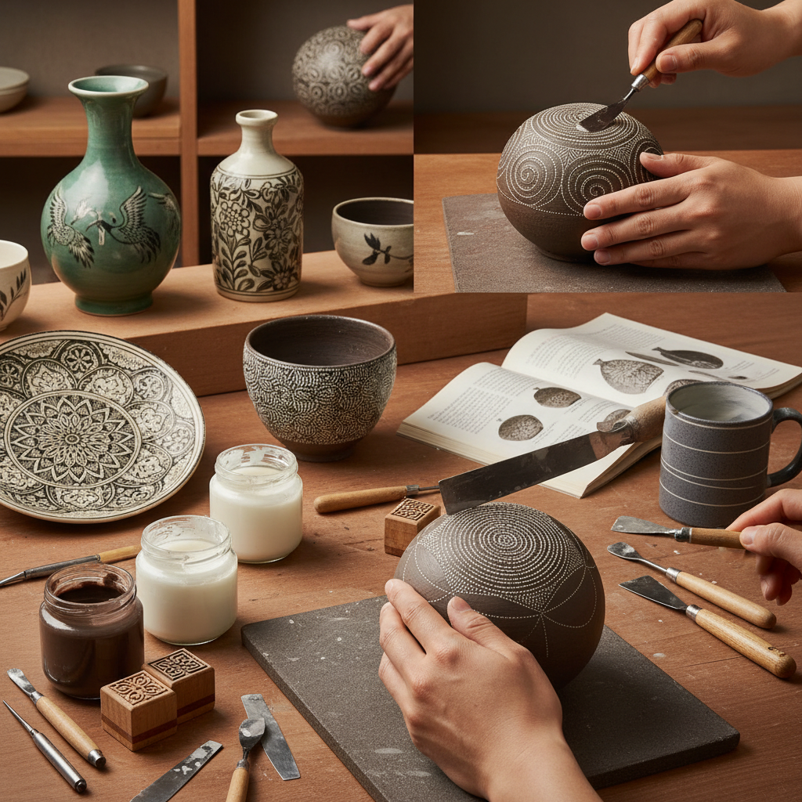

# Mishima Technique 三岛技法

> "Mishima is inlay in clay — lines carved into leather-hard surfaces then filled with contrasting slip, scraped clean to reveal precise patterns embedded flush with the surface, creating decoration that is neither raised nor recessed but perfectly integrated into the body of the vessel." — Unknown

## 概述

三岛技法（Mishima Technique）是一种陶瓷表面装饰技法——在半干（皮革硬度）的陶坯表面刻出线条或图案，然后将对比色的泥浆（slip）填入刻痕中，待稍干后刮去表面多余的泥浆，露出嵌入刻痕中的对比色线条。最终效果是精细的线条图案与器物表面齐平——既不凸起也不凹陷。

"Mishima"这个名称来源于日本——据说是因为这种装饰风格的细密线条图案类似于日本三岛大社（Mishima Taisha）出版的历书上的文字。但这种技法实际上起源于朝鲜半岛——高丽时代（918-1392）的粉青沙器（Buncheong）和镶嵌青瓷（inlaid celadon）是三岛技法的经典代表。当代陶艺家广泛使用三岛技法创作精细的装饰性作品。

## 核心特征

| 特征 | 描述 |
|------|------|
| 镶嵌 | 泥浆镶嵌入刻痕 |
| 对比 | 对比色的效果 |
| 精细 | 精细的线条图案 |
| 齐平 | 与表面齐平 |
| 朝鲜 | 起源于朝鲜半岛 |
| 刻填 | 先刻后填的工序 |

## 视觉特征

- **精细**：精细的线条
- **对比**：黑白或色彩对比
- **齐平**：平整的表面
- **图案**：装饰性图案
- **优雅**：优雅的视觉效果
- **传统**：传统的东方美感

## 代表作品

| 作品 | 艺术家 | 年代 | 意义 |
|------|--------|------|------|
| *高丽镶嵌青瓷* | 朝鲜工匠 | 高丽时代 | 镶嵌青瓷的巅峰 |
| *粉青沙器* | 朝鲜工匠 | 朝鲜时代 | 粉青沙器传统 |
| *Japanese Mishima ware* | 日本工匠 | 传统 | 日本三岛手 |
| *Contemporary Mishima* | Various | 当代 | 当代三岛技法 |
| *Mishima pottery* | Various | 当代 | 当代三岛陶艺 |

## 历史时间线

| 时期 | 事件 |
|------|------|
| 高丽时代 | 朝鲜镶嵌青瓷的发展 |
| 朝鲜时代 | 粉青沙器的三岛装饰 |
| 室町-江户 | 日本对朝鲜陶瓷的学习 |
| 20世纪 | 工作室陶艺中的三岛复兴 |
| 当代 | 三岛技法在全球陶艺中的传播 |
| 当代 | 当代陶艺家的三岛创新 |

## 中国语境

三岛技法与中国陶瓷有密切的历史联系——朝鲜的镶嵌青瓷受到中国青瓷的影响。中国的一些传统陶瓷也有类似的镶嵌装饰技法。中国的当代陶艺教育中，三岛技法作为一种重要的表面装饰技法被教授。中国的陶艺工作室和体验课程中，三岛技法因其"效果精美、操作有趣"的特点而受欢迎。中国的一些当代陶艺家在创作中使用三岛技法。

## AI生成概念图

## 与其他风格的关系

- **Sgraffito Ceramics** → 陶瓷刮花
- **Slip Trailing** → 泥浆拖线
- **Korean Celadon** → 高丽青瓷
- **Buncheong** → 粉青沙器
- **Inlay** → 镶嵌工艺
- **Ceramic Decoration** → 陶瓷装饰

---

*浮光艺志 | Chronicle of Artistry*
