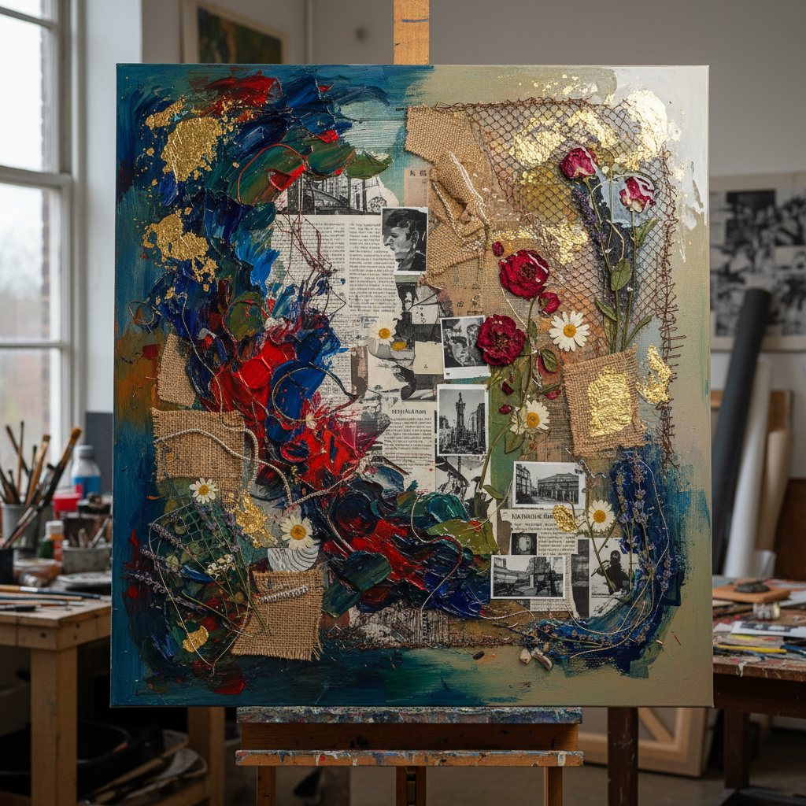

# Mixed Media 混合媒介

> "Why limit yourself to one medium when the world offers so many?" — Robert Rauschenberg

## 概述

混合媒介（Mixed Media）是在同一件作品中使用两种或以上不同媒介和材料的艺术创作方式。从绘画与拼贴的结合，到雕塑与电子元件的融合，混合媒介打破了传统艺术门类的界限，创造出跨越绘画、雕塑、装置、数字等领域的综合作品。

混合媒介的精神是自由——不被任何单一媒介的规则所束缚，让材料本身的特性和对话成为作品的一部分。

## 核心特征

| 特征 | 描述 |
|------|------|
| 多材料 | 使用两种以上不同媒介 |
| 跨界性 | 打破传统艺术门类界限 |
| 实验性 | 探索材料的新可能 |
| 对话性 | 不同材料之间的对话和张力 |
| 开放性 | 对任何材料和技法开放 |
| 层次性 | 多层次的视觉和触觉体验 |

## 视觉特征

- **材质对比**：光滑与粗糙、硬与软、自然与人工
- **层次**：多层材料的叠加
- **质感**：丰富的触觉质感
- **维度**：从平面到浮雕到三维
- **意外**：材料并置产生的意外效果
- **痕迹**：不同工艺留下的不同痕迹

## 代表作品

| 作品 | 艺术家 | 年代 | 意义 |
|------|--------|------|------|
| *Combines* | Robert Rauschenberg | 1954-64 | 绘画与现成物的结合——混合媒介先驱 |
| *Untitled (Your body is a battleground)* | Barbara Kruger | 1989 | 摄影与文字的混合 |
| *My Bed* | Tracey Emin | 1998 | 现成物与个人物品的装置 |
| *Anselm Kiefer works* | Anselm Kiefer | 1980s+ | 绘画、铅、稻草、灰烬的混合 |
| *El Anatsui tapestries* | El Anatsui | 2000s+ | 回收瓶盖编织的巨型壁挂 |
| *Wangechi Mutu collages* | Wangechi Mutu | 2000s+ | 绘画、拼贴、珠子的混合 |

## 历史时间线

| 时期 | 事件 |
|------|------|
| 1912 | Picasso/Braque——拼贴的发明 |
| 1920s | 达达——任何东西都可以是艺术 |
| 1950s | Rauschenberg的Combines |
| 1960s | Fluxus——跨媒介实验 |
| 1970s | 后现代主义——媒介界限的消解 |
| 1990s | 装置艺术的混合媒介化 |
| 2000s | 数字与物理的混合 |
| 2010s-至今 | 生物材料、AI、VR的加入 |

## 中国语境

中国当代艺术中混合媒介极为普遍——从徐冰的《天书》（版画与装置）到蔡国强的火药画（绘画与爆破），从刘韡的装置（工业材料与几何）到曹斐的多媒体作品。中国传统工艺本身就有混合媒介的传统——漆器中嵌入螺钿、金银，景泰蓝结合金属与珐琅。

## AI生成概念图

## 与其他风格的关系

- **Collage** → 拼贴是混合媒介的起点
- **Assemblage** → 集合艺术是三维的混合媒介
- **Installation Art** → 装置艺术常使用混合媒介
- **Found Object Art** → 现成物是混合媒介的重要材料来源
- **Digital Art** → 数字与物理的混合是当代趋势
- **Textile Art** → 纺织艺术常与其他媒介混合

---

*浮光艺志 | Chronicle of Artistry*
