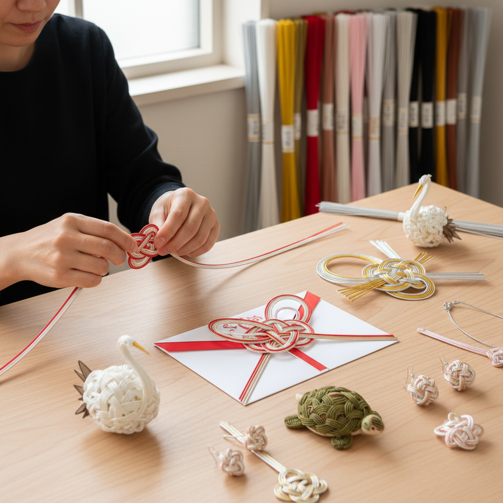

# Mizuhiki 水引

> "Mizuhiki is the language of knots — each twist and tie speaks of celebration or condolence, binding not just paper but the invisible threads between people." — Unknown

## 概述

水引（Mizuhiki）是日本传统的装饰性绳结艺术——使用细纸绳（由和纸搓成并涂以糊料使其挺括）编结成各种装饰结，用于礼品包装、祝仪袋（金封）和庆典装饰。水引的核心在于：不同的结法传达不同的含义——蝶结（花结び）用于可重复的喜事（如生日），结切（結び切り）用于一次性的大事（如婚礼、丧事），淡路结（あわじ結び）用于各种场合。

水引的颜色也有严格的规定：红白用于庆祝，黑白或银白用于丧事，金银用于特别隆重的场合。当代的水引艺术已超越传统礼仪，发展出了精美的立体造型——鹤、龟、花、动物等，成为一种独立的装饰艺术。

## 核心特征

| 特征 | 描述 |
|------|------|
| 纸绳 | 和纸制成的细绳 |
| 结法 | 不同结法不同含义 |
| 色彩 | 颜色有严格规定 |
| 礼仪 | 礼仪性的装饰 |
| 立体 | 可编结立体造型 |
| 象征 | 丰富的象征意义 |

## 视觉特征

- **线条**：细腻的纸绳线条
- **色彩**：红白、金银的配色
- **结**：精美的结法
- **立体**：立体的造型
- **对称**：对称的构图
- **优雅**：优雅的曲线

## 代表作品

| 作品 | 艺术家 | 年代 | 意义 |
|------|--------|------|------|
| *Traditional kinpu mizuhiki* | 匿名 | 传统 | 传统金封水引 |
| *Mizuhiki crane* | 匿名 | 传统 | 水引鹤 |
| *Contemporary mizuhiki art* | 長浦ちえ | 当代 | 当代水引艺术 |
| *Mizuhiki accessories* | Various | 当代 | 水引饰品 |
| *Large-scale mizuhiki* | Various | 当代 | 大型水引装置 |

## 历史时间线

| 时期 | 事件 |
|------|------|
| 飞鸟时代 | 遣隋使带回的红白绳 |
| 室町时代 | 水引礼法的确立 |
| 江户时代 | 水引的普及 |
| 明治时代 | 水引产业的发展 |
| 当代 | 水引的艺术化和现代化 |
| 当代 | 水引饰品和装置艺术 |

## 中国语境

水引的起源与中国有密切关系——据说飞鸟时代小野妹子出使隋朝时，隋朝赠送的礼物上系有红白绳，这被认为是水引的起源。中国传统的"中国结"（Chinese knotting）与水引有相似之处——都是用绳结来装饰和表达祝福。中国结的历史更为悠久，技法也更为复杂。当代中国的手工爱好者中，水引作为一种精致的纸绳编结艺术也受到关注。一些中国设计师将水引元素融入现代设计中。

## AI生成概念图

## 与其他风格的关系

- **Origata** → 折形
- **Chinese Knotting** → 中国结
- **Macramé** → 编结
- **Washi** → 和纸
- **Gift Wrapping** → 礼品包装
- **Japanese Craft** → 日本工艺

---

*浮光艺志 | Chronicle of Artistry*
