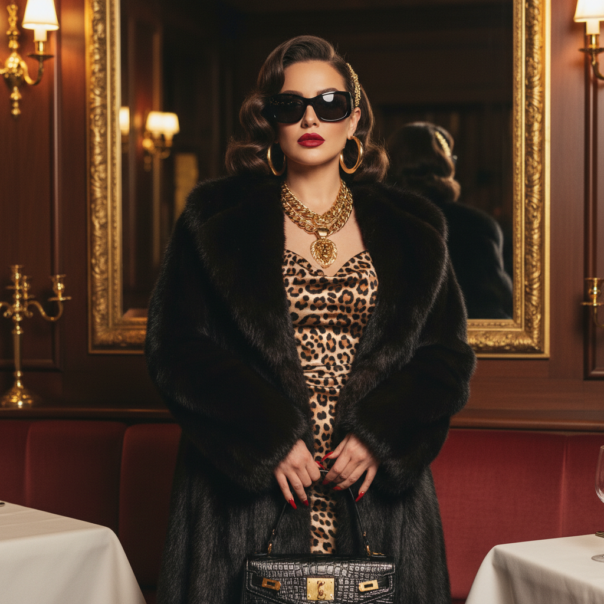

# Mob Wife 黑帮妻子



> **"皮草大衣、金色大耳环、红唇、豹纹——像《黑道家族》里的Carmela一样活着。"**

## 概述

| 维度 | 描述 |
|------|------|
| 时期 | 2024–至今 |
| 别名 | Mob Wife Aesthetic, Soprano Style, Jersey Glam |
| 核心色彩 | 黑色、金色、红色、豹纹、深棕 |
| 关键元素 | 皮草、金色珠宝、豹纹、红唇、大墨镜 |
| 代表人物 | Carmela Soprano、《Mob Wives》真人秀 |
| 关联风格 | Quiet Luxury (反面)、Y2K、Maximalism、Old Money |

---

## 历史脉络

### 从真人秀到 TikTok

| 年份 | 事件 |
|------|------|
| 1999–2007 | 《The Sopranos》定义视觉原型 |
| 2011–2016 | VH1《Mob Wives》真人秀 |
| 2024年1月 | TikTok 用户宣布 "Mob Wife Aesthetic is in" |
| 2024 | 成为对 Clean Girl/Quiet Luxury 的直接反叛 |

### 它反对什么？

| Clean Girl/Quiet Luxury | Mob Wife |
|------------------------|----------|
| 极简 | 极繁 |
| 裸妆 | 浓妆 |
| 无logo | 全是logo |
| 低调 | 高调 |
| "我没化妆" | "我花了2小时化妆" |
| 驼色羊绒 | 黑色皮草 |
| 小金耳环 | 大金耳环 |

### 核心哲学

Mob Wife 的精神是**"我不需要你的认可——我有我自己的钱"**：
- 炫耀不是罪过——是自信
- 女性化可以是强势的
- "低调"是给没底气的人的
- 我的风格我做主
- 豹纹是中性色

---

## 视觉语法

### 色彩系统

```
主色：
  黑色 (#000000) — 权力、皮草
  金色 (#FFD700) — 珠宝、装饰
  红色 (#FF0000) — 唇膏、指甲
  豹纹 — 不是颜色，是态度
  深棕 (#3D2B1F) — 皮革、毛皮

辅色：
  酒红 (#722F37) — 天鹅绒
  白色 (#FFFFFF) — 对比
  翡翠绿 (#50C878) — 宝石

规则：
  - 深色为主
  - 金色大量使用
  - 动物纹理（豹纹、蛇纹）
  - 高对比度
  - 奢华感

质感：
  皮草 — 真或仿
  金属 — 大块金色珠宝
  丝绒 — 深色、奢华
  皮革 — 黑色、光泽
  豹纹 — 无处不在
```

### 标志性元素

| 类别 | 元素 |
|------|------|
| 外套 | 皮草大衣、皮夹克 |
| 珠宝 | 大金耳环、粗金链、金手镯 |
| 妆容 | 红唇、烟熏眼、假睫毛 |
| 配饰 | 大墨镜、名牌包、高跟鞋 |
| 图案 | 豹纹、蛇纹、斑马纹 |
| 态度 | 强势、自信、不在乎别人 |

---

## 与千禧怀旧的关系

### 对 2023 "安静"趋势的反叛
- 2022–23 = Quiet Luxury、Clean Girl、极简
- 2024 = "我受够了安静——我要大声"
- 这是时尚钟摆的自然摆动
- 从"低调"到"高调"的周期

### 与 Y2K 的交叉
- 2000s 的 Paris Hilton/J.Lo = 原版 Mob Wife 精神
- 大金饰、皮草、豹纹 = Y2K 元素
- Mob Wife = Y2K 的"成熟版"

---

## 中国语境

- "黑帮妻子风"在小红书/抖音的讨论
- 与"辣妹风"/"御姐风"的交叉
- 中国版：金色大耳环+皮草+红唇+气场
- 对"极简高级感"的反叛
- "姐就是女王"的态度

---

## 设计应用

| 场景 | 应用方式 |
|------|----------|
| 时尚 | 皮草+金饰+豹纹+红唇+黑色 |
| 品牌 | 金色+黑色+大胆字体+奢华感 |
| 空间 | 天鹅绒+金色+豹纹+水晶灯 |
| 数字 | 深色背景+金色装饰+大胆排版 |

---

## 相关风格

← [Quiet Luxury 静奢](quiet-luxury.md) | [Maximalism 极繁主义](maximalism.md) →

↑ [返回千禧怀旧目录](README.md) | [返回总目录](../README.md)
