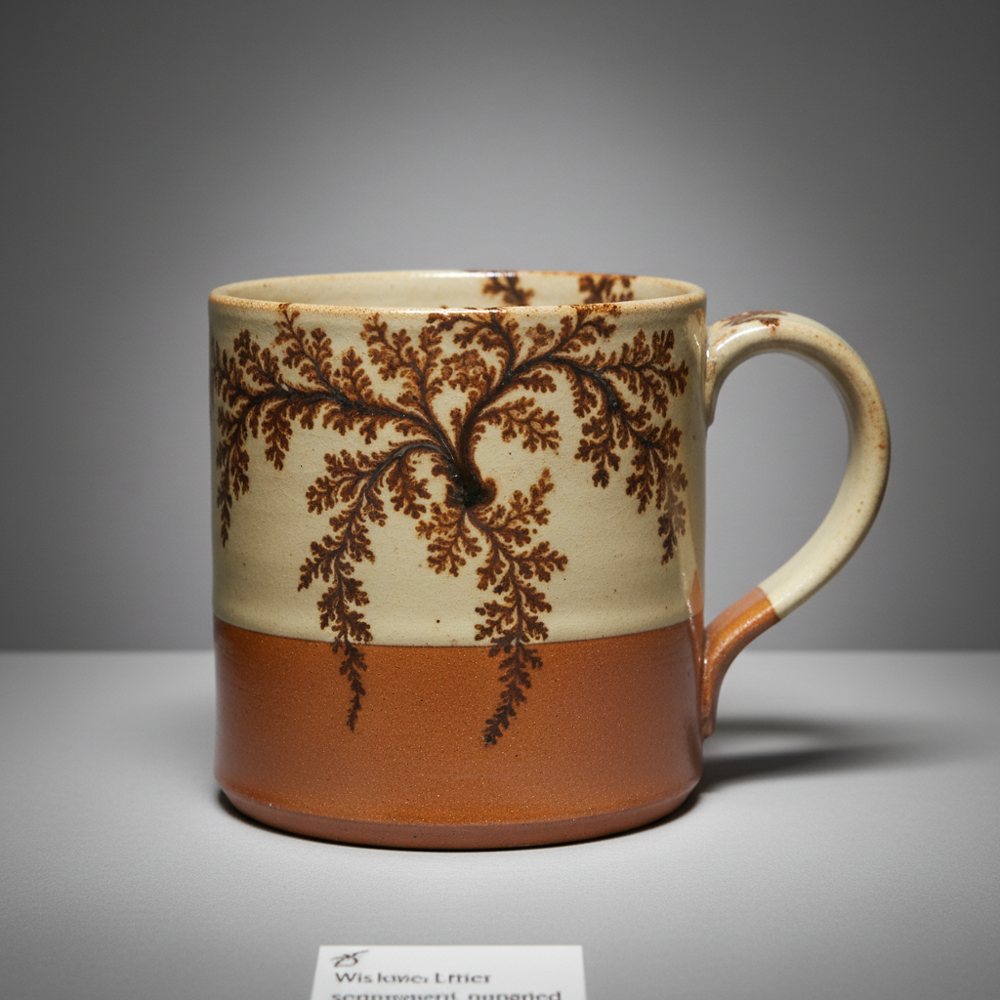

# Mocha Ware Art 摩卡陶艺术

> "Mocha ware is chemistry painting itself — a drop of acidic tobacco juice or iron-rich 'tea' touched onto wet alkaline slip, the acid reacting instantly with the base to spread outward in branching dendritic patterns that look exactly like trees, ferns, or moss growing across the surface, nature's own fractal geometry reproduced by the simple meeting of two incompatible liquids on a spinning pot." — Unknown

## 概述

摩卡陶艺术（Mocha Ware Art）是一种利用酸碱反应在湿润的化妆土表面产生树枝状（树突状）图案的陶瓷装饰技法。将酸性的"摩卡茶"（通常由烟草汁、铁锈水或啤酒花提取物制成）滴在刚施好的碱性湿润化妆土上——酸碱反应使色料瞬间向外扩散，形成如树木、蕨类或苔藓般的分枝图案。这种效果完全由化学反应自动产生，是自然界分形几何的完美再现。

摩卡陶艺术的核心要素包括：1）碱性化妆土——湿润的碱性白色化妆土底层；2）酸性色料——含酸的深色"摩卡茶"；3）酸碱反应——酸碱接触产生的化学扩散；4）树突图案——自动形成的树枝状图案；5）即时性——反应在几秒内完成；6）不可控——图案由化学反应自动生成；7）自然美——如自然界植物的分形图案。

## 核心特征

| 特征 | 描述 |
|------|------|
| 化学反应 | 酸碱反应产生的图案 |
| 树突图案 | 如树枝般的分枝图案 |
| 自动生成 | 图案由化学反应自动形成 |
| 即时完成 | 几秒内完成的装饰 |
| 分形美学 | 自然界分形几何的再现 |
| 不可复制 | 每次反应的图案都不同 |

## 视觉特征

- **树枝图案**：如树木分枝的图案
- **蕨类形态**：如蕨类植物的叶片
- **苔藓质感**：如苔藓生长的纹理
- **深浅对比**：深色图案在浅色底上
- **分形结构**：自相似的分形几何
- **自然美感**：如自然界植物的美

## 代表作品

| 作品 | 艺术家/文化 | 年代 | 意义 |
|------|-------------|------|------|
| *英国摩卡陶杯* | 英国 | 18-19世纪 | 英国摩卡陶传统 |
| *摩卡陶量杯* | 英国 | 19世纪 | 实用摩卡陶器 |
| *法国摩卡陶* | 法国 | 19世纪 | 法国摩卡传统 |
| *当代摩卡陶* | 各地陶艺家 | 当代 | 摩卡陶的现代复兴 |
| *摩卡陶实验* | 当代陶艺家 | 当代 | 摩卡技法的实验探索 |

## 历史时间线

| 时期 | 事件 |
|------|------|
| 1780年代 | 英国开始生产摩卡陶 |
| 19世纪 | 摩卡陶在英法广泛生产 |
| 19世纪末 | 摩卡陶生产逐渐衰落 |
| 20世纪末 | 陶艺家重新发现摩卡技法 |
| 当代 | 摩卡陶作为艺术技法的复兴 |

## 中国语境

摩卡陶技法在中国是相对新颖的引入，但其"化学自动生成图案"的原理与中国传统的"窑变"概念有精神上的相通——都是利用化学反应产生不可预测的美丽效果。中国当代陶艺工作坊中，摩卡陶作为一种科学与艺术结合的技法受到关注。它的树突图案与中国传统绘画中的"枯木寒林"题材有视觉上的相似。摩卡陶也被用于陶艺教育中的科学实验——让学生理解酸碱反应如何产生艺术效果。

## AI生成概念图

## 与其他风格的关系

- **Slip Decoration** → 化妆土装饰
- **Dendritic Art** → 树突艺术
- **Fractal Art** → 分形艺术
- **Science Art** → 科学与艺术
- **Nature Art** → 自然艺术
- **Folk Pottery** → 民间陶器

---

*浮光艺志 | Chronicle of Artistry*
