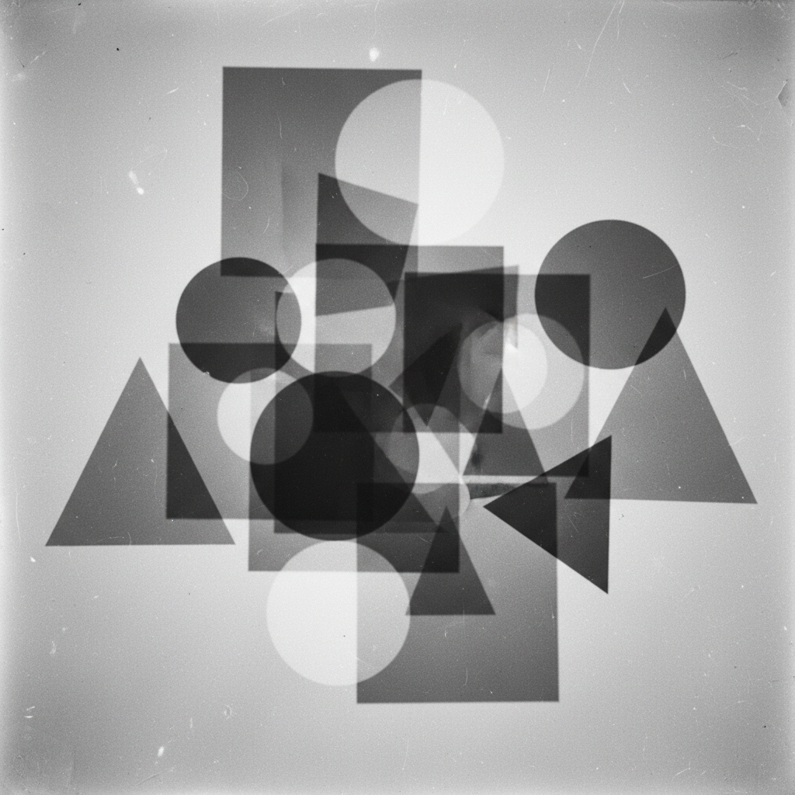

# László Moholy-Nagy 莫霍利-纳吉

> "The enemy of photography is the convention." — László Moholy-Nagy

## 概述

拉斯洛·莫霍利-纳吉（László Moholy-Nagy，1895–1946）是匈牙利裔艺术家和包豪斯教师，横跨绘画、摄影、雕塑、电影和设计的多媒体先驱。他以"光的艺术"理念闻名——光影实验（Photogram）、动态雕塑（Light-Space Modulator）和革命性的排版设计，将技术与艺术的边界彻底打破。

## 核心特征

| 特征 | 描述 |
|------|------|
| 光影实验 | Photogram——无相机摄影 |
| 动态雕塑 | 光与运动的机械装置 |
| 透明叠加 | 多层透明材料的空间感 |
| 新视觉 | 极端角度和微距摄影 |
| 跨媒介 | 绘画、摄影、电影、设计的融合 |
| 包豪斯教学 | 基础课程的革新者 |

## 代表作品

| 作品 | 年代 | 意义 |
|------|------|------|
| *Light-Space Modulator* | 1922–30 | 动态光影雕塑的先驱 |
| *Photogram* series | 1922–43 | 无相机摄影的经典 |
| *A 19* | 1927 | 几何抽象绘画 |
| *Vision in Motion* | 1947 | 设计教育的圣经 |

## AI生成概念图

## 与其他风格的关系

- **Bauhaus** → 包豪斯金属工坊和基础课教师
- **Constructivism** → 受俄国构成主义影响
- **Kinetic Art** → 动态艺术的先驱
- **New Bauhaus/IIT** → 芝加哥设计学院创始人
