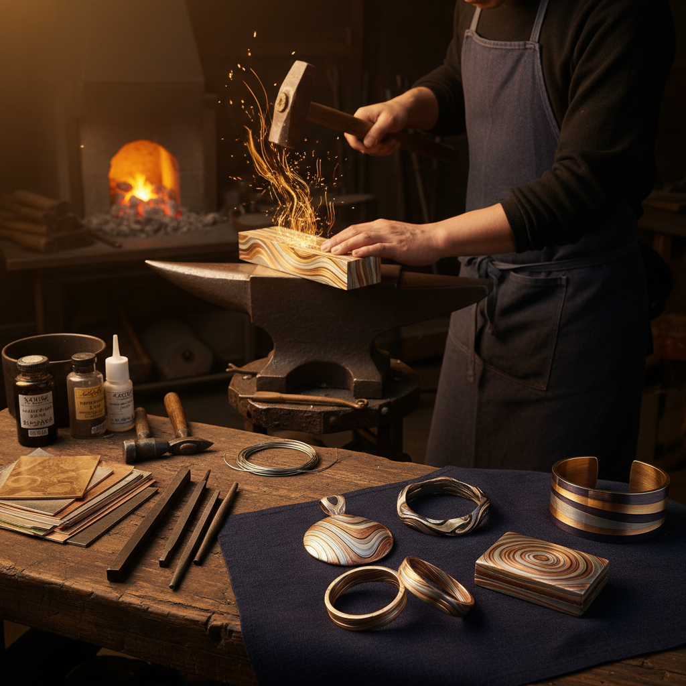

# Mokume-gane Art 木目金艺术

> "Mokume-gane — 'wood-grain metal' — is alchemy made visible. Layers of different colored metals are fused together under heat and pressure, then carved, twisted, and forged until their cross-sections reveal flowing patterns that mimic the grain of wood or the layers of geological strata. Each piece is unique and unrepeatable, a frozen moment in the flow of molten metal." — Unknown

## 概述

木目金艺术（Mokume-gane Art）是一种源自17世纪日本的金属锻造技法——将不同颜色的金属薄片（如金、银、铜、赤铜等）层叠焊接在一起，然后通过锻造、雕刻和扭转等手法使不同金属层暴露出来，形成类似木纹的自然流动图案。"木目金"在日语中意为"木纹金属"。

木目金艺术的实践包括：1）传统木目金——使用贵金属的日本传统技法；2）刀装木目金——日本刀装具上的木目金装饰；3）珠宝木目金——当代珠宝中的木目金戒指和首饰；4）铜合金木目金——使用铜基合金的木目金；5）当代木目金——将传统技法与现代设计结合的创作；6）工业木目金——功能性梯度材料的工业应用。

## 核心特征

| 特征 | 描述 |
|------|------|
| 层叠 | 多层金属的融合 |
| 木纹 | 类似木纹的图案 |
| 独特 | 每件作品独一无二 |
| 贵金属 | 传统使用贵金属 |
| 锻造 | 复杂的锻造工艺 |
| 日本 | 源自日本的技法 |

## 视觉特征

- **流动**：自然流动的金属纹理
- **层次**：不同金属的色彩层次
- **对比**：金银铜的色彩对比
- **有机**：类似自然界的纹理
- **深度**：多层金属的深度感
- **温润**：贵金属的温润光泽

## 代表作品

| 作品 | 艺术家/文化 | 年代 | 意义 |
|------|-------------|------|------|
| *Denbei Shoami tsuba* | 正阿弥伝兵衛 | 1650s | 木目金的发明者 |
| *Edo period sword fittings* | 江户时代 | 17-19世纪 | 刀装具木目金 |
| *George Sawyer rings* | George Sawyer | 当代 | 当代木目金珠宝 |
| *James Binnion works* | James Binnion | 当代 | 当代木目金大师 |
| *Alistair McCallum* | Alistair McCallum | 当代 | 英国木目金艺术家 |

## 历史时间线

| 时期 | 事件 |
|------|------|
| 1650年代 | 正阿弥伝兵衛发明木目金 |
| 江户时代 | 刀装具木目金的繁荣 |
| 明治维新 | 武士刀衰落，木目金转型 |
| 1970年代 | 西方珠宝界重新发现木目金 |
| 当代 | 木目金在全球珠宝界的复兴 |

## 中国语境

木目金艺术虽然源自日本，但在中国当代金属工艺中正获得越来越多的关注。中国的珠宝设计师开始学习和实践木目金技法——将其作为高端定制珠宝的特色工艺。中国的金属工艺教育中，木目金被纳入一些艺术院校的课程——作为金属锻造的高级技法教学。中国传统的金属工艺中有类似的"叠打"技法——虽然不完全相同，但体现了类似的多层金属加工理念。中国的一些独立珠宝品牌将木目金与中国传统美学结合——创造具有东方韵味的木目金首饰。中国的金属工艺研究者也在探索木目金的材料科学基础——研究不同金属组合的扩散焊接机理。中国的婚戒定制市场中，木目金戒指作为独一无二的选择正在获得年轻消费者的青睐。

## AI生成概念图

## 与其他风格的关系

- **Damascus Steel** → 大马士革钢
- **Metalsmithing** → 金属锻造
- **Japanese Art** → 日本艺术
- **Jewelry Art** → 珠宝艺术
- **Shibuichi** → 四分一合金
- **Shakudo** → 赤铜合金

---

*浮光艺志 | Chronicle of Artistry*
