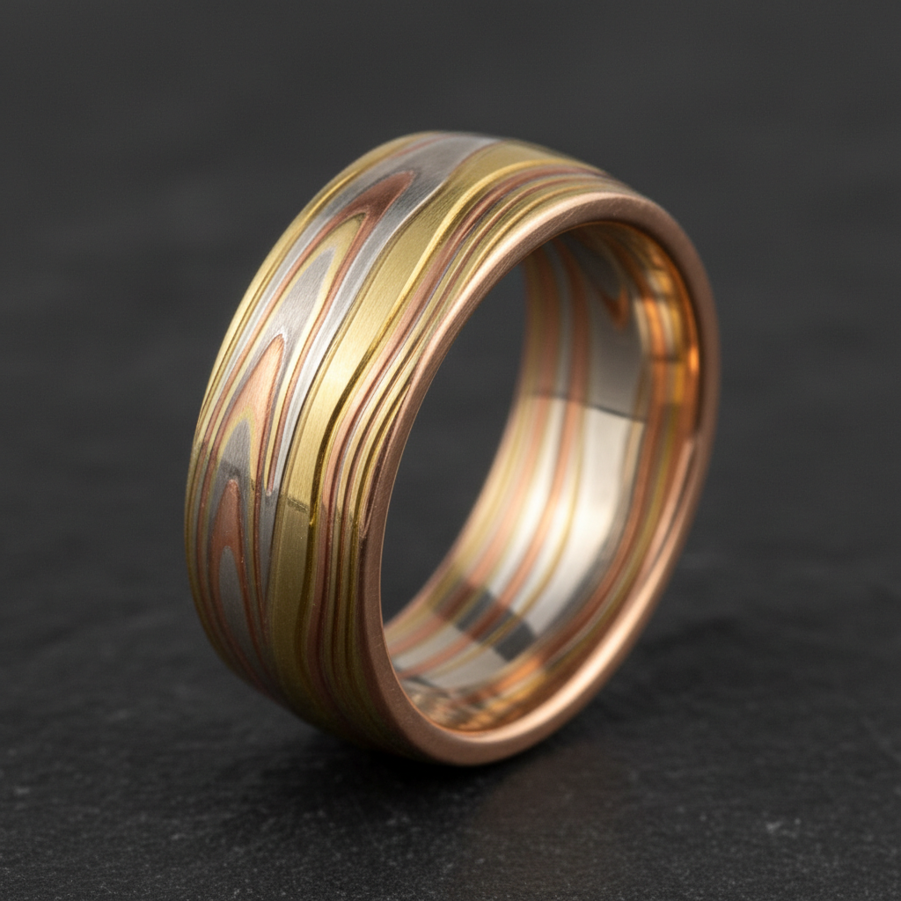

# Mokume-gane Jewelry Art 木目金珠宝艺术

> "Mokume-gane is the metallurgist's woodgrain — layers of different colored metals are fused together under heat and pressure, then carved, twisted, and forged until the laminations reveal organic patterns that echo the growth rings of ancient trees. Born in 17th-century Japan as a technique for decorating samurai sword fittings, it transforms cold metal into something that appears to have grown naturally, layer by patient layer." — Unknown

## 概述

木目金珠宝艺术（Mokume-gane Jewelry Art）是一种源自日本的金属层压锻造技法——将不同颜色的金属薄片层叠焊接在一起，然后通过雕刻、扭转和锻打使内部层次暴露出来，形成类似木纹的自然图案。Mokume-gane（日语"木目金"，意为"木纹金属"）最初用于装饰武士刀的刀镡（tsuba），现已成为高端珠宝设计中备受推崇的技法。

木目金珠宝艺术的实践包括：1）层叠——将不同金属薄片交替堆叠；2）扩散焊接——在高温高压下使金属层融合；3）锻打——反复锻打使金属层变薄；4）雕刻——在表面雕刻凹槽暴露内层；5）扭转——扭转金属块改变纹理方向；6）成型——将木目金材料制成珠宝；7）蚀刻——用酸蚀刻增强层次对比。

## 核心特征

| 特征 | 描述 |
|------|------|
| 层压 | 多层金属的融合 |
| 木纹 | 类似木纹的图案 |
| 日本 | 源自日本的传统 |
| 独特 | 每件图案都独一无二 |
| 对比 | 不同金属的色彩对比 |
| 有机 | 有机自然的纹理 |

## 视觉特征

- **纹理**：类似木纹的层次纹理
- **色彩**：不同金属的色彩对比
- **有机**：有机流动的图案
- **深度**：多层次的视觉深度
- **独特**：每件作品的独特图案
- **温暖**：温暖自然的金属质感

## 代表作品

| 作品 | 艺术家/文化 | 年代 | 意义 |
|------|-------------|------|------|
| *Samurai tsuba* | 日本 | 17世纪 | 武士刀镡装饰 |
| *Denbei Shoami works* | 正阿弥伝兵衛 | 1600年代 | 木目金的发明者 |
| *George Sawyer rings* | 美国 | 当代 | 当代木目金珠宝 |
| *Alistair McCallum works* | 英国 | 当代 | 当代木目金大师 |
| *Contemporary mokume-gane* | 国际 | 当代 | 当代木目金发展 |

## 历史时间线

| 时期 | 事件 |
|------|------|
| 17世纪 | 正阿弥伝兵衛发明木目金 |
| 江户时代 | 用于武士刀装饰 |
| 明治时代 | 随武士文化衰落而式微 |
| 1970年代 | 西方珠宝界重新发现 |
| 当代 | 成为高端珠宝的重要技法 |

## 中国语境

木目金艺术在中国的认知正在增长。中国的珠宝设计师开始学习和应用木目金技法——将其视为一种高端的金属装饰工艺。中国的一些珠宝工作室开始提供木目金定制服务——特别是在婚戒和高端首饰领域。中国的金属工艺传统中有类似的层压技法——如大马士革钢的花纹锻造。中国的珠宝教育中开始引入木目金课程——作为金属工艺的高级技法。中国的消费者对木目金珠宝的兴趣日益增长——因为每件作品的独特性和手工价值。中国的一些艺术家将木目金与中国传统金属工艺结合——创造出具有东方美学的木目金作品。

## AI生成概念图

## 与其他风格的关系

- **Damascus Steel** → 大马士革钢
- **Japanese Metalwork** → 日本金属工艺
- **Jewelry Design** → 珠宝设计
- **Forging** → 锻造工艺
- **Lamination** → 层压技术
- **Patination** → 着色工艺

---

*浮光艺志 | Chronicle of Artistry*
