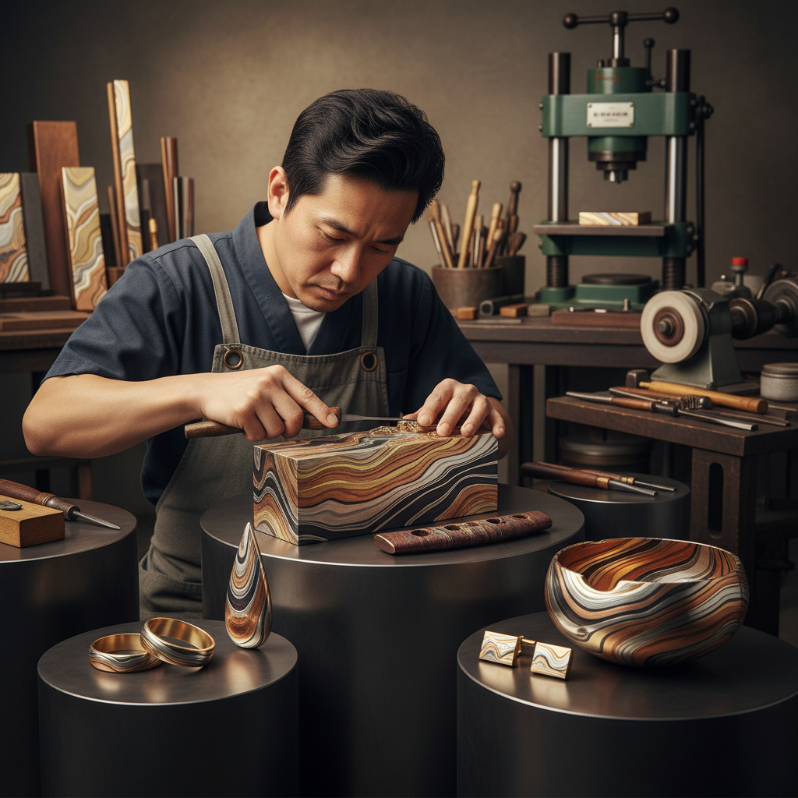

# Mokume-gane 木目金

> "Mokume-gane is geology in miniature — layers of different metals fused, carved, and manipulated to reveal patterns that echo the grain of wood or the strata of ancient stone." — Unknown

## 概述

木目金（Mokume-gane，日语意为"木纹金属"）是一种日本传统的金属加工技法——将多层不同颜色的金属（如金、银、铜、赤铜shakudo、四分一shibuichi等）叠压在一起，通过扩散焊接（diffusion bonding）使其融合为一体，然后通过雕刻、锻打和展平来露出不同层次的金属，形成类似木纹的图案。

木目金的原理类似于大马士革钢（Damascus steel）——但使用的是有色金属而非钢铁，目的是装饰而非功能。木目金最初由17世纪日本的刀剑装具工匠发明——用于装饰刀镡（tsuba）和其他刀剑配件。当代，木目金主要用于高端首饰制作——特别是婚戒，其独特的层状图案使每一件作品都是独一无二的。

## 核心特征

| 特征 | 描述 |
|------|------|
| 多层 | 多层不同金属 |
| 焊接 | 扩散焊接融合 |
| 木纹 | 类似木纹的图案 |
| 独特 | 每件作品独一无二 |
| 日本 | 日本传统技法 |
| 贵金属 | 使用贵金属 |

## 视觉特征

- **层状**：可见的层状结构
- **木纹**：类似木纹的图案
- **多色**：多种金属色彩
- **有机**：有机的自然图案
- **对比**：不同金属的色彩对比
- **独特**：每件都不同

## 代表作品

| 作品 | 艺术家 | 年代 | 意义 |
|------|--------|------|------|
| *Mokume-gane tsuba* | 正阿弥伝兵衛 | 17世纪 | 最早的木目金刀镡 |
| *Japanese sword fittings* | 日本工匠 | 江户时代 | 刀剑装具 |
| *Contemporary mokume rings* | Various | 当代 | 当代木目金戒指 |
| *Mokume-gane vessels* | Various | 当代 | 木目金器皿 |
| *Mixed metal mokume jewelry* | Various | 当代 | 混合金属首饰 |

## 历史时间线

| 时期 | 事件 |
|------|------|
| 1658 | 正阿弥伝兵衛发明木目金 |
| 江户时代 | 木目金在刀剑装具中的应用 |
| 明治维新 | 刀剑禁令后技法的衰落 |
| 1970s | 西方金属工匠的重新发现 |
| 1990s | 木目金婚戒的流行 |
| 当代 | 全球木目金艺术家社区 |

## 中国语境

木目金在中国的高端首饰设计领域有一定的知名度——一些中国的独立首饰设计师学习并使用木目金技法。中国的珠宝设计教育中开始引入木目金课程。中国的一些高端定制婚戒品牌提供木目金戒指选项。木目金的"每件独一无二"特性符合当代中国消费者对个性化和独特性的追求。中国的金属工艺爱好者社区中有关于木目金的讨论和教程分享。

## AI生成概念图

## 与其他风格的关系

- **Damascus Steel** → 大马士革钢
- **Shibuichi** → 四分一
- **Shakudo** → 赤铜
- **Metalsmithing** → 金属锻造
- **Jewelry Making** → 首饰制作
- **Japanese Metalwork** → 日本金属工艺

---

*浮光艺志 | Chronicle of Artistry*
