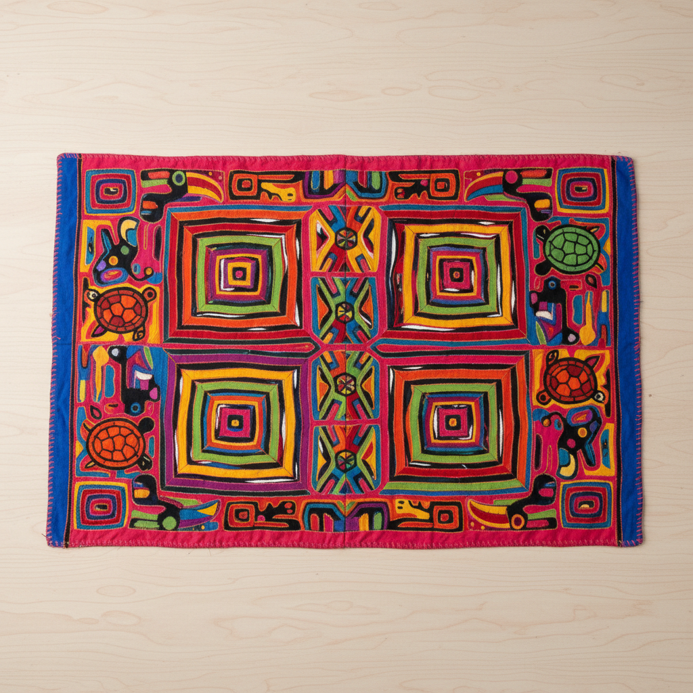

# Mola Art 莫拉艺术

> "A mola is a textile painting made with scissors and needle — the Kuna women of Panama's San Blas Islands stack layers of brightly colored cotton, then cut channels through each layer to reveal the colors beneath, creating designs of astonishing complexity where every line is actually an edge of fabric turned under with surgical precision." — Unknown

## 概述

莫拉艺术（Mola Art）是巴拿马库纳族（Guna/Kuna）妇女创造的传统反贴布纺织艺术——通过在多层鲜艳棉布上剪切并缝合，露出不同层次的颜色来创造复杂的图案。莫拉是库纳族妇女传统服装（blouse）的前后面板，以其鲜艳的色彩、复杂的几何和有机图案以及精湛的技艺著称。

莫拉艺术的实践包括：1）多层反贴布——在2-7层不同颜色的布上剪切；2）窄通道——极窄的色彩通道（约3mm）；3）对称设计——镜像对称的图案设计；4）自然主题——动物、植物和海洋生物图案；5）几何图案——抽象几何的填充图案；6）当代主题——融入现代生活元素的设计；7）精细缝合——极其精细的隐藏针脚。

## 核心特征

| 特征 | 描述 |
|------|------|
| 反贴布 | 多层反贴布技法 |
| 鲜艳 | 极其鲜艳的色彩 |
| 复杂 | 极其复杂的图案 |
| 库纳 | 库纳族的传统 |
| 对称 | 对称的设计结构 |
| 精细 | 极其精细的工艺 |

## 视觉特征

- **色彩**：鲜艳饱和的多层色彩
- **复杂**：极其复杂的图案结构
- **通道**：窄色彩通道的特征
- **对称**：严格的对称设计
- **填充**：密集的背景填充
- **生动**：生动的自然主题

## 代表作品

| 作品 | 艺术家/文化 | 年代 | 意义 |
|------|-------------|------|------|
| *Traditional Kuna molas* | 库纳族 | 传统 | 传统库纳莫拉 |
| *Animal molas* | 库纳族 | 传统 | 动物主题莫拉 |
| *Geometric molas* | 库纳族 | 传统 | 几何图案莫拉 |
| *Contemporary molas* | 库纳族 | 当代 | 当代主题莫拉 |
| *Museum collection molas* | 库纳族 | 各时期 | 博物馆收藏莫拉 |

## 历史时间线

| 时期 | 事件 |
|------|------|
| 19世纪中 | 莫拉从身体彩绘转向纺织 |
| 19世纪末 | 莫拉技法的成熟 |
| 20世纪初 | 莫拉的国际认知 |
| 1925年 | 库纳革命保护文化自主 |
| 当代 | 莫拉的艺术收藏和文化保护 |

## 中国语境

莫拉与中国少数民族的反贴布传统有深刻的共鸣。中国苗族的反贴布（Pa Ndau）与莫拉在技法上高度相似——都是多层剪切露出不同颜色的反贴布。中国西南少数民族的纺织传统中，鲜艳色彩和复杂图案——与莫拉的美学追求一致。中国的纤维艺术研究中，莫拉作为世界反贴布艺术的巅峰——常被用来与中国苗族反贴布进行比较。中国的博物馆和收藏家对莫拉有一定的关注——作为世界民族纺织艺术的重要代表。中国的设计教育中，莫拉作为反贴布技法的经典案例——在纺织设计课程中被介绍。

## AI生成概念图

## 与其他风格的关系

- **Reverse Appliqué** → 反贴布
- **Hmong Textile** → 苗族纺织
- **Folk Art** → 民间艺术
- **Textile Art** → 纺织艺术
- **Indigenous Art** → 原住民艺术
- **Color Theory** → 色彩理论

---

*浮光艺志 | Chronicle of Artistry*
