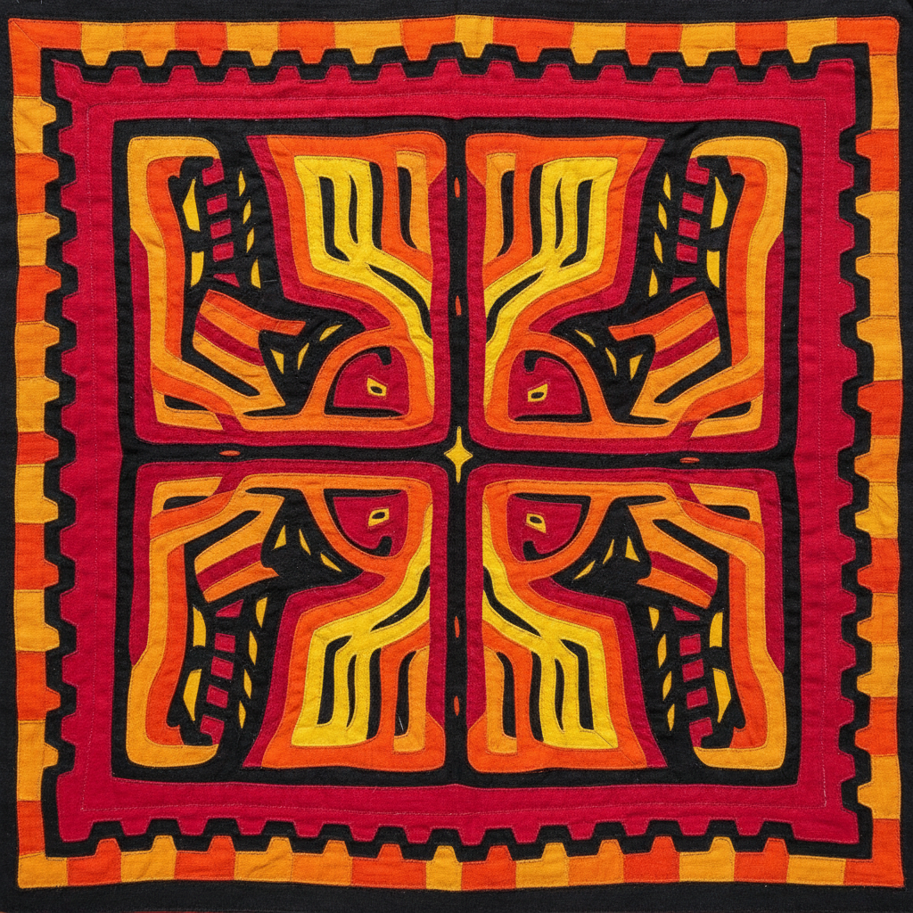

# Mola 莫拉 | Mola / Morra

> **"反向的拼布——库纳族女性用剪刀和针线在多层布料中'挖掘'出迷宫般的彩色图案。"**

## 概述

Mola（莫拉）是巴拿马和哥伦比亚的库纳族（Guna / Kuna）女性创作的传统反向贴布绣（reverse appliqué）艺术。与普通贴布绣在底布上缝加布料不同，Mola是将多层不同颜色的布料叠在一起，然后从上层开始逐层剪开并翻折缝合，露出下层的颜色，形成多层次的彩色图案。一件精美的Mola可能有5-7层布料，需要数周到数月完成。Mola是库纳族女性的日常服装（胸前和背后各一块），也是她们身份和艺术才华的展示。

## 核心特征

- **反向贴布绣**：从上层剪开露出下层
- **多层布料**：5-7层不同颜色
- **逐层剪切**：每层露出不同颜色
- **手工缝合**：极精细的翻折缝合
- **对称设计**：左右或上下对称
- **日常服装**：库纳族女性的衣服

## 常见题材

| 题材 | 特征 |
|------|------|
| 动物 | 鸟、鱼、海龟 |
| 植物 | 花卉、树木 |
| 几何 | 迷宫般的抽象图案 |
| 日常生活 | 现代物品 |
| 神话 | 传统故事 |
| 政治/流行 | 当代主题 |

## 视觉特征

- 多层色彩的深度感
- 迷宫般的线条通道
- 鲜艳的对比色组合
- 精密的手工缝合
- 对称的构图
- 平面化的图案设计

## 与其他风格的关系

| 风格 | 关系 |
|------|------|
| Patchwork拼布 | 共享布料拼接传统 |
| Paper Cutting剪纸 | 共享剪切和层次 |
| Aboriginal Art | 共享原住民当代艺术 |
| Pop Art | Mola的当代主题 |
| 当代纤维艺术 | Mola的全球影响 |

## 概念图

---

*浮光艺志 | Chronicle of Artistry*
