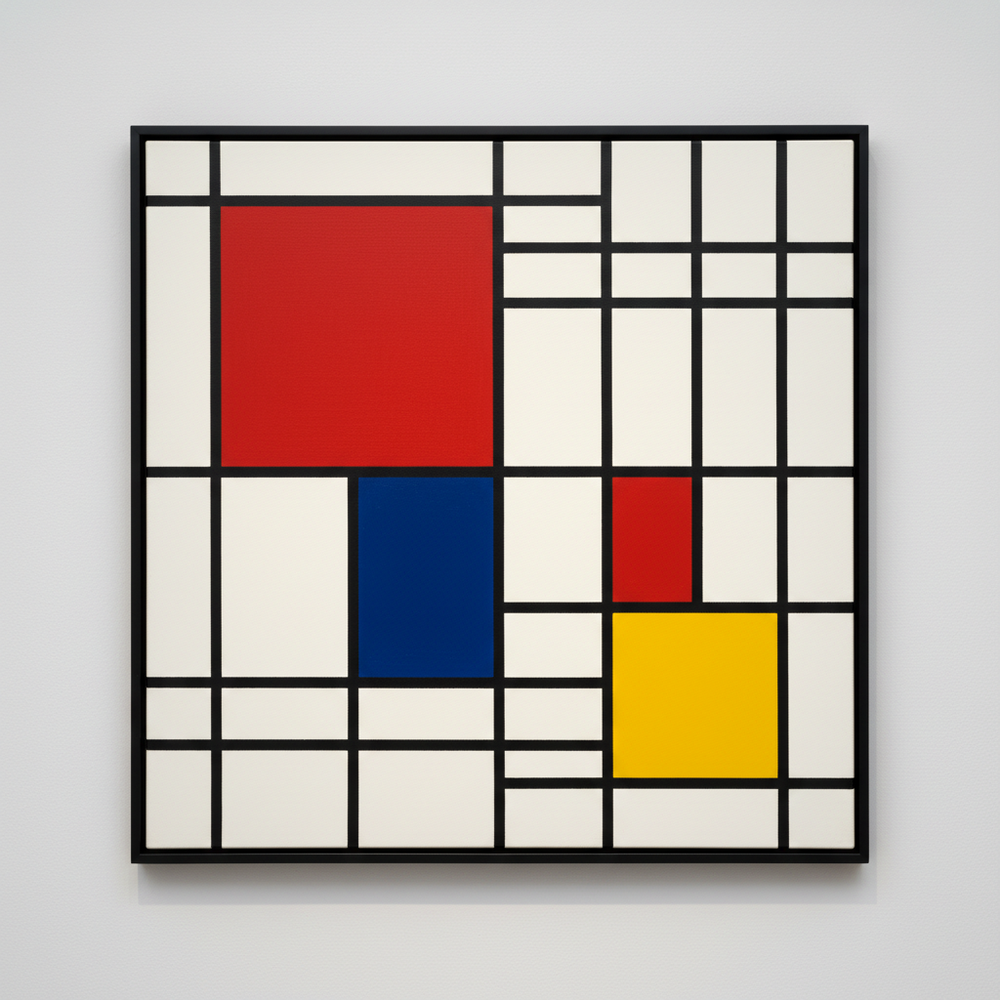

# Piet Mondrian 蒙德里安

> "The position of the artist is humble. He is essentially a channel." — Piet Mondrian

## 概述

皮特·蒙德里安（Piet Mondrian，1872–1944）是荷兰画家，新造型主义（De Stijl）的创始人之一。他将绘画简化为最基本的元素——水平线、垂直线、三原色加黑白灰——创造出纯粹的视觉和谐，深刻影响了现代设计、建筑和时尚。

## 核心特征

| 特征 | 描述 |
|------|------|
| 网格结构 | 严格的水平与垂直黑线 |
| 三原色 | 仅使用红、黄、蓝 |
| 非对称平衡 | 不等分的矩形创造动态均衡 |
| 白色空间 | 大面积留白作为积极元素 |
| 去除曲线 | 完全排斥对角线和曲线 |
| 精神追求 | 通过纯粹形式达到宇宙和谐 |

## 代表作品

| 作品 | 年代 | 意义 |
|------|------|------|
| *Composition with Red, Blue, and Yellow* | 1930 | 新造型主义的经典 |
| *Broadway Boogie Woogie* | 1942–43 | 纽约爵士的视觉翻译 |
| *Victory Boogie Woogie* | 1942–44 | 未完成的遗作 |
| *Gray Tree* | 1911 | 从具象到抽象的过渡 |

## AI生成概念图

## 与其他风格的关系

- **De Stijl** → 风格派运动的核心理论家
- **Bauhaus** → 影响了包豪斯的设计理念
- **Minimalism** → 极简主义的精神先驱
- **Kandinsky** → 同为抽象艺术先驱，但路径不同
