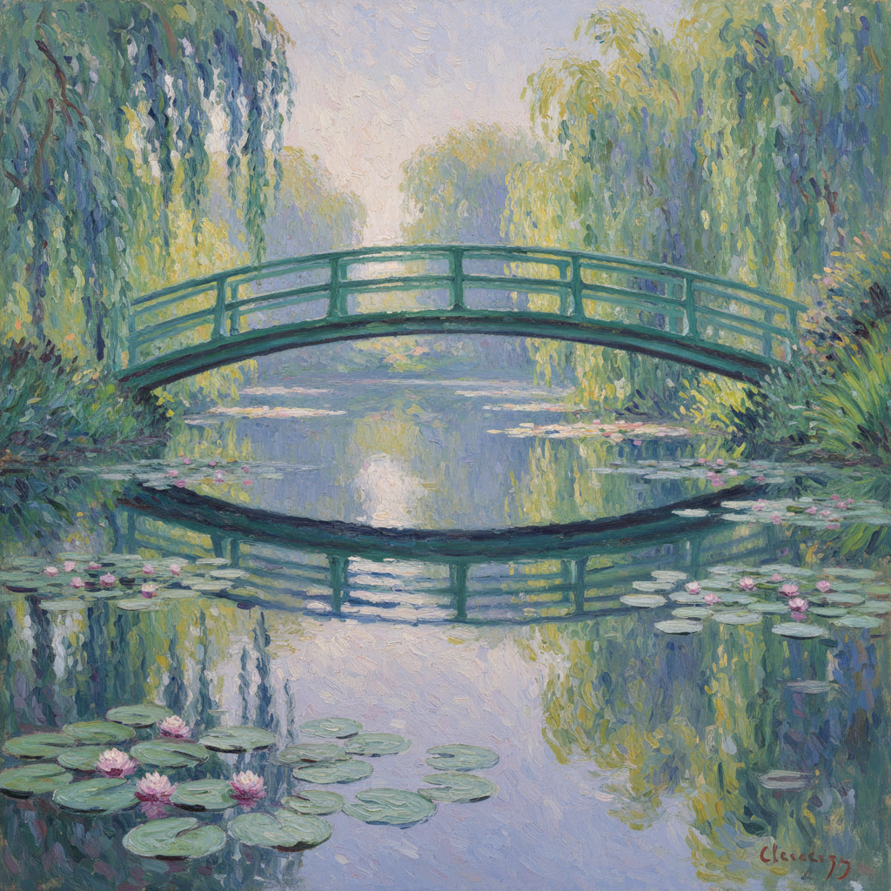

# Claude Monet 莫奈

> "I would like to paint the way a bird sings." — Claude Monet

## 概述

克劳德·莫奈（Claude Monet，1840–1926）是法国印象派的创始人和最纯粹的实践者。他的画作《印象·日出》（1872）直接为"印象派"命名。莫奈毕生追求一个目标：捕捉光线在不同时刻、不同季节、不同天气下对同一景物的瞬间效果。

从塞纳河畔的帆船到吉维尼花园的睡莲，莫奈将户外写生推向极致，晚年的巨幅睡莲系列更被视为抽象表现主义的先驱。

## 核心特征

| 特征 | 描述 |
|------|------|
| 系列创作 | 同一主题在不同光线下反复描绘（干草堆、教堂、睡莲） |
| 瞬间光线 | 捕捉特定时刻的光照效果 |
| 色彩分析 | 阴影中发现紫色、蓝色而非黑色 |
| 户外完成 | 坚持在自然光下完成作品 |
| 笔触可见 | 短促的、逗号般的色彩笔触 |
| 水面反射 | 对水面光影反射的极致表现 |

## 视觉特征

- **笔触**：短促、跳跃、方向多变的色彩笔触
- **色彩**：高明度、高饱和度，阴影中有蓝紫色
- **光线**：特定时刻的瞬间光照
- **边缘**：柔和模糊，物体融入光线
- **水面**：光影碎片在水面跳动
- **构图**：自然裁切，日本影响的不对称

## 代表作品

| 作品 | 年代 | 意义 |
|------|------|------|
| *Impression, Sunrise* | 1872 | 为印象派命名的画作 |
| *Haystacks* 系列 | 1890-91 | 系列创作的典范——30幅干草堆 |
| *Rouen Cathedral* 系列 | 1892-94 | 光线改变建筑——同一立面30+幅 |
| *Water Lilies* 系列 | 1896-1926 | 250+幅睡莲，晚年巨作 |
| *The Japanese Bridge* | 1899 | 吉维尼花园的标志 |
| *Women in the Garden* | 1866 | 早期外光画代表 |

## 真实作品（公共领域）

莫奈的作品已进入公共领域：

| 作品 | 来源 |
|------|------|
| *Impression, Sunrise* | [Musée Marmottan](https://www.marmottan.fr/) / [Wikimedia](https://commons.wikimedia.org/wiki/File:Monet_-_Impression,_Sunrise.jpg) |
| *Water Lilies (1906)* | [Art Institute of Chicago](https://www.artic.edu/artworks/16568) |
| *Haystacks (End of Summer)* | [Musée d'Orsay](https://www.musee-orsay.fr/) |

> ⚠️ 本条目优先使用真实作品。如需本地图片，请从上述来源手动下载后放入 `assets/artworks/monet/` 并压缩。

## AI生成概念图（备用）

## 创作分期

| 时期 | 年代 | 特点 |
|------|------|------|
| 早期 | 1860s | 受马奈和库尔贝影响，外光画探索 |
| 印象派鼎盛 | 1870s-80s | 阿让特伊时期，塞纳河系列 |
| 系列时期 | 1890s | 干草堆、教堂、白杨树系列 |
| 吉维尼晚期 | 1900-1926 | 睡莲、日本桥，走向抽象 |

## 与其他风格的关系

- **Plein Air** → 外光画的最著名实践者
- **Japonisme** → 深受浮世绘构图影响，建造日本花园
- **Impressionism** → 运动的命名者和最纯粹代表
- **Abstract Expressionism** → 晚期睡莲预示了抽象表现主义
- **Turner** → 在伦敦看到透纳后深受启发
- **Divisionism** → 印象派笔触是分割主义的先驱

---

*浮光艺志 | Chronicle of Artistry*
