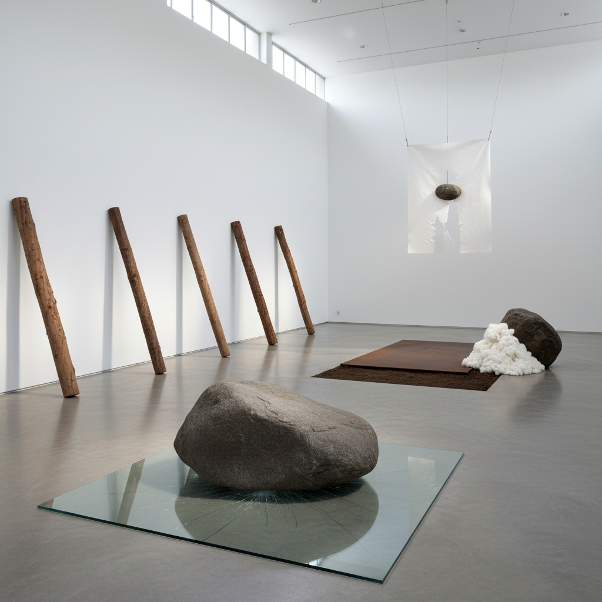

# Mono-ha Art 物派艺术

> "Mono-ha — the School of Things — asked the simplest and most radical question in art: what happens when you stop making and start encountering? When you place a stone on a sheet of glass and let the weight speak, when you lean raw timber against a wall and attend to the relationship, when you lay iron plates on the earth and notice how ground and metal negotiate their boundary, when the artist becomes not a creator but an arranger of encounters between materials that already possess their own eloquence, their own gravity, their own truth — this is not minimalism's industrial reduction but something more tender, more attentive, more Japanese in its respect for the thingness of things." — Unknown

## 概述

物派（もの派 / Mono-ha，字面意为"物的学派"）是1960年代末至1970年代初在日本兴起的一个重要艺术运动，代表艺术家包括关根伸夫（Sekine Nobuo）、李禹焕（Lee Ufan）、�的原有辅（Enokura Kōji）、小清水渐（Koshimizu Susumu）和吉田克朗（Yoshida Katsurō）。物派艺术家使用未经加工的自然和工业材料——石头、木材、铁板、玻璃、棉花、水、土——通过简单的并置和排列来揭示材料本身的存在和关系。

物派的核心理念是"遭遇"（encounter）——不是艺术家对材料的征服或转化，而是材料之间、材料与空间之间的相遇和对话。李禹焕作为物派的主要理论家，提出了"关系性"（relationality）的概念——艺术不在于创造新的对象，而在于揭示已经存在的关系。物派受到了海德格尔现象学、禅宗思想和日本传统美学的影响。

## 核心特征

| 特征 | 描述 |
|------|------|
| 物质 | 未加工的材料 |
| 关系 | 材料间的关系 |
| 遭遇 | 遭遇而非创造 |
| 自然 | 自然材料的使用 |
| 空间 | 空间的意识 |
| 减法 | 最少的人为干预 |

## 视觉特征

- **石头**：天然石头的放置
- **铁板**：工业铁板和钢材
- **木材**：原木和木板
- **玻璃**：玻璃板的使用
- **并置**：材料的简单并置
- **空间**：对空间的敏感

## 代表作品

| 作品 | 艺术家 | 年代 | 意义 |
|------|--------|------|------|
| *Phase—Mother Earth* | Sekine Nobuo | 1968 | 关根伸夫的土柱 |
| *Relatum* | Lee Ufan | 1968起 | 李禹焕的关系项 |
| *Situation* | Enokura Kōji | 1970年代 | 榎仓康二的状况 |
| *From Surface to Surface* | Koshimizu Susumu | 1971 | 小清水渐的表面 |
| *Cut-off* | Yoshida Katsurō | 1969 | 吉田克朗的切断 |

## 历史时间线

| 时期 | 事件 |
|------|------|
| 1968 | 关根伸夫的《位相—大地》 |
| 1969 | 物派的形成期 |
| 1970-71 | 物派的高峰期 |
| 1970年代中 | 运动的衰退 |
| 2000年代 | 国际重新评价 |

## 中国语境

物派对中国当代艺术有深远的影响，特别是通过李禹焕（韩裔日本艺术家）的理论和实践。中国的一些当代艺术家在创作中探索类似的"物质性"和"关系性"——对自然材料的尊重、对最少干预的追求、以及对空间关系的敏感。中国传统美学中的"留白"、"虚实"和"气韵"概念与物派的空间意识有深层的共鸣。中国的一些装置艺术家和雕塑家受到物派的启发，探索如何在当代语境中重新激活中国传统的"物"的哲学。物派也提供了一个重要的参照——如何在东亚文化传统中发展出与西方极简主义平行但不同的艺术语言。

## AI生成概念图

## 与其他风格的关系

- **Minimalism** → 极简主义
- **Arte Povera** → 贫穷艺术
- **Land Art** → 大地艺术
- **Gutai** → 具体派
- **Post-Minimalism** → 后极简主义
- **Dansaekhwa** → 单色画

---

*浮光艺志 | Chronicle of Artistry*
