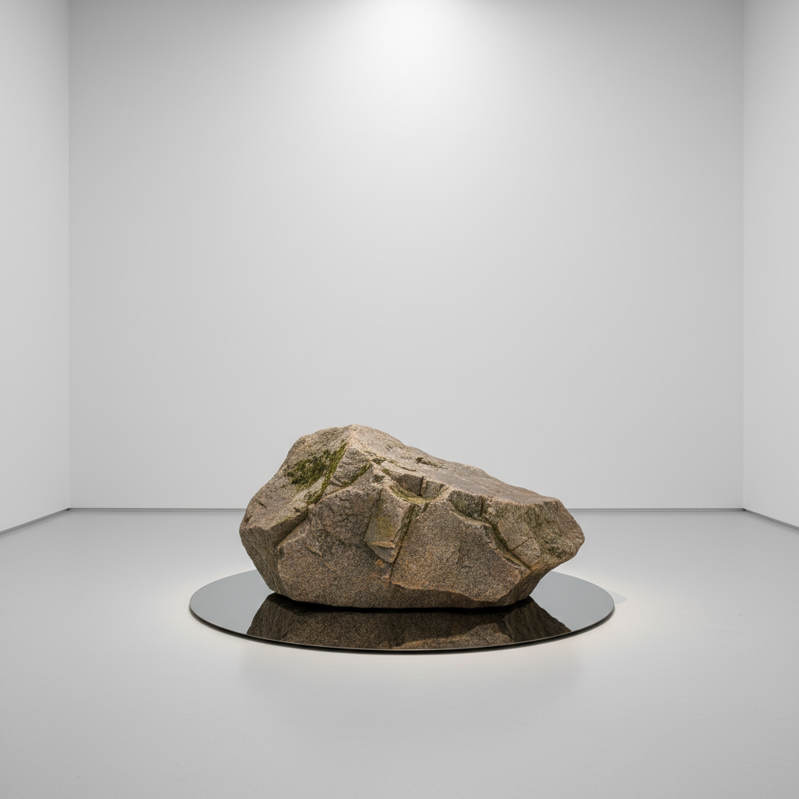

# Mono-ha 物派



> **"不是创造物体，而是让物体与空间的关系自行显现——石头就是石头，铁板就是铁板。"**

## 概述

物派（もの派 / Mono-ha，直译"物的学派"）是1968–1975年间日本兴起的重要艺术运动，强调材料与感官的重要性、空间与物质的相互关系，拒绝西方对表现手法的观念。它是日本第一个被国际认可的当代艺术运动。

## 时代背景

| 维度 | 内容 |
|------|------|
| 兴起 | 1968年，关根伸夫《位相—大地》 |
| 活跃期 | 1968–1975 |
| 理论家 | 李禹焕（Lee Ufan） |
| 社会语境 | 日本战后经济高速增长、反安保运动 |
| 哲学根基 | 东亚哲学（老庄、禅）+ 现象学 |

## 核心艺术家

| 艺术家 | 代表作 |
|------|------|
| 関根伸夫 Sekine Nobuo | 《位相—大地》（巨型土柱与圆坑） |
| 李禹焕 Lee Ufan | 《关系项》系列（石头与铁板） |
| 菅木志雄 Suga Kishio | 木材、石头、绳索的临时组合 |
| 吉田克朗 Yoshida Katsuro | 木板与布的并置 |
| 小清水渐 Koshimizu Susumu | 石头的切割与重组 |
| 榎倉康二 Enokura Koji | 布、皮革与液体的渗透 |

## 视觉特征

- **未加工材料**：石头、铁板、木材、玻璃、棉布、绳索
- **并置与对比**：自然物与工业物的直接对话
- **临时性**：作品可拆解、重组，不追求永恒
- **空间关系**：物体之间的间距和张力是作品核心
- **极简呈现**：不雕刻、不涂色、不变形——让材料保持原状
- **重力与平衡**：倚靠、悬挂、堆叠的物理关系

## 核心理念

### "遭遇"（出会い）

物派不是"制作"作品，而是安排一次"遭遇"——让石头遭遇铁板，让木材遭遇空间，让观者遭遇物质的存在感。

### 李禹焕的理论

> "不是创造新的东西，而是打开与已存在之物的关系。"

李禹焕主张艺术家应该"减少自我表现"，让世界自行显现——这与西方现代主义"艺术家是创造者"的观念形成根本对立。

### 与贫穷艺术的异同

| 物派 | 贫穷艺术（Arte Povera） |
|------|------|
| 让材料"自行显现" | 用材料"表达观念" |
| 东方哲学（无为） | 西方批判理论 |
| 关系与空间 | 过程与转化 |
| 极度克制 | 相对戏剧化 |

## 与其他运动的关系

```
极简主义(美) ──→ [影响] ──→ 物派(日, 1968)
贫穷艺术(意) ←→ 物派 ←→ 大地艺术(美)
                    ↓
        单色画(韩) ←── 李禹焕 ──→ 当代装置艺术
```

## 当代影响

- 李禹焕2011年古根海姆回顾展、2014年凡尔赛宫个展
- 直岛李禹焕美术馆（安藤忠雄设计）
- 对当代"关系美学"和场域特定艺术的启发
- 日本当代建筑中"材料真实性"理念的源头
- 全球拍卖市场对物派作品的持续升温

## 多语言名称

| 语言 | 名称 |
|------|------|
| 日语 | もの派 |
| 英语 | Mono-ha / School of Things |
| 中文 | 物派 |
| 韩语 | 모노하 |
| 法语 | École des choses |

## 延伸阅读

- 李禹焕《出会いを求めて》（寻求遭遇）
- Tate Gallery "Mono-ha" 词条
- 東京都現代美術館 物派回顾展

---

*最后更新：2026-07-26*
