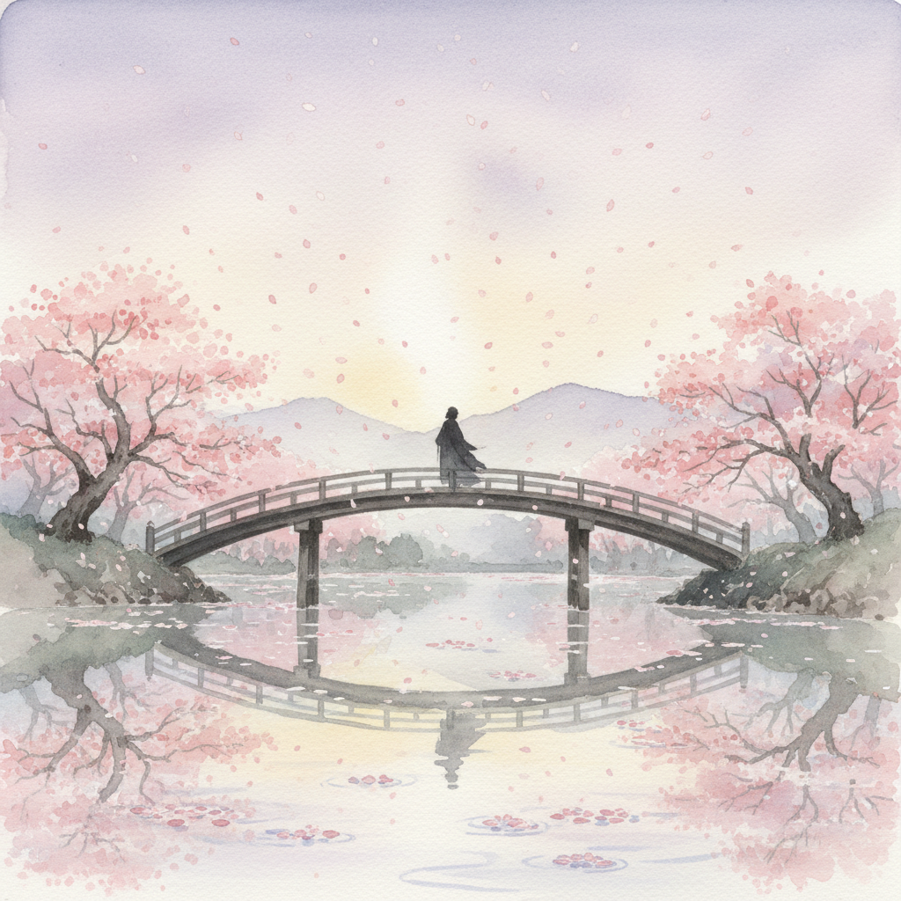

# Mono no Aware 物哀



> **"樱花落下的瞬间——感知万物无常之美，心生柔软的感叹。"**

## 概述

物哀（もののあはれ / Mono no Aware）是日本最古老的核心美学概念之一，意为"对事物的哀感"——面对世间万物的短暂与无常，内心自然涌起的感动、怜惜与共情。它不是悲痛，而是一种温柔的感叹。

## 时代背景

| 维度 | 内容 |
|------|------|
| 起源 | 平安时代（794–1185），《源氏物语》为集大成之作 |
| 理论化 | 江户时代本居宣长（1730–1801）系统阐述 |
| 核心文本 | 紫式部《源氏物语》、《万叶集》 |
| 哲学根基 | 佛教无常观 + 日本神道自然崇拜 |

## 视觉特征

- **樱花意象**：盛开即将凋零的瞬间最美
- **柔和色调**：淡粉、薄紫、月白、枯草色
- **光影流转**：晨雾、夕照、月光、雨幕
- **季节感**：强调时令变化中的转瞬即逝
- **留白与余韵**：画面不说尽，留给观者感受的空间
- **自然元素**：落叶、流水、飞鸟、薄冰

## 核心理念

### "哀"的五层含义（大西克礼解读）

1. **狭义哀怜**：对弱小事物的同情
2. **一般感叹**：超越悲喜的"呜呼！"
3. **知物之心**：加入直观认知的审美感动
4. **存在之哀**：对人生与世界无常的形而上体验
5. **美的统一**：将优美、艳美、婉美统合为浑然天成的美

### 与西方美学的区别

| 西方 | 物哀 |
|------|------|
| 追求永恒之美 | 美在于短暂 |
| 悲剧性崇高 | 温柔的感伤 |
| 主客对立 | 物我一体的共情 |
| 理性分析 | 直觉感受 |

## 代表作品

| 作品 | 类型 | 物哀体现 |
|------|------|------|
| 《源氏物语》 | 文学 | 贵族爱情的盛衰无常 |
| 《万叶集》 | 和歌 | 自然与人情的感叹 |
| 《平家物语》 | 军记物语 | "盛者必衰"的武士悲歌 |
| 新海诚动画 | 电影 | 错过与重逢的切ない感 |
| 是枝裕和电影 | 电影 | 日常中的生死感悟 |

## 与日本其他美学的关系

```
物哀(平安时代) ──→ 幽玄(中世) ──→ 侘寂(近世)
  ↓                    ↓                ↓
感知无常之美        朦胧深远之美      枯淡简素之美
  ↓                    ↓                ↓
樱花·恋情          能剧·和歌        茶道·俳句
```

## 当代影响

- 日本动画中的"切ない"（切なさ）情感基调
- 新海诚、是枝裕和、岩井俊二的影像美学
- 日本产品设计中的"一期一会"理念
- 全球极简设计中对"不完美之美"的追求
- 摄影中的"侘び"美学（与物哀相通）

## 多语言名称

| 语言 | 名称 |
|------|------|
| 日语 | 物の哀れ（もののあはれ） |
| 英语 | Mono no Aware / The Pathos of Things |
| 中文 | 物哀 |
| 韩语 | 모노노아와레 |
| 法语 | L'empathie envers les choses |

## 延伸阅读

- 大西克礼《幽玄·物哀·寂》
- 本居宣长《紫文要領》《石上私淑言》
- 紫式部《源氏物语》

---

*最后更新：2026-07-26*
