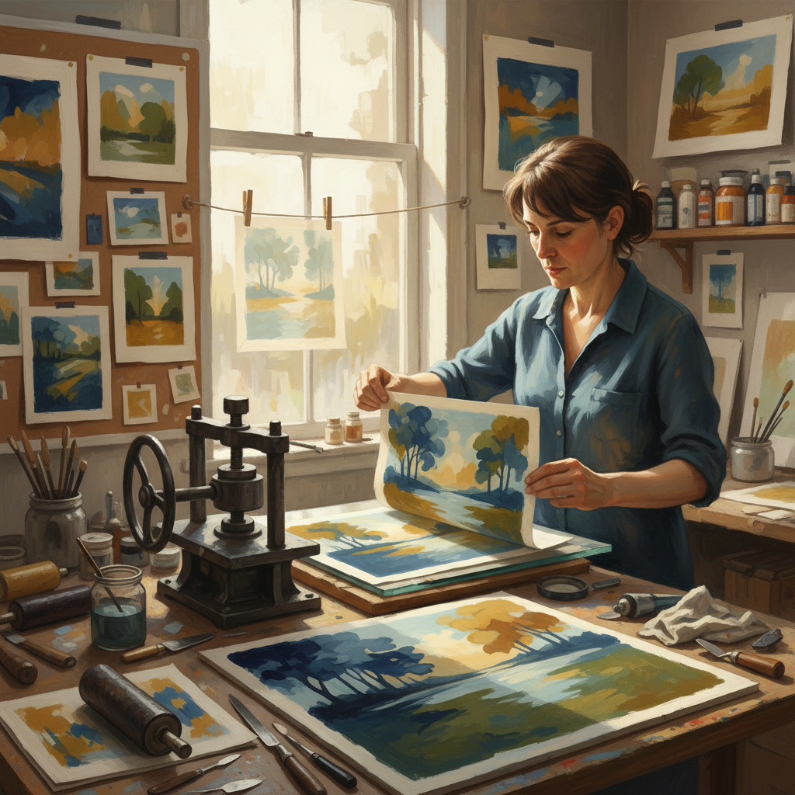

# Monotype Art 独版画艺术

> "A monotype is a painting that passes through a press — the artist paints on a smooth plate, then transfers the image to paper in a single impression. Unlike other printmaking methods, there is no matrix to reuse, no edition to pull. Each monotype is unique, a one-time event, a painting that has been transformed by pressure and transfer into something softer, more mysterious, more luminous than the original marks on the plate." — Unknown

## 概述

独版画艺术（Monotype Art）是在光滑的平板（玻璃、金属或塑料）上绑画，然后通过压印将图像转移到纸张上的版画艺术形式——每次只能印出一张独一无二的作品，因此得名"独版画"。独版画结合了绑画的自由度和版画的转印质感，是最具绑画性的版画技法。

独版画艺术的实践包括：1）加法独版画——在空白板上添加颜料后印刷；2）减法独版画——在满版颜料上擦除后印刷；3）混合独版画——同时使用加法和减法技法；4）多色独版画——使用多种颜色的独版画；5）幽灵印——第二次印刷获得的淡化图像；6）独版画与其他技法结合——在蚀刻或石版画基础上叠加独版画；7）大型独版画——大尺幅的独版画创作。

## 核心特征

| 特征 | 描述 |
|------|------|
| 唯一 | 每张作品独一无二 |
| 自由 | 绑画般的自由度 |
| 转印 | 压印转移的质感 |
| 柔和 | 柔和的边缘效果 |
| 即兴 | 即兴创作的特质 |
| 偶然 | 转印中的偶然效果 |

## 视觉特征

- **柔和**：转印产生的柔和边缘
- **层次**：丰富的色调层次
- **纹理**：独特的转印纹理
- **透明**：半透明的色彩叠加
- **笔触**：保留的绑画笔触
- **反转**：左右反转的图像

## 代表作品

| 作品 | 艺术家 | 年代 | 意义 |
|------|--------|------|------|
| *Monotypes* | Edgar Degas | 1870s-90s | 独版画先驱 |
| *Dark monotypes* | Paul Gauguin | 1890s | 表现性独版画 |
| *Monotype landscapes* | William Blake | 1795 | 早期独版画实验 |
| *Contemporary monotypes* | Various | 当代 | 当代独版画 |
| *Large-scale monotypes* | Helen Frankenthaler | 1990s | 大型抽象独版画 |

## 历史时间线

| 时期 | 事件 |
|------|------|
| 17世纪 | Giovanni Castiglione发明独版画 |
| 19世纪 | 德加将独版画发展为重要艺术形式 |
| 20世纪 | 独版画在现代艺术中的广泛应用 |
| 1980年代 | 独版画工坊的兴起 |
| 当代 | 独版画的当代实践和教育普及 |

## 中国语境

独版画艺术在中国的版画教育中占有一定地位——作为版画专业的基础课程之一，帮助学生理解印刷转移的原理和效果。中国的一些当代版画家将独版画作为主要创作媒介——利用其独特的转印质感和不可重复性进行艺术表达。中国的版画工坊中，独版画因其设备要求相对简单而受到欢迎——不需要复杂的制版过程，适合即兴创作。中国的一些艺术教育机构将独版画作为儿童艺术教育的入门项目——因为它安全、直观且充满惊喜。中国当代艺术中，独版画的"唯一性"与传统中国绑画的"一次性"（不可修改的水墨创作）有精神上的共鸣——都强调创作瞬间的不可重复。

## AI生成概念图

## 与其他风格的关系

- **Printmaking** → 版画艺术
- **Painting** → 绑画
- **Etching** → 蚀刻版画
- **Lithography** → 石版画
- **Mixed Media** → 混合媒介
- **Experimental Art** → 实验艺术

---

*浮光艺志 | Chronicle of Artistry*
