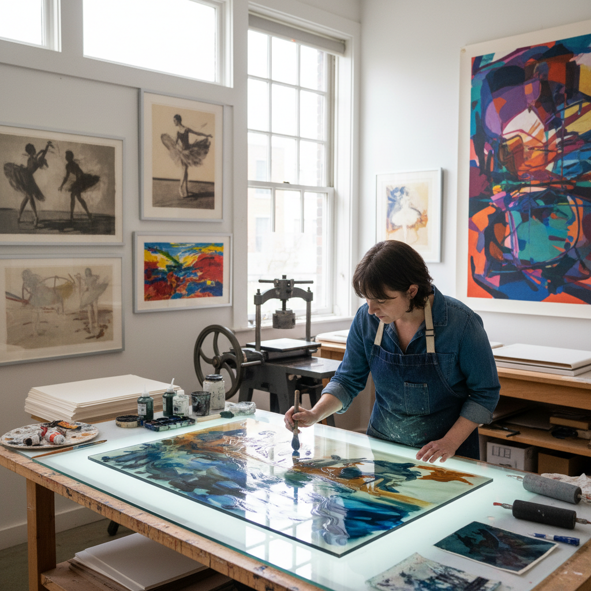

# Monotype Printing 单刷版画

> "Monotype is the most painterly of prints — ink or paint applied freely to a smooth plate then transferred to paper in a single unrepeatable impression, combining the spontaneity of painting with the transformative pressure of the press, each print a unique ghost of the gesture that created it, existing in that magical space between painting and printmaking where neither medium fully claims it." — Unknown

## 概述

单刷版画（Monotype）是一种只能产生一张独特印刷品的版画技法——艺术家在光滑的平面（玻璃板、金属板或塑料板）上用油墨或颜料自由绑画，然后将纸张覆盖在上面，通过手压或印刷机的压力将图像转印到纸上。因为每次印刷都会将大部分油墨转移到纸上，所以每块"版"只能印刷一张完整的作品——因此称为"mono"（单一）"type"（印刷）。

Monotype被认为是最具绘画性的版画形式——它结合了绘画的自由和即兴性与版画的压力转印效果。Edgar Degas是monotype的大师——他创作了数百幅monotype作品。Monotype的独特之处在于压力转印过程中产生的特殊质感——油墨在压力下的流动和纸张纤维的吸收创造出任何其他媒介无法复制的效果。

## 核心特征

| 特征 | 描述 |
|------|------|
| 唯一 | 只能印刷一张 |
| 绘画性 | 最具绘画性的版画 |
| 自由 | 自由的创作方式 |
| 即兴 | 即兴的表现 |
| 转印 | 压力转印效果 |
| 独特质感 | 独特的转印质感 |

## 视觉特征

- **绘画感**：绘画般的自由笔触
- **柔和**：柔和的边缘效果
- **独特**：每张都是唯一的
- **层次**：丰富的色调层次
- **质感**：独特的转印质感
- **即兴**：即兴的表现力

## 代表作品

| 作品 | 艺术家 | 年代 | 意义 |
|------|--------|------|------|
| *Ballet monotypes* | Edgar Degas | 1870-90年代 | 德加芭蕾单刷 |
| *Dark Field monotypes* | Edgar Degas | 1870年代 | 德加暗场单刷 |
| *Monotype landscapes* | Paul Gauguin | 1890年代 | 高更单刷风景 |
| *Contemporary monotypes* | Various | 当代 | 当代单刷版画 |
| *Large-scale monotypes* | Various | 当代 | 大型单刷版画 |

## 历史时间线

| 时期 | 事件 |
|------|------|
| 17世纪 | Giovanni Castiglione的早期实践 |
| 19世纪 | 德加将单刷提升为艺术 |
| 20世纪 | 单刷版画的广泛实践 |
| 1960-80年代 | 单刷版画的复兴 |
| 当代 | 单刷版画的多元发展 |

## 中国语境

单刷版画在中国的版画教育中有一定的地位——作为版画创作的实验性手段。中国的美术院校版画专业教授monotype技法。中国的一些当代版画家在创作中使用单刷版画——特别是在追求绘画性和即兴性时。中国的一些版画工作坊开设单刷版画体验课程。单刷版画的自由性和绘画性与中国水墨画的即兴传统有相通之处。

## AI生成概念图

## 与其他风格的关系

- **Painting** → 绘画
- **Printmaking** → 版画
- **Monoprint** → 单版画
- **Degas** → 德加
- **Mixed Media** → 混合媒介
- **Experimental Art** → 实验艺术

---

*浮光艺志 | Chronicle of Artistry*
