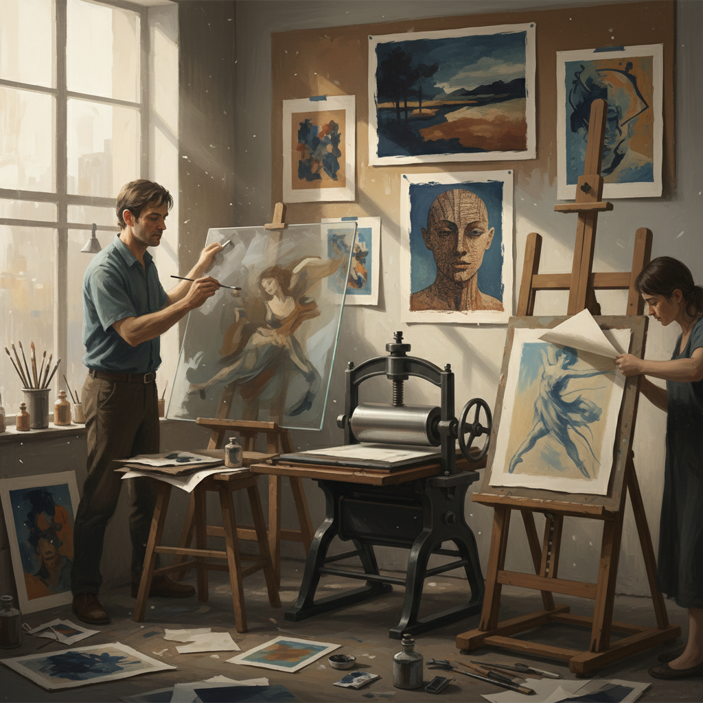

# Monotype 独幅版画

> "Monotype is printmaking's most painterly form — each impression is unique, a ghost of the artist's hand transferred through pressure." — Unknown

## 概述

独幅版画（Monotype）是一种只能印刷一次的版画技法——艺术家在光滑的平面（玻璃板、金属板或塑料板）上用油墨或颜料直接绑画，然后将纸覆盖其上，通过手压或印刷机转印图像。由于每次印刷都会将大部分油墨转移到纸上，因此每幅独幅版画都是独一无二的——这也是"mono"（单一）这个前缀的含义。独幅版画介于绑画和版画之间——它有版画的转印质感（柔和的边缘、独特的压印效果），又有绑画的自由和即兴性。

独幅版画的哲学在于：唯一性——每一次印刷都是不可重复的瞬间，拥抱过程中的偶然和惊喜。

## 核心特征

| 特征 | 描述 |
|------|------|
| 唯一 | 只能印刷一次 |
| 即兴 | 即兴自由的创作 |
| 转印 | 压力转印图像 |
| 柔和 | 柔和的转印质感 |
| 混合 | 绘画与版画的混合 |
| 偶然 | 偶然的效果 |

## 视觉特征

- **柔和**：柔和的边缘
- **质感**：独特的转印质感
- **层次**：丰富的明暗层次
- **偶然**：偶然的纹理
- **绘画性**：绘画般的自由
- **深度**：墨色的深度

## 代表作品

| 作品 | 艺术家 | 年代 | 意义 |
|------|--------|------|------|
| *Degas monotypes* | Edgar Degas | 1870s-90s | 独幅版画先驱 |
| *William Blake prints* | William Blake | 1790s | 早期独幅版画 |
| *Milton Avery monotypes* | Milton Avery | 1950s | 色彩独幅版画 |
| *Tracey Emin monotypes* | Tracey Emin | 1990s+ | 当代独幅版画 |
| *Contemporary monotypes* | Various | 当代 | 当代独幅艺术 |

## 历史时间线

| 时期 | 事件 |
|------|------|
| 1640s | Giovanni Castiglione发明 |
| 1790s | William Blake的实验 |
| 1870s | Degas大量创作独幅版画 |
| 20世纪 | 现代艺术家的广泛使用 |
| 1970s+ | 独幅版画工作坊的兴起 |
| 当代 | 当代独幅版画的繁荣 |

## 中国语境

独幅版画在中国版画界被称为"独幅版画"或"单刷版画"。中国的版画教育体系中包含独幅版画的教学，许多美术院校的版画系开设相关课程。独幅版画因其自由即兴的特点，吸引了许多中国当代艺术家——它不需要复杂的设备，却能产生独特的视觉效果。中国的一些版画工作室和艺术空间定期举办独幅版画工作坊，推广这种介于绘画和版画之间的艺术形式。

## AI生成概念图

## 与其他风格的关系

- **Printmaking** → 版画总称
- **Monoprint** → 单版复印（有底版）
- **Painting** → 绘画（绘画性）
- **Lithography** → 石版画
- **Etching** → 蚀刻版画
- **Mixed Media** → 混合媒介

---

*浮光艺志 | Chronicle of Artistry*
