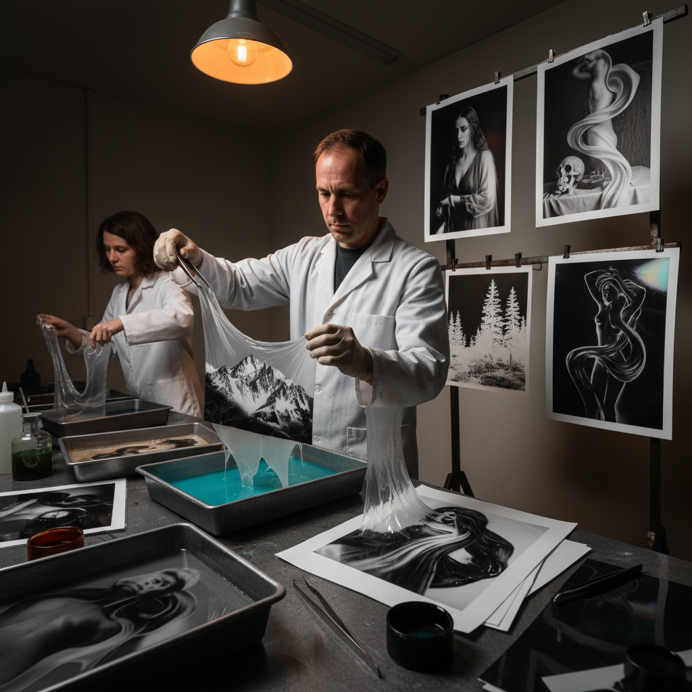

# Mordançage 腐蚀剥离

> "Mordançage is photography's dark alchemy — a developed silver print immersed in a bleaching bath that attacks the darkest shadows, lifting the emulsion into delicate veils that can be peeled away, folded back, or left floating like ghostly membranes, transforming a conventional photograph into something between sculpture and dream." — Unknown

## 概述

腐蚀剥离（Mordançage，也称bleach-etch）是一种对已冲洗的银盐照片进行后处理的实验性暗房技法。将完成的银盐照片浸入特殊的漂白液（通常含有铜盐和酸）中，漂白液会选择性地攻击照片中最暗的区域（银密度最高的区域），使这些区域的乳剂层从纸基上松动和剥离。

剥离的乳剂层可以被：完全去除（露出白色纸基）、折叠回去形成浮雕效果、拉伸变形、或保持半剥离状态形成半透明的"面纱"效果。然后照片可以重新显影，在剥离区域产生深黑色的反转效果（Sabattier效果的物理版本）。腐蚀剥离创造出超现实的、梦幻般的图像——部分区域正常，部分区域反转或剥离，产生独特的三维质感。

## 核心特征

| 特征 | 描述 |
|------|------|
| 漂白 | 选择性漂白暗部 |
| 剥离 | 乳剂层的剥离 |
| 后处理 | 对成品照片后处理 |
| 三维 | 产生三维质感 |
| 超现实 | 超现实的效果 |
| 不可逆 | 不可逆的过程 |

## 视觉特征

- **超现实**：超现实的视觉效果
- **剥离**：乳剂剥离的质感
- **反转**：暗部的反转效果
- **三维**：三维的浮雕感
- **梦幻**：梦幻般的氛围
- **有机**：有机的变形效果

## 代表作品

| 作品 | 艺术家 | 年代 | 意义 |
|------|--------|------|------|
| *Mordançage experiments* | Jean-Pierre Sudre | 1960s | 技法的艺术化发展 |
| *Bleach-etch portraits* | Various | 当代 | 腐蚀剥离肖像 |
| *Mordançage landscapes* | Various | 当代 | 腐蚀剥离风景 |
| *Abstract mordançage* | Various | 当代 | 抽象腐蚀剥离 |
| *Contemporary mordançage* | Various | 当代 | 当代腐蚀剥离 |

## 历史时间线

| 时期 | 事件 |
|------|------|
| 1930年代 | 早期漂白蚀刻实验 |
| 1960年代 | Jean-Pierre Sudre的艺术化发展 |
| 1970-80年代 | 技法在实验摄影中的应用 |
| 2000年代 | 替代摄影运动中的复兴 |
| 当代 | 腐蚀剥离的持续探索 |

## 中国语境

腐蚀剥离在中国属于非常小众的实验暗房技法。中国的摄影艺术院校在高级暗房课程中可能会介绍这种技法。随着中国传统暗房摄影的复兴和实验摄影的发展，腐蚀剥离作为一种创造超现实效果的暗房技法有潜在的发展空间。中国的一些实验摄影艺术家对这种"破坏性创造"的技法表现出兴趣。

## AI生成概念图

## 与其他风格的关系

- **Chemigram** → 化学图
- **Solarization** → 中途曝光
- **Alternative Photography** → 替代摄影
- **Surrealism** → 超现实主义
- **Darkroom Art** → 暗房艺术
- **Experimental Photography** → 实验摄影

---

*浮光艺志 | Chronicle of Artistry*
