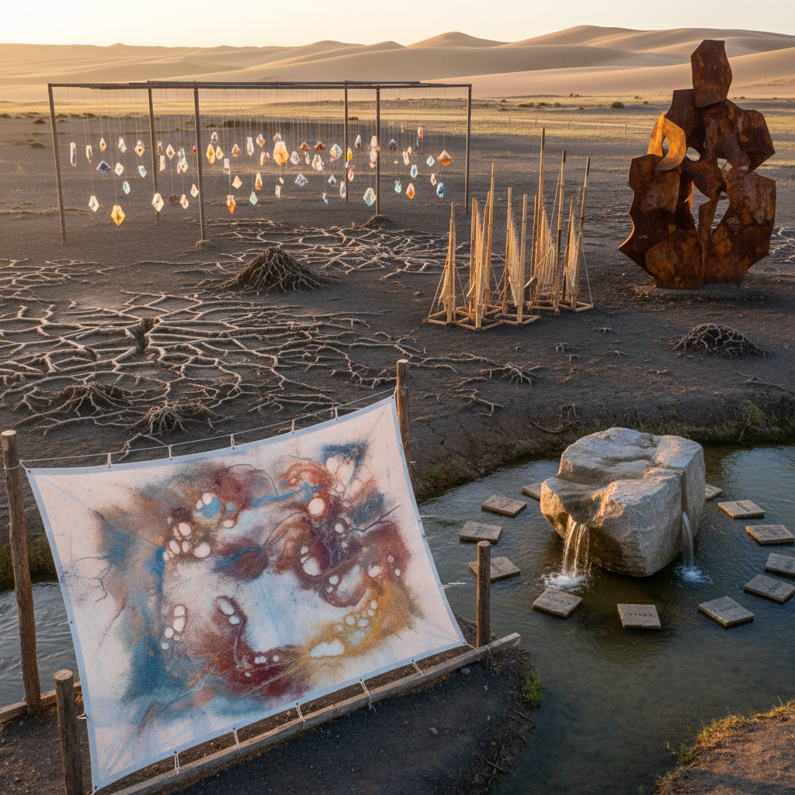

# More-Than-Human Art 超越人类艺术

> "More-than-human art begins with a simple but radical premise — that the world does not belong to us, that creativity is not exclusively human, that agency is distributed across all matter and all beings, and that the role of the artist is not to impose form on passive material but to collaborate with the active, creative forces that already animate the world, from the intelligence of slime molds to the architecture of termites to the poetry of birdsong to the mathematics of crystal growth." — David Abram

## 概述

超越人类艺术（More-Than-Human Art）是一种承认并回应非人类世界的创造力和能动性的艺术实践。"超越人类"（more-than-human）这一概念强调世界不仅仅是人类的——它包含了无数其他存在者，每一个都有自己的经验、智慧和创造力。

超越人类艺术的实践包括：1）承认非人类的创造力——认识到自然界中存在大量的"设计"和"美学"，它们不是人类创造的；2）与非人类力量合作——让风、水、重力、生物生长等自然力量参与创作过程；3）去中心化的创作——放弃人类作为唯一创作者的特权地位；4）感知的扩展——尝试感知和表达超越人类感官范围的世界；5）伦理的扩展——将道德关怀扩展到所有存在者。

## 核心特征

| 特征 | 描述 |
|------|------|
| 扩展 | 超越人类的视角 |
| 分布 | 分布式的能动性 |
| 合作 | 与自然力量合作 |
| 谦逊 | 人类的谦逊 |
| 感知 | 扩展的感知 |
| 伦理 | 扩展的伦理 |

## 视觉特征

- **尺度**：从微观到宏观的尺度
- **过程**：自然过程的展示
- **痕迹**：非人类留下的痕迹
- **力量**：自然力量的可视化
- **时间**：地质时间的表达
- **网络**：生态网络的呈现

## 代表作品

| 作品 | 艺术家 | 年代 | 意义 |
|------|--------|------|------|
| *Weather installations* | Olafur Eliasson | 2000年代 | 天气装置 |
| *Slime mold art* | Various | 2010年代 | 黏菌艺术 |
| *Geological art* | Various | 2010年代 | 地质艺术 |
| *Plant intelligence* | Various | 2020年代 | 植物智能 |
| *Elemental art* | Various | 当代 | 元素艺术 |

## 历史时间线

| 时期 | 事件 |
|------|------|
| 1996 | David Abram《The Spell of the Sensuous》 |
| 2000年代 | 后人类主义理论的发展 |
| 2010年代 | "超越人类"概念的流行 |
| 2020年代 | 与气候危机的结合 |
| 当代 | 制度化和策展实践 |

## 中国语境

超越人类艺术在中国有深刻的哲学共鸣。中国传统思想中的"天人合一"不是人类征服自然，而是人类融入更大的宇宙秩序；道家的"道法自然"强调人应该效法自然的运行方式；庄子的"齐物论"主张万物平等，消除人与物的等级差异。中国传统山水画的最高境界不是"画山水"，而是"成为山水"——画家通过长期的观察和体悟，让山水的精神通过自己流淌出来。中国当代的一些艺术家在实践超越人类的创作方式：让自然力量（风、水、火、生长）成为创作的主导力量，将人类的角色从"创造者"转变为"倾听者"和"合作者"。

## AI生成概念图

## 与其他风格的关系

- **Eco-Art** → 生态艺术
- **Land Art** → 大地艺术
- **Posthumanism** → 后人类主义
- **Multispecies Art** → 多物种艺术
- **Deep Ecology** → 深层生态
- **Process Art** → 过程艺术

---

*浮光艺志 | Chronicle of Artistry*
