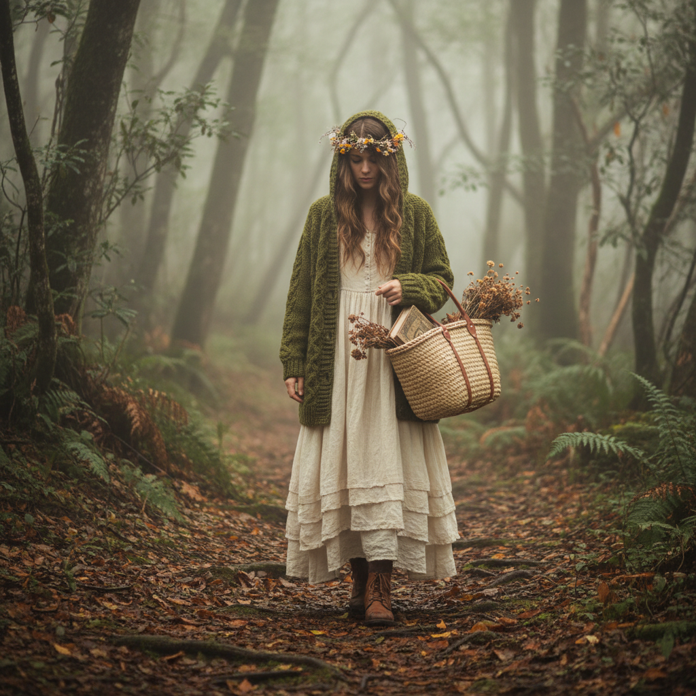

# Mori Girl 森女



> **"亚麻长裙、编织篮子、森林散步——像住在森林里的女孩一样生活。"**

## 概述

| 维度 | 描述 |
|------|------|
| 时期 | 2006–至今 |
| 别名 | Mori Girl, 森ガール, Forest Girl |
| 核心色彩 | 米白、棕色、森林绿、淡粉、奶油色 |
| 关键元素 | 亚麻/棉麻面料、层叠穿搭、自然材质、手工感 |
| 代表人物 | 日本 mixi 社区、苍井优 |
| 关联风格 | Cottagecore, Natural Kei, Lagenlook, Forestcore |

---

## 历史脉络

| 年份 | 事件 |
|------|------|
| 2006 | "森ガール"一词在日本 mixi 社区诞生 |
| 2009 | 《森ガールLesson》杂志出版——风格系统化 |
| 2010 | 全盛期——日本街头随处可见 |
| 2012 | 开始向"Natural Kei"演变 |
| 2018 | Cottagecore 兴起——精神延续 |

### 核心哲学

Mori Girl 的精神是**"像住在森林里的女孩——自然、温柔、不急不慢"**：
- 自然 = 美（不需要人工修饰）
- 层叠 = 丰富（像森林的层次）
- 手工 = 温度（"机器做不出这种感觉"）
- 慢 = 好（"不需要赶时间"）
- "我想成为一个在森林里迷路也不害怕的女孩"

---

## 视觉语法

### 色彩系统

```
主色：
  米白 (#F5F5DC) — 亚麻、棉
  棕色 (#8B7355) — 木头、皮革
  森林绿 (#4A7C59) — 苔藓、叶子
  淡粉 (#FFF0F5) — 花瓣
  奶油 (#FFFDD0) — 温暖

辅色：
  灰色 (#A9A9A9) — 石头
  深蓝 (#2F4F4F) — 阴影
  酒红 (#722F37) — 浆果

质感：
  亚麻 — 基础面料
  棉 — 柔软、自然
  蕾丝 — 手工、精致
  编织 — 篮子、帽子
  木头 — 配饰、纽扣
```

### 标志性元素

| 类别 | 元素 |
|------|------|
| 服装 | 亚麻长裙、层叠连衣裙、针织开衫 |
| 配饰 | 编织篮子、花冠、木质首饰 |
| 鞋 | 圆头皮鞋、短靴、布鞋 |
| 发型 | 自然卷、编发、松散 |
| 活动 | 森林散步、采集、手工、阅读 |
| 态度 | 温柔、自然、不急、手工 |

---

## 与千禧怀旧的关系

### Cottagecore 的"日本前身"
- Mori Girl (2006) → Cottagecore (2018)
- 两者共享"自然""手工""逃离城市"
- Mori Girl 更"日本"（层叠、精致）
- Cottagecore 更"英国"（花园、烘焙）

---

## 中国语境

- "森女"在中国的直接流行（2010-2015）
- 淘宝"森女风"店铺的爆发
- 与中国"文艺女青年"形象的交叉
- 棉麻面料在中国时尚中的地位

---

## 设计应用

| 场景 | 应用方式 |
|------|----------|
| 时尚 | 亚麻+层叠+自然色+手工感 |
| 品牌 | 自然+手工+温柔+有机+慢 |
| 空间 | 木材+亚麻+植物+自然光+手工 |
| 摄影 | 自然光+森林+柔焦+温暖色调 |

---

## 相关风格

← [Cottagecore 田园核](cottagecore.md) | [Forestcore 森林核](forestcore.md) →

↑ [返回千禧怀旧目录](README.md) | [返回总目录](../README.md)
