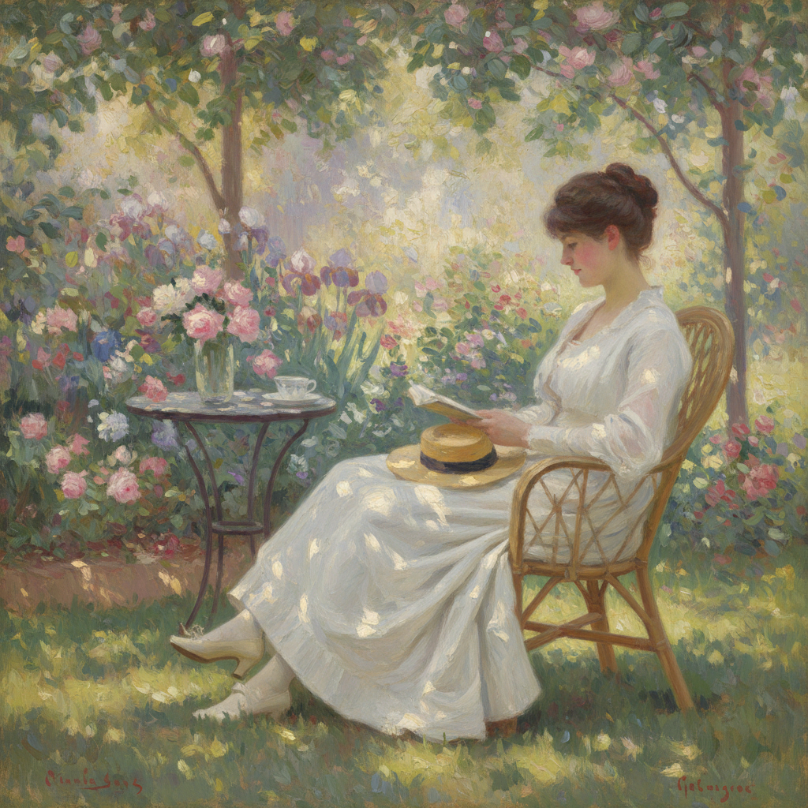

# Berthe Morisot 莫里索

> "I don't think there has ever been a man who treated a woman as an equal, and that's all I would have asked for." — Berthe Morisot

## 概述

贝尔特·莫里索（Berthe Morisot，1841–1895）是法国印象派的核心成员，也是该运动中最重要的女性画家。她以描绘女性的私密生活空间——花园、客厅、育儿场景——而闻名，笔触轻盈飘逸，色彩如薄纱般透明。

## 核心特征

| 特征 | 描述 |
|------|------|
| 轻盈笔触 | 快速、飘逸、几乎透明的笔法 |
| 女性视角 | 从内部观察女性的日常生活 |
| 私密空间 | 花园、阳台、卧室、育儿场景 |
| 光线处理 | 柔和的自然光，窗边的逆光 |
| 未完成感 | 刻意保留的速写般松散 |
| 白色运用 | 大量白色与浅色调 |

## 代表作品

| 作品 | 年代 | 意义 |
|------|------|------|
| *The Cradle* | 1872 | 母性的亲密凝视 |
| *Summer's Day* | 1879 | 布洛涅森林的光影 |
| *Woman at Her Toilette* | 1875 | 私密空间的诗意 |
| *Eugene Manet on the Isle of Wight* | 1875 | 丈夫的温柔肖像 |

## AI生成概念图

## 与其他风格的关系

- **Impressionism** → 核心成员，参加了几乎所有印象派展览
- **Manet** → 马奈的嫂子与模特，互相影响
- **Renoir** → 同代人，共享对光线的热爱
- **Cassatt** → 另一位印象派女性先驱
