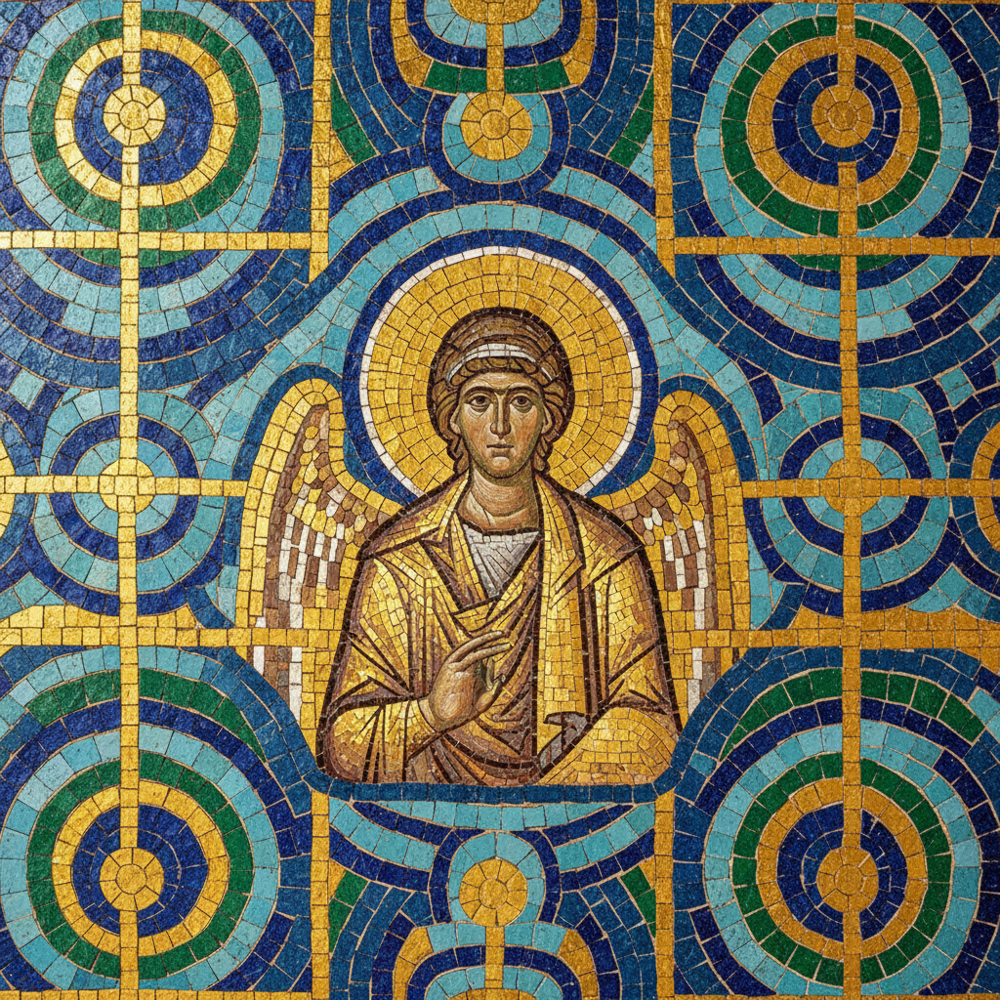

# Mosaic Art 马赛克艺术

> "A mosaic is a conversation between broken things made whole." — Terry Tempest Williams

## 概述

马赛克艺术（Mosaic Art）是用小块材料——石头、玻璃、陶瓷、贝壳——拼合成图像或图案的艺术形式。它是人类最古老的装饰艺术之一，从美索不达米亚的泥钉墙到罗马的地板马赛克、从拜占庭教堂的金色穹顶到高迪的碎瓷拼贴，马赛克跨越了五千年的历史。

马赛克的独特魅力在于"碎片的整体"——远看是完整的图像，近看是无数独立的小块。这种从碎片中创造统一的过程本身就是一种深刻的隐喻。

## 核心特征

| 特征 | 描述 |
|------|------|
| 碎片组合 | 用小块材料拼合成整体图像 |
| 耐久性 | 石材和玻璃马赛克可保存数千年 |
| 光泽 | 玻璃和金箔马赛克的反光效果 |
| 建筑性 | 与建筑表面（墙、地、穹顶）结合 |
| 劳动密集 | 极其耗时的手工拼贴过程 |
| 公共性 | 通常位于公共和宗教空间 |

## 视觉特征

- **材料**：大理石、玻璃（smalti）、金箔、陶瓷碎片
- **网格**：小块之间的缝隙（grout）是视觉的一部分
- **色彩**：通过不同材料的天然色彩实现
- **光**：不规则表面产生的闪烁光效
- **尺度**：从小型装饰到覆盖整个穹顶
- **图像**：从几何图案到复杂的叙事场景

## 代表作品

| 作品 | 创作者 | 年代 | 意义 |
|------|--------|------|------|
| *亚历山大马赛克* | 佚名 | 前100年 | 庞贝出土——古典马赛克的巅峰 |
| *圣维塔莱教堂马赛克* | 佚名 | 547年 | 拜占庭金色马赛克的杰作 |
| *Park Güell* | Antoni Gaudí | 1900-14 | 碎瓷拼贴（trencadís）的革新 |
| *Four Seasons* | Marc Chagall | 1974 | 芝加哥的现代马赛克壁画 |
| *Subway Mosaics* | Various | 1904+ | 纽约地铁站的公共马赛克 |
| *Invader* | Invader | 1998+ | 像素化的街头马赛克——当代 |

## 历史时间线

| 时期 | 事件 |
|------|------|
| 前3000年 | 美索不达米亚的泥钉马赛克 |
| 前4-1世纪 | 希腊罗马的地板马赛克黄金时代 |
| 5-15世纪 | 拜占庭的金色玻璃马赛克 |
| 8-15世纪 | 伊斯兰的几何瓷砖马赛克 |
| 1900s | 高迪的碎瓷拼贴（trencadís） |
| 1930s-60s | 墨西哥壁画运动中的马赛克 |
| 1990s+ | Invader——像素马赛克的街头艺术 |
| 2000s-至今 | 当代马赛克艺术的复兴 |

## 子类型

| 子类型 | 特征 |
|--------|------|
| 古典马赛克 | 罗马——大理石和石头的精细拼贴 |
| 拜占庭马赛克 | 金箔玻璃的神圣光辉 |
| 伊斯兰马赛克 | 几何瓷砖的无限重复 |
| 碎瓷拼贴 | 高迪——不规则碎片的自由组合 |
| 像素马赛克 | Invader——数字像素的物理化 |
| 当代马赛克 | 混合材料的当代艺术表达 |

## 中国语境

中国的马赛克传统体现在不同的形式中——从汉代的画像砖到明清的琉璃瓦拼花、从敦煌的千佛洞到当代的公共艺术。中国传统建筑中的"百宝嵌"——用各种材料镶嵌组合——是中国版的马赛克艺术。当代中国的地铁站、公共广场中大量使用马赛克装饰，但艺术质量参差不齐。

## AI生成概念图

## 与其他风格的关系

- **Byzantine Art** → 拜占庭艺术以马赛克为核心媒介
- **Islamic Art** → 伊斯兰艺术的几何瓷砖是马赛克的重要传统
- **Art Nouveau** → 新艺术运动（高迪）革新了马赛克技法
- **Pixel Art** → 像素艺术是马赛克的数字时代继承者
- **Public Art** → 马赛克是公共艺术的重要形式
- **Pattern and Decoration** → P&D运动重新评价了装饰性马赛克

---

*浮光艺志 | Chronicle of Artistry*
