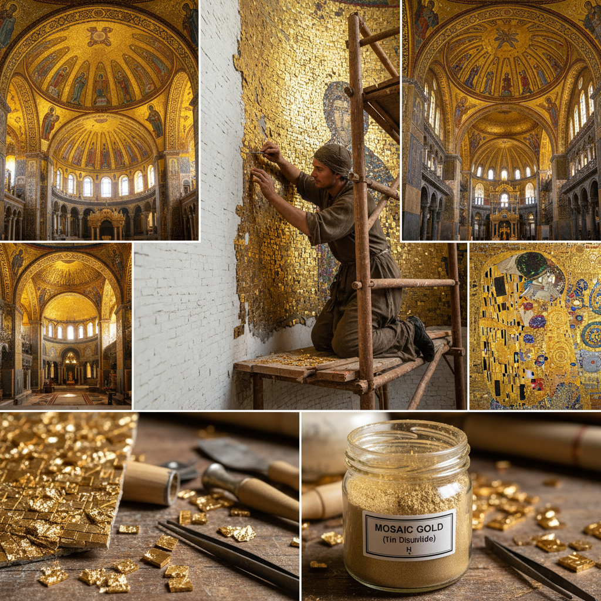

# Mosaic Gold 金色马赛克

> "Mosaic gold is illusion perfected — tin disulfide crystals shimmer with the warmth of true gold, offering artists and craftsmen a golden glow without the golden price." — Unknown

## 概述

金色马赛克（Mosaic Gold）有两层含义：一是指二硫化锡（tin disulfide, SnS₂）——一种金黄色的晶体粉末，历史上被用作金粉的廉价替代品来装饰书籍、画框和工艺品；二是指使用金色材料（金箔、金色玻璃片、金色石材等）制作的马赛克镶嵌艺术。

作为材料的Mosaic Gold（二硫化锡）在中世纪和文艺复兴时期被广泛使用——它被称为"aurum musivum"（马赛克金），因为它最初被用于装饰马赛克作品。作为艺术形式的金色马赛克则是拜占庭艺术的标志——拜占庭教堂中大量使用金色玻璃马赛克（gold tesserae）来创造神圣的金色背景，象征天堂的光辉。

## 核心特征

| 特征 | 描述 |
|------|------|
| 金色 | 金色的视觉效果 |
| 替代 | 金的廉价替代 |
| 马赛克 | 镶嵌艺术形式 |
| 拜占庭 | 拜占庭艺术标志 |
| 光辉 | 神圣的光辉效果 |
| 历史 | 悠久的历史 |

## 视觉特征

- **金色**：温暖的金色光泽
- **闪烁**：闪烁的光效
- **镶嵌**：马赛克的镶嵌感
- **神圣**：神圣庄严的氛围
- **反射**：不同角度的反射
- **华丽**：极其华丽的效果

## 代表作品

| 作品 | 艺术家 | 年代 | 意义 |
|------|--------|------|------|
| *Hagia Sophia mosaics* | 匿名 | 6-14世纪 | 圣索菲亚大教堂金色马赛克 |
| *Ravenna mosaics* | 匿名 | 5-6世纪 | 拉文纳金色马赛克 |
| *St. Mark's Basilica* | 匿名 | 11-16世纪 | 圣马可大教堂 |
| *Medieval manuscripts* | 匿名 | 中世纪 | 中世纪手抄本装饰 |
| *Gustav Klimt mosaics* | Klimt | 1900s | 克里姆特马赛克 |

## 历史时间线

| 时期 | 事件 |
|------|------|
| 古罗马 | 金色马赛克的早期使用 |
| 拜占庭 | 金色马赛克的鼎盛 |
| 中世纪 | 二硫化锡作为金粉替代 |
| 文艺复兴 | Mosaic Gold在装饰中的应用 |
| 19世纪 | 拜占庭风格的复兴 |
| 当代 | 金色马赛克在当代建筑中的应用 |

## 中国语境

金色马赛克在中国主要体现在两个方面：一是中国传统建筑中的金色装饰——如故宫的琉璃瓦、寺庙的金色装饰等，虽然不是严格意义上的马赛克，但有类似的金色镶嵌效果；二是当代中国的建筑和室内设计中，金色马赛克瓷砖被广泛用于高端酒店、会所和住宅的装饰。中国的一些当代艺术家也使用金色马赛克作为创作媒介。

## AI生成概念图

## 与其他风格的关系

- **Mosaic** → 马赛克
- **Gold Leaf** → 金箔
- **Gilding** → 鎏金
- **Byzantine Art** → 拜占庭艺术
- **Tessellation** → 镶嵌
- **Icon Painting** → 圣像画

---

*浮光艺志 | Chronicle of Artistry*
