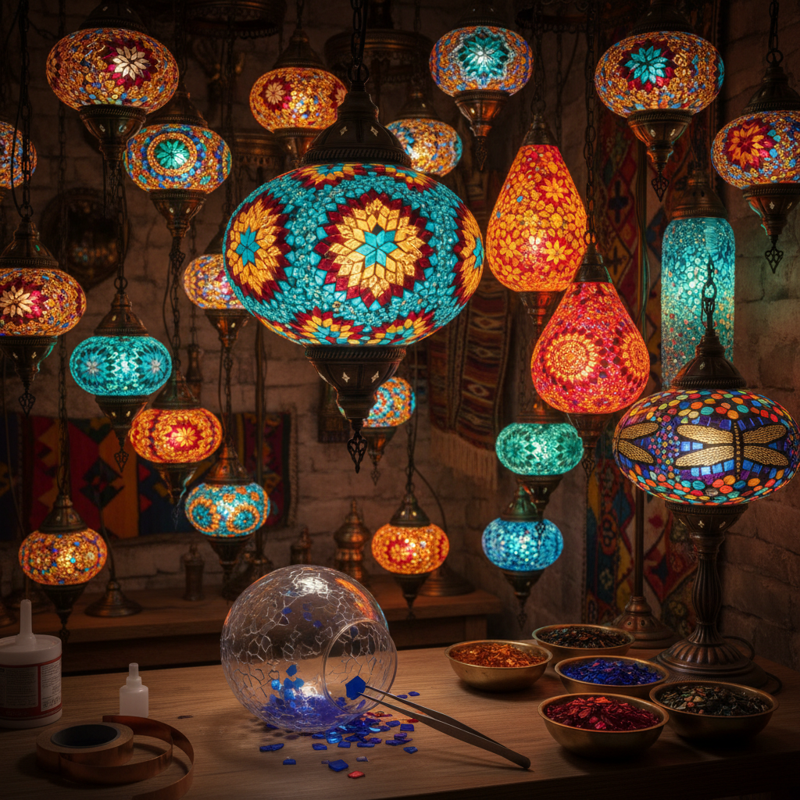

# Mosaic Lamp Art 马赛克灯艺术

> "A mosaic lamp is a constellation brought indoors — hundreds of colored glass fragments fitted together into a glowing sphere that scatters light in every direction like a captured sunset. Each piece of glass is a different color, a different transparency, a different story, yet together they create a unified radiance that transforms any room into a jeweled cave of dancing light and shadow." — Unknown

## 概述

马赛克灯艺术（Mosaic Lamp Art）是将马赛克玻璃镶嵌技法应用于灯具制作的艺术形式——通过将彩色玻璃碎片、珠子和镜片镶嵌在灯罩表面，创造出能够投射出绚丽多彩光影效果的装饰灯具。马赛克灯是土耳其和中东地区最具代表性的装饰艺术之一。

马赛克灯艺术的实践包括：1）土耳其马赛克灯——传统的土耳其彩色玻璃灯；2）摩洛哥灯笼——摩洛哥风格的金属镂空马赛克灯；3）蒂芙尼灯——美国蒂芙尼风格的彩色玻璃灯；4）印度马赛克灯——印度风格的镜片马赛克灯；5）吊灯——大型马赛克吊灯；6）台灯——桌面马赛克台灯；7）当代马赛克灯——现代设计师的创新马赛克灯具。

## 核心特征

| 特征 | 描述 |
|------|------|
| 彩色 | 丰富的色彩组合 |
| 光影 | 绚丽的光影投射 |
| 手工 | 纯手工镶嵌 |
| 装饰 | 强烈的装饰性 |
| 温暖 | 温暖的光线氛围 |
| 独特 | 每件作品独一无二 |

## 视觉特征

- **碎片**：彩色玻璃碎片的拼贴
- **光斑**：投射在墙面的彩色光斑
- **球形**：经典的球形灯罩
- **金属**：金属框架的支撑结构
- **透光**：不同透明度的玻璃层次
- **图案**：几何或花卉图案

## 代表作品

| 作品 | 艺术家/传统 | 年代 | 意义 |
|------|-------------|------|------|
| *Turkish mosaic lamps* | 土耳其传统 | 奥斯曼时期至今 | 土耳其马赛克灯 |
| *Tiffany lamps* | Louis Comfort Tiffany | 1890s | 蒂芙尼彩色玻璃灯 |
| *Moroccan lanterns* | 摩洛哥传统 | 中世纪至今 | 摩洛哥灯笼 |
| *Grand Bazaar lamps* | 伊斯坦布尔 | 当代 | 大巴扎马赛克灯 |
| *Contemporary mosaic lighting* | Various | 当代 | 当代马赛克灯设计 |

## 历史时间线

| 时期 | 事件 |
|------|------|
| 古代 | 早期玻璃灯具 |
| 奥斯曼时期 | 土耳其马赛克灯传统形成 |
| 1890年代 | 蒂芙尼灯的诞生 |
| 20世纪 | 马赛克灯的全球传播 |
| 当代 | 马赛克灯的旅游文化和当代设计 |

## 中国语境

马赛克灯艺术在中国近年来随着家居装饰文化的发展而受到关注。中国的家居市场上，土耳其风格的马赛克灯作为异域风情装饰品越来越受欢迎——许多咖啡馆、餐厅和民宿使用马赛克灯营造氛围。中国的一些手工艺人开始学习和制作马赛克灯——将中国传统的色彩美学融入马赛克灯设计。中国义乌等地已经成为马赛克灯的重要生产基地——为全球市场供应各种风格的马赛克灯具。中国传统的琉璃灯和宫灯与马赛克灯有精神上的相似之处——都是通过彩色透光材料创造美丽的光影效果。中国当代的一些灯具设计师在探索将马赛克技法与中国传统元素相结合——创造具有东方韵味的马赛克灯具。

## AI生成概念图

## 与其他风格的关系

- **Mosaic Art** → 马赛克艺术
- **Stained Glass** → 彩色玻璃
- **Tiffany Art** → 蒂芙尼艺术
- **Turkish Art** → 土耳其艺术
- **Lighting Design** → 灯具设计
- **Glass Art** → 玻璃艺术

---

*浮光艺志 | Chronicle of Artistry*
