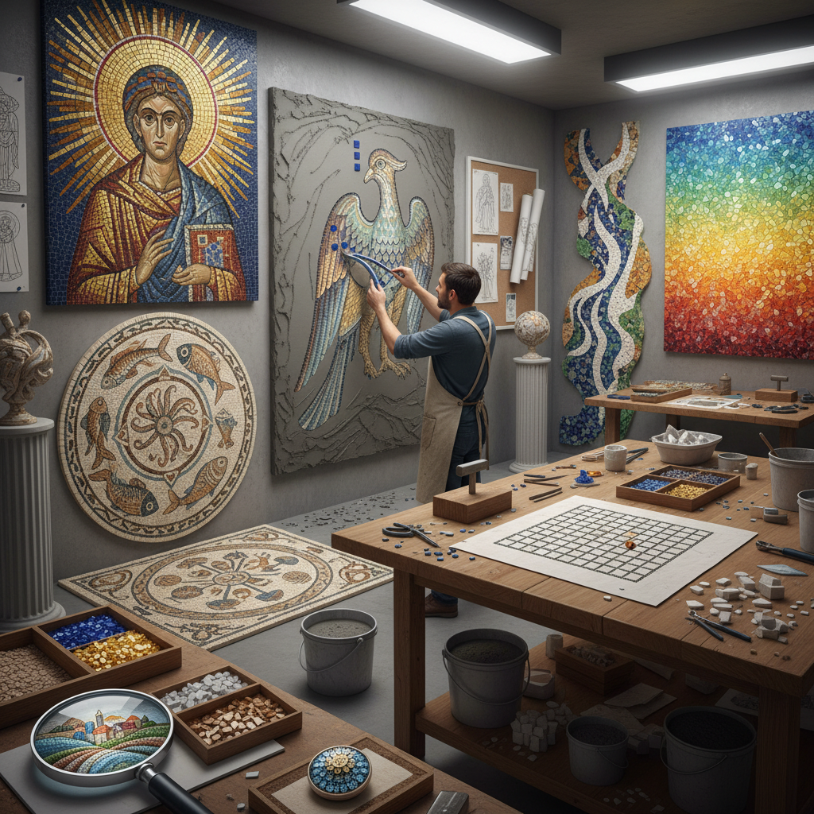

# Mosaic Technique 马赛克技法

> "Mosaic is the art of the fragment made whole — thousands of tiny pieces of stone, glass, or ceramic, each one insignificant alone, arranged together to create images that have outlasted empires, their colors as vivid after two thousand years as the day they were set." — Unknown

## 概述

马赛克技法（Mosaic Technique）是使用小块材料（tesserae，称为"镶嵌片"）——石材、玻璃、陶瓷、贝壳等——拼贴组合成图案或图像的装饰艺术。马赛克是人类最古老的装饰艺术之一，从古美索不达米亚的彩色石子镶嵌到古罗马的地面马赛克，从拜占庭教堂的金色玻璃马赛克到高迪的碎瓷片马赛克（trencadís），马赛克艺术贯穿了整个人类文明史。

马赛克的核心技法包括：直接法（direct method，将镶嵌片直接粘贴到基底上）、间接法（indirect method，先在临时表面上组装，再转移到最终位置）、双间接法（double indirect method）。马赛克材料包括：大理石（传统）、玻璃马赛克（smalti，威尼斯传统）、陶瓷、天然石材、金箔玻璃等。

## 核心特征

| 特征 | 描述 |
|------|------|
| 镶嵌 | 小块材料拼贴 |
| 耐久 | 极其耐久 |
| 色彩 | 丰富的色彩 |
| 装饰 | 装饰性强 |
| 建筑 | 与建筑结合 |
| 古老 | 极其古老的传统 |

## 视觉特征

- **碎片**：碎片化的视觉效果
- **色彩**：丰富的色彩组合
- **纹理**：镶嵌片的纹理
- **光泽**：玻璃和石材的光泽
- **图案**：几何和具象图案
- **规模**：从小型到建筑规模

## 代表作品

| 作品 | 艺术家 | 年代 | 意义 |
|------|--------|------|------|
| *Alexander Mosaic* | Unknown | 公元前100年 | 庞贝古城马赛克 |
| *Ravenna mosaics* | Unknown | 6世纪 | 拜占庭马赛克巅峰 |
| *Gaudí Park Güell* | Antoni Gaudí | 1900-14 | 碎瓷片马赛克 |
| *Chagall mosaic* | Marc Chagall | 20世纪 | 现代马赛克 |
| *Contemporary mosaic art* | Various | 当代 | 当代马赛克艺术 |

## 历史时间线

| 时期 | 事件 |
|------|------|
| 公元前3000年 | 美索不达米亚的早期马赛克 |
| 古希腊罗马 | 地面马赛克的发展 |
| 拜占庭 | 金色玻璃马赛克的巅峰 |
| 伊斯兰 | 几何马赛克的发展 |
| 19-20世纪 | 新艺术运动和高迪 |
| 当代 | 当代马赛克的多样化 |

## 中国语境

马赛克在中国有独特的发展轨迹——中国传统建筑中虽然没有西方意义上的马赛克，但有类似的镶嵌装饰传统（如百宝嵌、螺钿镶嵌）。现代中国的建筑装饰中广泛使用马赛克瓷砖。中国的当代艺术家将马赛克技法与中国传统图案结合，创作具有中国特色的马赛克作品。中国的一些城市公共艺术项目中也使用马赛克壁画。

## AI生成概念图

## 与其他风格的关系

- **Stained Glass** → 彩色玻璃
- **Tile Art** → 瓷砖艺术
- **Collage** → 拼贴
- **Pixel Art** → 像素艺术
- **Terrazzo** → 水磨石
- **Byzantine Art** → 拜占庭艺术

---

*浮光艺志 | Chronicle of Artistry*
