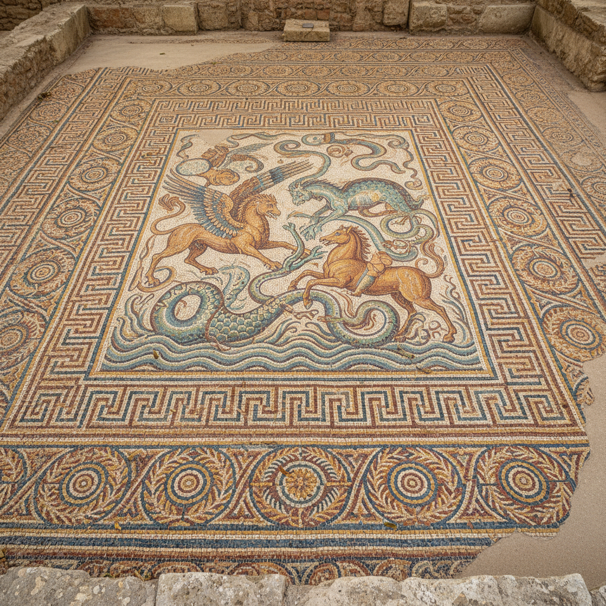

# Mosaic 马赛克 | Μωσαϊκό / Mosaico

> **"碎片拼出永恒——罗马人用百万块石子铺就了不朽的地面画卷。"**

## 概述

马赛克（Mosaic / Μωσαϊκό / Mosaico）是用小块彩色石材、玻璃、陶瓷或贝壳（称为tesserae/嵌片）拼贴成图案和画面的装饰艺术。这种技法有4000年以上的历史，在古罗马帝国时期达到第一个巅峰（地面马赛克），在拜占庭帝国时期达到第二个巅峰（墙面和穹顶金色马赛克）。马赛克的耐久性使其成为保存最完好的古代艺术形式之一——庞贝城的马赛克在火山灰下保存了近2000年。

## 主要传统

| 传统 | 时期 | 特征 |
|------|------|------|
| 美索不达米亚 | 前3000年 | 最早的马赛克 |
| 古希腊 | 前4世纪 | 鹅卵石马赛克 |
| 古罗马 | 前2世纪-5世纪 | 地面马赛克，写实 |
| 拜占庭 | 4-15世纪 | 金色玻璃，宗教 |
| 伊斯兰 | 7世纪–至今 | 几何图案（Zellij） |
| 高迪 | 19-20世纪 | Trencadís碎瓷片 |

## 核心特征

- **嵌片拼贴**：小块材料拼成图案
- **极耐久**：可保存数千年
- **色彩永久**：石材和玻璃不褪色
- **大尺度**：覆盖整面墙壁或地面
- **光影效果**：嵌片角度不同产生闪烁
- **像素感**：类似数字像素的视觉效果

## 常见题材

| 题材 | 传统 |
|------|------|
| 神话场景 | 古罗马 |
| 基督和圣人 | 拜占庭 |
| 几何图案 | 伊斯兰 |
| 动物 | 古罗马/拜占庭 |
| 抽象 | 现代 |
| 肖像 | 各时期 |

## 视觉特征

- 小块嵌片的独特质感
- 色彩的永久鲜艳
- 金色玻璃的神圣光芒
- 像素般的图像构成
- 大面积的视觉冲击
- 光线下的闪烁效果

## 与其他风格的关系

| 风格 | 关系 |
|------|------|
| 彩色玻璃 | 共享中世纪宗教艺术 |
| 像素艺术 | 共享"像素"构成原理 |
| 点彩派 | 共享小单元构成画面 |
| Zellij伊斯兰瓷砖 | 共享几何拼贴传统 |
| 高迪建筑 | Trencadís是马赛克的现代转化 |

## 概念图

---

*浮光艺志 | Chronicle of Artistry*
