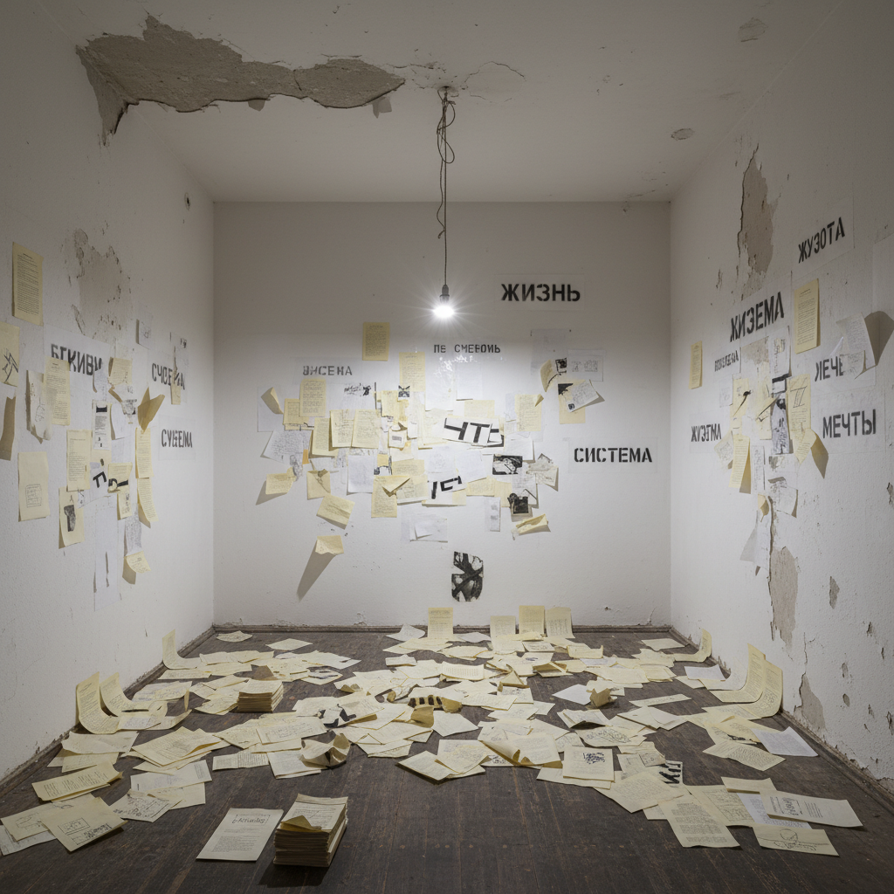

# 莫斯科概念主义 · Moscow Conceptualism Art

> "艺术不在画布上，艺术在观念与语境之间。" —— 伊利亚·卡巴科夫

## 概述

莫斯科概念主义（Moscow Conceptualism）是1970年代至1990年代在苏联莫斯科发展起来的前卫艺术运动，是苏联非官方艺术中最具理论深度和国际影响力的分支。与西方概念艺术不同，莫斯科概念主义深植于苏联特殊的意识形态环境，以文本、装置、行为和"集体行动"（Collective Actions）等形式，探讨语言、权力、日常生活与艺术边界的关系。

## 核心特征

| 特征 | 描述 |
|------|------|
| 时期 | 1970年代–1990年代 |
| 地域 | 莫斯科及莫斯科郊外 |
| 媒介 | 装置、文本、行为、摄影、绘画 |
| 核心理念 | 以观念和语境取代物质性艺术对象 |
| 色彩 | 白色、灰色为主，强调"空"与"虚无" |

## 视觉特征

- **"总体装置"**：卡巴科夫创造的沉浸式空间叙事
- **文本优先**：文字作为核心艺术媒介，而非辅助说明
- **档案美学**：模仿官僚文件、表格、清单的形式
- **空旷与虚无**：大面积留白，暗示意义的缺席
- **日常物品的陌生化**：将苏联日常生活物品置于艺术语境

## 代表作品

| 作品 | 艺术家 | 年代 | 类型 |
|------|--------|------|------|
| 《从公寓飞向太空的人》 | 伊利亚·卡巴科夫 | 1985 | 总体装置 |
| 《集体行动》系列 | 安德烈·莫纳斯特尔斯基 | 1976-至今 | 行为/文献 |
| 《斯洛甘》系列 | 德米特里·普里戈夫 | 1970s-80s | 文本/视觉诗 |
| 《NOMA》 | 鲍里斯·格罗伊斯 | 1979 | 理论文本 |
| 《基本词汇》 | 安德烈·莫纳斯特尔斯基 | 1985 | 概念文献 |

## 发展时间线

| 时期 | 事件 |
|------|------|
| 1970 | 卡巴科夫开始创作"相册"系列 |
| 1976 | 莫纳斯特尔斯基成立"集体行动"小组 |
| 1979 | 格罗伊斯发表NOMA理论，定义莫斯科概念主义 |
| 1970s-80s | 普里戈夫、鲁宾斯坦等发展文本艺术 |
| 1988 | 卡巴科夫移居西方，国际影响力扩大 |
| 1992 | 卡巴科夫代表俄罗斯参加卡塞尔文献展 |
| 2000s | 莫斯科概念主义被纳入全球当代艺术史叙事 |

## 中国语境

莫斯科概念主义对中国当代艺术的影响主要体现在方法论层面。徐冰的《天书》（1987-1991）与莫斯科概念主义对文本/语言的解构有深层共鸣。黄永砯、吴山专等"85新潮"后的概念艺术家，在策略上与莫斯科概念主义共享对意识形态话语的反思立场。两者都在社会主义语境中发展出独特的概念艺术路径。

## AI 概念图

*AI 生成概念图：莫斯科概念主义风格*

## 关联词条

- [[soviet-nonconformist-art]] - 苏联非官方艺术
- [[sots-art]] - 苏茨艺术
- [[russian-avant-garde-art]] - 俄罗斯先锋派
- [[russian-constructivism-art]] - 俄罗斯构成主义

---

*浮光艺志 · Chronicle of Artistry*
