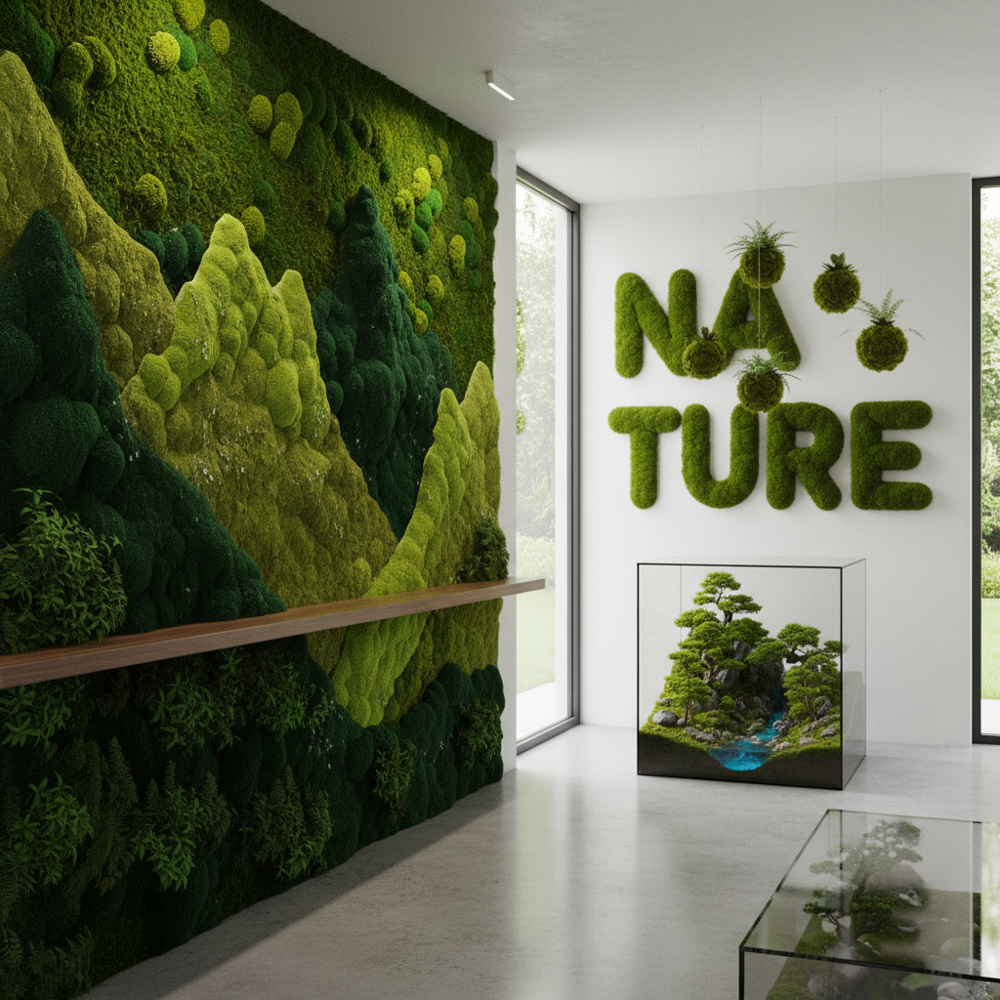

# Moss Art 苔藓艺术

> "Moss art works with the quietest of all plants — organisms so small and so patient that they can colonize bare rock, so ancient that they predate flowers by hundreds of millions of years, so resilient that they can survive complete desiccation and revive with a single drop of rain. Moss asks nothing of the artist but time and moisture; in return, it offers a living green surface of impossible softness, a miniature forest visible only to those who kneel down and look closely." — Unknown

## 概述

苔藓艺术（Moss Art）是以苔藓——最古老的陆生植物之一——为创作媒介的艺术实践。苔藓是一种无根、无花、无种子的植物，通过孢子繁殖，能在极端环境中生存。苔藓的独特品质——柔软的质地、鲜艳的绿色、不需要土壤、能在垂直表面生长——使其成为独特的艺术材料。

苔藓艺术的实践包括：1）苔藓墙——在室内或室外墙面上种植苔藓创造绿色壁画；2）苔藓涂鸦——用苔藓混合物在墙面上"绘制"图案（moss graffiti）；3）苔藓盆景——微型苔藓景观（苔玉、苔藓盆景）；4）苔藓字体——用苔藓生长出文字和图形；5）苔藓保存艺术——用保存处理的苔藓创作永久性装饰；6）苔藓生态艺术——利用苔藓的生态功能（空气净化、保水）进行环境艺术。

## 核心特征

| 特征 | 描述 |
|------|------|
| 绿色 | 鲜艳的绿色 |
| 柔软 | 极度柔软的质地 |
| 生长 | 缓慢的生长 |
| 古老 | 最古老的陆生植物 |
| 微型 | 微型的世界 |
| 耐久 | 极强的生命力 |

## 视觉特征

- **绿色**：多种绿色的层次
- **柔软**：天鹅绒般的质感
- **微型**：微观的森林景观
- **湿润**：湿润的光泽
- **覆盖**：覆盖表面的能力
- **自然**：自然的不规则形态

## 代表作品

| 作品 | 艺术家 | 年代 | 意义 |
|------|--------|------|------|
| *Moss graffiti* | Various | 2000年代 | 苔藓涂鸦 |
| *Moss walls* | Various | 2010年代 | 苔藓墙 |
| *Moss typography* | Various | 2010年代 | 苔藓字体 |
| *Preserved moss art* | Various | 2010年代 | 保存苔藓艺术 |
| *Moss gardens* | 日本传统 | 古代至今 | 苔藓庭园 |

## 历史时间线

| 时期 | 事件 |
|------|------|
| 古代 | 日本苔藓庭园传统 |
| 平安时代 | 日本苔寺（西芳寺） |
| 2000年代 | 苔藓涂鸦运动 |
| 2010年代 | 室内苔藓墙流行 |
| 当代 | 苔藓作为可持续设计材料 |

## 中国语境

苔藓艺术在中国有深厚的文化传统。中国传统园林中苔藓有重要的美学地位——"苔痕上阶绿，草色入帘青"（刘禹锡）是中国文人对苔藓之美的经典描写。中国传统盆景中苔藓是不可或缺的元素——它代表着岁月的积淀和自然的气息。中国传统文化中苔藓象征着幽静、古朴和隐逸——"应怜屐齿印苍苔"表达了对苔藓的珍惜。中国南方湿润地区（如苏州、杭州的古典园林）有丰富的苔藓景观。中国当代的一些艺术家在探索苔藓艺术：将中国传统园林的苔藓美学与当代室内设计结合、用苔藓在中国城市空间中创作绿色涂鸦、以及将中国传统的"苔痕"意象与当代生态艺术对话。

## AI生成概念图

## 与其他风格的关系

- **Eco-Art** → 生态艺术
- **Living Art** → 活体艺术
- **Green Art** → 绿色艺术
- **Garden Art** → 园林艺术
- **Bio Art** → 生物艺术
- **Sustainable Art** → 可持续艺术

---

*浮光艺志 | Chronicle of Artistry*
