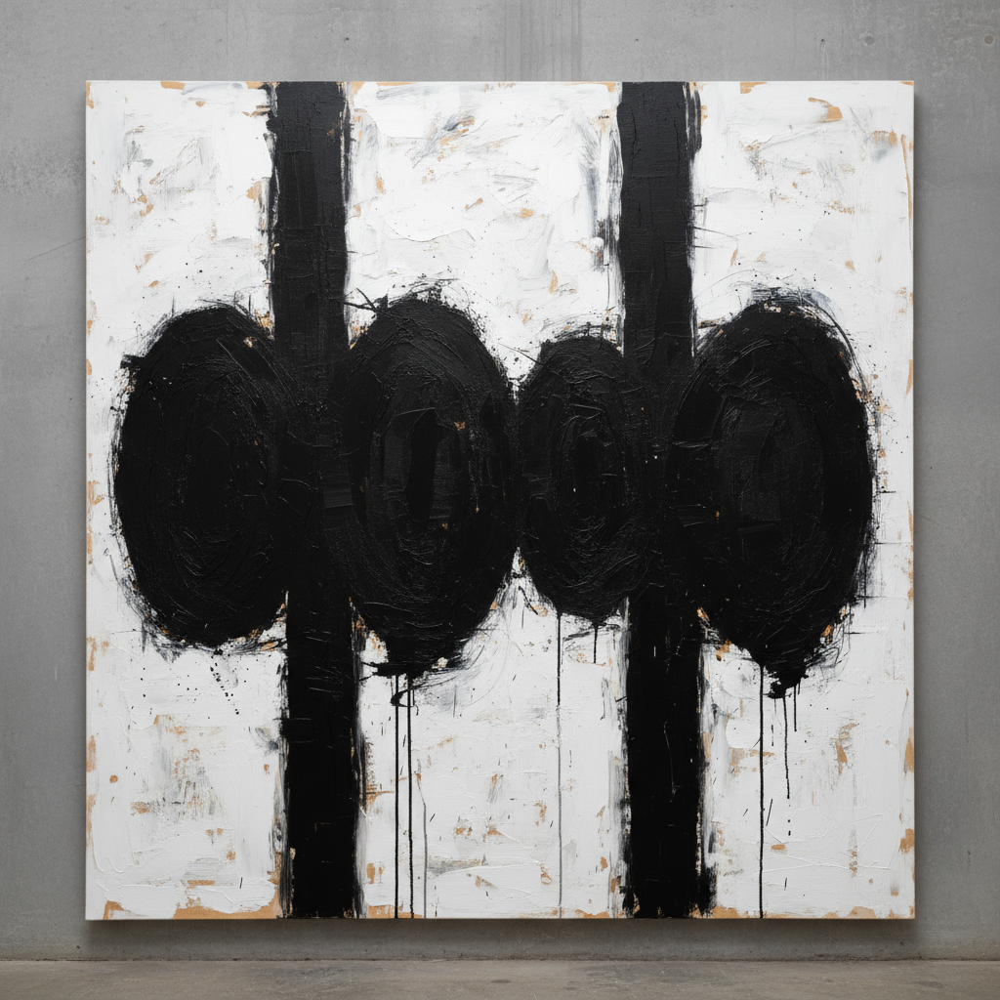

# Robert Motherwell 罗伯特·马瑟韦尔

> "Art is much less important than life, but what a poor life without it." — Robert Motherwell

## 概述

罗伯特·马瑟韦尔（Robert Motherwell，1915–1991）是美国抽象表现主义的核心成员，也是该运动中最具学术素养的艺术家。他以《西班牙共和国挽歌》系列闻名——巨大的黑色椭圆形和垂直条带在白色画布上形成庄严的节奏，将个人情感与历史悲剧融为一体。

## 核心特征

| 特征 | 描述 |
|------|------|
| 黑白对比 | 黑色形体在白色空间中的张力 |
| 椭圆与条带 | 标志性的有机几何形式 |
| 挽歌主题 | 对西班牙内战的持续哀悼 |
| 拼贴 | 纸张、布料的物质性实验 |
| 书写性 | 书法般的自发笔触 |
| 知识分子气质 | 哲学与文学的视觉转化 |

## 代表作品

| 作品 | 年代 | 意义 |
|------|------|------|
| *Elegy to the Spanish Republic No. 110* | 1971 | 挽歌系列的巅峰 |
| *At Five in the Afternoon* | 1949 | 挽歌系列的起源 |
| *Open* series | 1967–85 | 色域与线条的极简对话 |
| *Je t'aime* series | 1955–57 | 拼贴与绘画的融合 |

## AI生成概念图

## 与其他风格的关系

- **Abstract Expressionism** → 纽约画派核心成员
- **Surrealism** → 受超现实主义自动书写影响
- **Matisse** → 受马蒂斯剪纸启发
- **Franz Kline** → 共享黑白大笔触的力量
