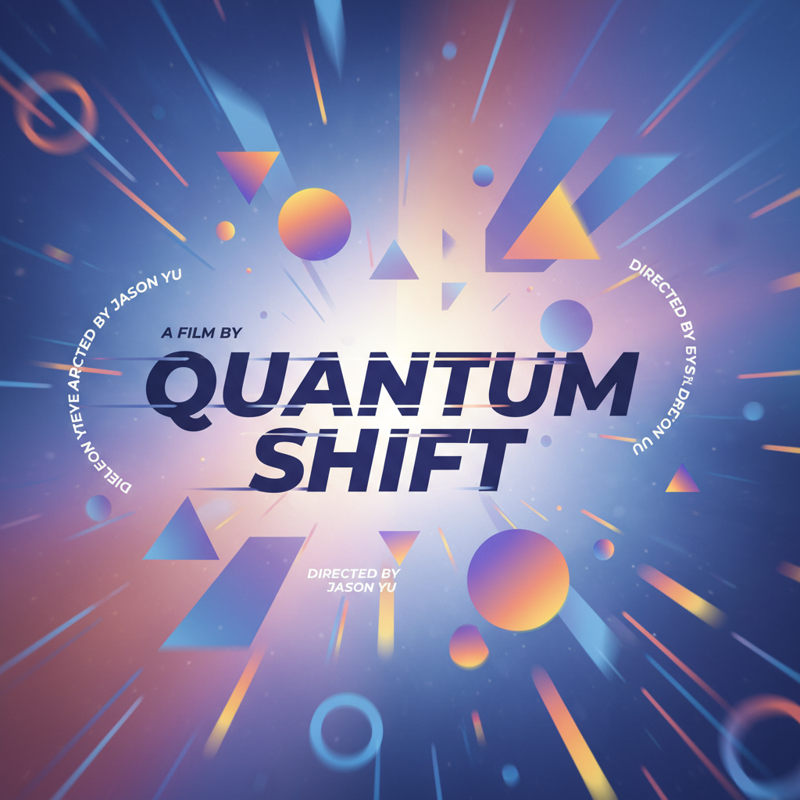

# Motion Graphics 动态图形

> **时期：** 1960年代–至今  
> **关键词：** 动态排版、品牌动画、UI动效、片头设计、信息可视化

## 概述

动态图形（Motion Graphics）是将平面设计元素——文字、图形、色块、图标——赋予运动和时间维度的设计艺术。从Saul Bass的电影片头到当代的UI微动效和数据可视化动画，动态图形已成为数字时代最普遍的视觉传达形式之一，存在于每一个屏幕、每一个界面中。

## 风格特征

- **动态排版**：文字的出现、变形、消失作为叙事
- **图形运动**：几何形状的弹性、惯性、物理模拟
- **时间节奏**：与音乐或叙事节拍同步的运动
- **品牌一致性**：在运动中保持视觉识别
- **信息层次**：通过动画引导注意力流向

## 代表人物与作品

- Saul Bass 电影片头设计
- Kyle Cooper《七宗罪》片头
- Buck Design 品牌动画
- Gmunk 科幻界面设计

## 概念图

