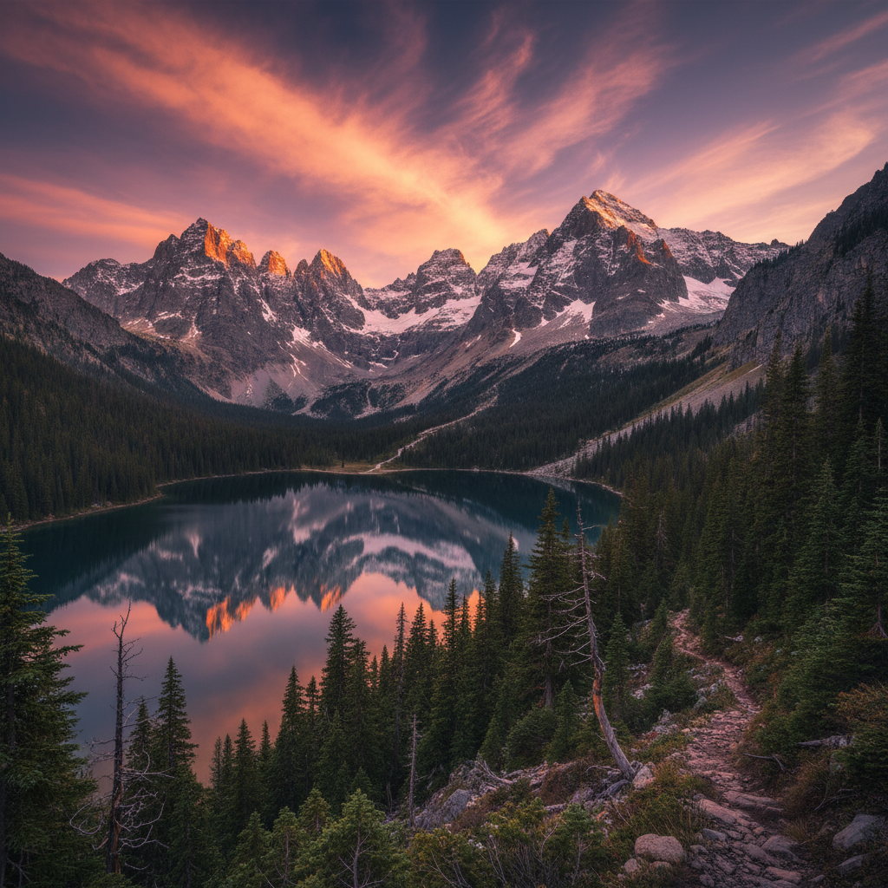

# Mountaincore 山核



> **"雪峰、松林、高山湖泊——在海拔之上找到渺小与壮阔。"**

## 概述

| 维度 | 描述 |
|------|------|
| 时期 | 2020–至今 |
| 别名 | Mountaincore, Alpine Aesthetic, Highland |
| 核心色彩 | 石灰、深绿、雪白、天蓝、棕色 |
| 关键元素 | 雪山、松树、高山湖、木屋、登山装备 |
| 代表人物 | Pinterest/TikTok 户外社区 |
| 关联风格 | Forestcore, Cabincore, Gorpcore, Cottagecore |

---

## 历史脉络

| 年份 | 事件 |
|------|------|
| 浪漫主义 | 山 = "崇高"的象征（Caspar David Friedrich） |
| 1900s | 登山运动兴起——山 = 征服 |
| 1960s | Patagonia/North Face——户外品牌美学 |
| 2018 | Gorpcore——户外装备时尚化 |
| 2020 | Mountaincore 作为独立美学兴起 |
| 2022 | 与"户外热"/"露营热"交叉 |

### 核心哲学

Mountaincore 的精神是**"在山顶，一切都变得清晰——高度带来视角"**：
- 山 = 挑战（"值得攀登的东西"）
- 高度 = 视角（"站得高看得远"）
- 寒冷 = 清醒（"冷空气让头脑清晰"）
- 渺小 = 自由（"在山面前，烦恼很小"）
- "不是征服山，是山允许你经过"

---

## 视觉语法

### 色彩系统

```
主色：
  石灰 (#708090) — 岩石
  深绿 (#2E4E2E) — 松林
  雪白 (#F8F8FF) — 雪、云
  天蓝 (#87CEEB) — 高山天空
  棕色 (#5D4037) — 木头、土壤

辅色：
  橙色 (#FF6600) — 日出/日落
  深蓝 (#1A237E) — 夜空
  金色 (#DAA520) — 秋叶

质感：
  粗糙 — 岩石、树皮
  光滑 — 冰、湖面
  蓬松 — 雪、云
  坚硬 — 花岗岩
```

### 标志性元素

| 类别 | 元素 |
|------|------|
| 地形 | 雪峰、山脊、悬崖、冰川、高山湖 |
| 植物 | 松树、高山草甸、苔藓、地衣 |
| 动物 | 山羊、鹰、雪豹、旱獭 |
| 人造 | 木屋、缆车、登山小径、石墙 |
| 装备 | 登山靴、背包、冲锋衣、登山杖 |
| 态度 | 敬畏、挑战、清醒、自由 |

---

## 与千禧怀旧的关系

### Gorpcore 与户外热
- Gorpcore = 户外装备的时尚化
- Mountaincore = 更广泛的"山"美学
- 疫情后"逃离城市"的集体冲动
- 从"看山"到"住在山里"的幻想

---

## 中国语境

- 中国丰富的山岳文化（五岳、黄山、泰山）
- "山水"在中国美学中的核心地位
- 户外运动在中国的爆发式增长
- 与中国"隐居"文化的交叉
- 川西/西藏 = 中国的山核圣地

---

## 设计应用

| 场景 | 应用方式 |
|------|----------|
| 品牌 | 石灰色+深绿+自然+坚韧+户外 |
| 空间 | 木材+石头+大窗+自然光+壁炉 |
| 时尚 | 功能性面料+大地色+层叠+户外 |
| 摄影 | 广角+金色光线+极简构图+壮阔 |

---

## 相关风格

← [Forestcore 森林核](forestcore.md) | [Gorpcore 户外核](gorpcore.md) →

↑ [返回千禧怀旧目录](README.md) | [返回总目录](../README.md)
