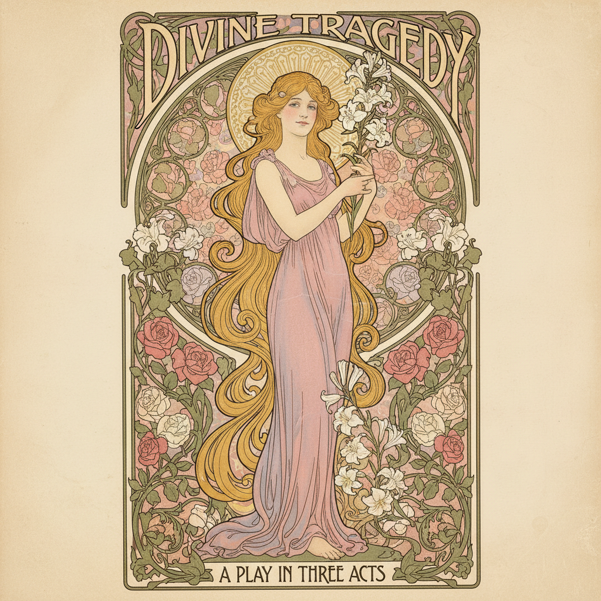

# Alphonse Mucha 穆夏

> "My mission is not to make myself rich, but to enrich art." — Alphonse Mucha

## 概述

阿尔丰斯·穆夏（Alfons Maria Mucha，1860–1939）是捷克画家和装饰艺术家，新艺术运动（Art Nouveau）最具标志性的视觉代言人。他为女演员萨拉·伯恩哈特设计的戏剧海报一夜成名，由此开创了"穆夏风格"（Le Style Mucha）——将女性形象与花卉、曲线和装饰图案融为一体的华丽平面设计。

穆夏的风格深刻影响了20世纪的海报设计、插画、漫画和当代数字艺术，至今仍是最受欢迎的装饰艺术风格之一。

## 核心特征

| 特征 | 描述 |
|------|------|
| 女性中心 | 理想化的女性形象——优雅、梦幻、神圣 |
| 装饰曲线 | 流畅的有机曲线环绕人物 |
| 圆形光环 | 人物头部后方的圆形装饰框（类似圣像光环） |
| 花卉图案 | 百合、玫瑰、雏菊等花卉装饰 |
| 平面化 | 轮廓线+平涂色块的装饰性处理 |
| 对称构图 | 中心对称的装饰性布局 |

## 视觉特征

- **线条**：优雅流畅的装饰性曲线轮廓
- **色彩**：柔和的粉彩色调——淡金、玫瑰粉、薰衣草紫、橄榄绿
- **人物**：长发飘逸的理想化女性
- **背景**：几何装饰图案、马赛克、星星
- **构图**：垂直构图，人物居中，装饰框环绕
- **字体**：与画面融为一体的装饰性手写字

## 代表作品

| 作品 | 年代 | 意义 |
|------|------|------|
| *Gismonda* 海报 | 1894 | 一夜成名之作——为伯恩哈特设计 |
| *四季* 系列 | 1896 | 最著名的装饰面板系列 |
| *黄道十二宫* | 1896 | 装饰性日历设计 |
| *斯拉夫史诗* | 1910-28 | 20幅巨型历史画——民族主义巨作 |
| *JOB 香烟* 海报 | 1896 | 商业海报设计的典范 |
| *宝石* 系列 | 1900 | 红宝石、蓝宝石、翡翠、紫水晶 |

## 真实作品（公共领域）

穆夏的大部分作品已进入公共领域：

| 作品 | 来源 |
|------|------|
| *四季 (The Seasons)* | [Mucha Foundation](https://www.muchafoundation.org/) / [Wikimedia](https://commons.wikimedia.org/wiki/Category:Alphonse_Mucha) |
| *Gismonda* | [Wikimedia](https://commons.wikimedia.org/wiki/File:Alfons_Mucha_-_1894_-_Gismonda.jpg) |
| *JOB* | [Wikimedia](https://commons.wikimedia.org/wiki/File:Mucha-Job.jpg) |

> ⚠️ 本条目优先使用真实作品。如需本地图片，请从上述来源手动下载后放入 `assets/artworks/mucha/` 并压缩。

## AI生成概念图（备用）

## 影响与遗产

- **Art Nouveau** → 新艺术运动的视觉代言人
- **1960s Psychedelic** → 迷幻海报直接借鉴穆夏风格
- **日本动漫** → CLAMP 等漫画家深受穆夏影响
- **当代插画** → 数字艺术中"穆夏风格"仍极受欢迎
- **Tarot/Oracle Cards** → 塔罗牌设计的主流美学来源

## 与其他风格的关系

- **Art Nouveau** → 新艺术运动的核心视觉风格
- **Japonisme** → 受浮世绘平面装饰性影响
- **Pre-Raphaelite** → 共享对理想化女性和中世纪的迷恋
- **Symbolism** → 象征主义的装饰性分支
- **Psychedelic Art** → 1960年代迷幻海报的直接灵感

---

*浮光艺志 | Chronicle of Artistry*
