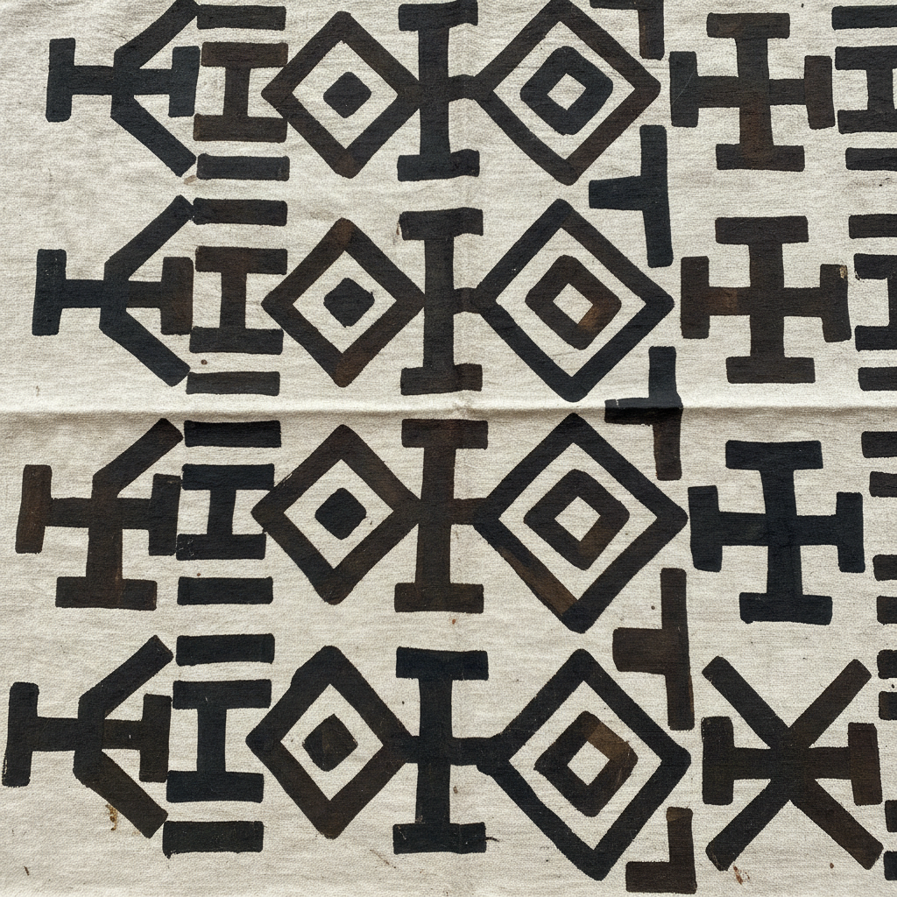

# Mudcloth 泥染布 | Bògòlanfini

> **"大地的语言——马里女性用河泥和树汁在棉布上书写古老的符号。"**

## 概述

泥染布（Mudcloth / Bògòlanfini）是西非马里共和国班巴拉族（Bambara）的传统手工染织艺术。"Bògòlanfini"在班巴拉语中意为"用泥土制成的布"（bògò=泥土，lan=用，fini=布）。制作过程极为独特：先用树叶汁液浸泡棉布（作为媒染剂），再用发酵的河泥在布上绘制图案。泥中的铁离子与树汁中的单宁酸反应，产生永久的深棕色或黑色。每一个几何符号都有特定的含义——记录历史事件、社会地位、人生阶段或精神信仰。

## 核心特征

- **天然染料**：河泥+树汁的化学反应
- **手绘图案**：用竹棍或金属工具手绘
- **符号系统**：每个图案有特定含义
- **女性传统**：主要由女性创作
- **棉布基底**：手工纺织的窄幅棉布
- **黑白/棕白**：有限的自然色彩

## 常见符号

| 符号 | 含义 |
|------|------|
| 十字 | 勇气、力量 |
| 菱形 | 女性、生育 |
| 锯齿线 | 鳄鱼背——力量 |
| 同心圆 | 知识、智慧 |
| 箭头 | 方向、目标 |
| 螺旋 | 生命循环 |

## 视觉特征

- 深棕/黑色与米白色的对比
- 大胆的几何图案
- 手绘的有机不规则感
- 重复的符号排列
- 大地色调的温暖
- 原始而现代的视觉力量

## 当代影响

| 领域 | 特征 |
|------|------|
| 时装 | 非洲设计师的标志性面料 |
| 室内设计 | 抱枕、挂毯 |
| 平面设计 | 非洲风格图案 |
| 当代艺术 | 非洲身份的视觉符号 |
| 全球时尚 | 非洲美学的全球传播 |

## 与其他风格的关系

| 风格 | 关系 |
|------|------|
| Kente Cloth | 共享西非纺织传统 |
| Adire蓝染 | 共享西非染织传统 |
| Aboriginal Dot Painting | 共享符号系统 |
| 当代极简 | Mudcloth的现代应用 |
| Bauhaus | 共享几何抽象美学 |

## 概念图

---

*浮光艺志 | Chronicle of Artistry*
