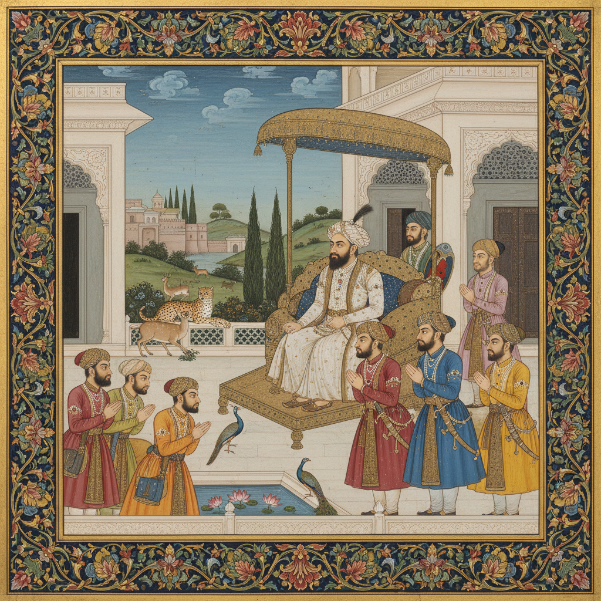

# 莫卧儿细密画 · Mughal Miniature Art

> "每一笔都是对造物主精妙的赞美。" —— 阿布·法兹勒

## 概述

莫卧儿细密画（Mughal Miniature Art）是16世纪至19世纪印度莫卧儿帝国宫廷发展出的精致绘画传统，融合了波斯细密画的装饰性、印度本土绘画的自然主义和欧洲文艺复兴的透视技法。由阿克巴大帝创建的皇家画院（kitabkhana）汇聚了波斯和印度画师，创造了一种独特的跨文化视觉语言——既有波斯的精密线描，又有印度的生动写实，还融入了欧洲的明暗法和空间感。

## 核心特征

| 特征 | 描述 |
|------|------|
| 时期 | 1526年–19世纪 |
| 地域 | 印度（德里、阿格拉、拉合尔） |
| 媒介 | 矿物颜料、金箔、纸本 |
| 核心理念 | 以精密写实记录帝国荣耀与自然万物 |
| 色彩 | 金色、朱红、群青、翠绿、象牙白 |

## 视觉特征

- **肖像写实**：高度个性化的人物面部特征描绘
- **自然主义**：动植物的精确科学式观察与记录
- **空间层次**：融合波斯平面构图与欧洲透视法
- **金色边框**：精美的花卉装饰边饰（hashiya）
- **宫廷场景**：觐见、狩猎、宴饮等帝国生活记录

## 代表作品

| 作品 | 艺术家 | 年代 | 类型 |
|------|--------|------|------|
| 《阿克巴纪》插图 | 多位宫廷画师 | 1590s | 历史插图 |
| 《贾汉吉尔偏爱苏菲圣人》 | 比奇特尔 | 1620 | 寓意画 |
| 《垂死的因纽特人》 | 曼苏尔 | 1620s | 动物画 |
| 《沙贾汗骑马像》 | 帕亚格 | 1630s | 肖像画 |
| 《帕德沙纪》插图 | 宫廷工坊 | 1640s | 历史插图 |

## 发展时间线

| 时期 | 事件 |
|------|------|
| 1526 | 巴布尔建立莫卧儿帝国 |
| 1549 | 胡马雍从波斯带回画师米尔·赛义德·阿里 |
| 1556-1605 | 阿克巴时期，皇家画院建立，融合风格形成 |
| 1605-1627 | 贾汉吉尔时期，自然主义和肖像画达到巅峰 |
| 1628-1658 | 沙贾汗时期，装饰性增强 |
| 1658-1707 | 奥朗则布时期，宫廷赞助减少 |
| 18世纪 | 地方画派（拉杰普特画派）兴起 |
| 19世纪 | 英国殖民影响，传统细密画衰落 |

## 中国语境

莫卧儿细密画与中国绘画的交流主要通过丝绸之路和海上贸易。莫卧儿宫廷收藏中国瓷器和丝绸，画师们从中国花鸟画中汲取灵感。贾汉吉尔时期的动物画（如曼苏尔的作品）在精密写实方面与中国宋代院体花鸟画有异曲同工之妙。当代中印文化交流中，两国的工笔/细密画传统成为重要的对话媒介。

## AI 概念图

*AI 生成概念图：莫卧儿细密画风格*

## 关联词条

- [[persian-miniature-art]] - 波斯细密画
- [[ottoman-art]] - 奥斯曼艺术

---

*浮光艺志 · Chronicle of Artistry*
