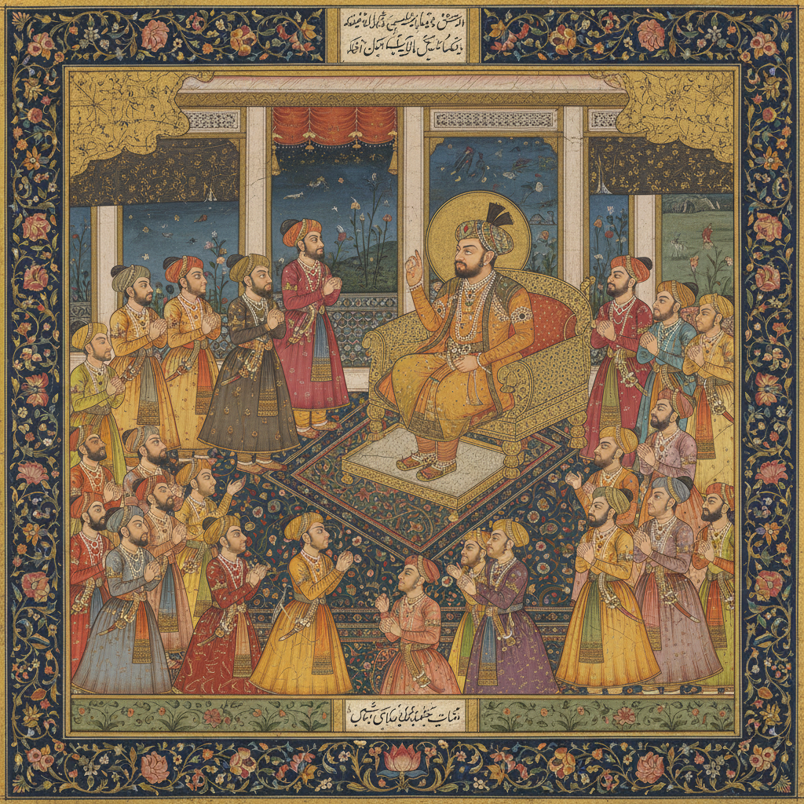

# Mughal Miniature 莫卧儿细密画

> "A single leaf of this album is worth a kingdom." — Emperor Jahangir

## 概述

莫卧儿细密画（Mughal Miniature）是16至19世纪印度莫卧儿帝国宫廷发展的精致绘画传统。它融合了波斯细密画的精致装饰性与印度本土的自然主义观察，创造出一种独特的宫廷艺术风格。

莫卧儿细密画是帝国权力的视觉记录——宫廷场景、狩猎、战役、肖像和自然研究，每一幅都以令人难以置信的精细度绘制在纸上。

## 核心特征

| 特征 | 描述 |
|------|------|
| 极致精细 | 用单根毛发制成的画笔绘制细节 |
| 波斯+印度 | 波斯装饰性与印度自然主义的融合 |
| 宫廷记录 | 帝王生活的视觉编年史 |
| 自然研究 | 精确的动植物描绘 |
| 金色装饰 | 金粉和金箔的大量使用 |
| 叙事性 | 连续的故事场景 |

## 视觉特征

- **细节**：显微镜般的精细——每片叶子、每颗宝石
- **色彩**：浓郁的矿物颜料——群青、朱砂、金色
- **构图**：鸟瞰与侧面的混合视角
- **边框**：精致的花卉边框装饰
- **人物**：侧面肖像，精确的服饰细节
- **背景**：分层的风景——近景到远景

## 代表作品

| 作品 | 年代 | 意义 |
|------|------|------|
| *Hamzanama* 插图 | 1562–77 | 莫卧儿画派的奠基 |
| *Padshahnama* | 1630s | 沙贾汗的宫廷记录 |
| *Jahangir's Album* | 1600s | 自然研究的巅峰 |
| *Baburnama* 插图 | 1590s | 帝国创建者的回忆录 |
| *Dara Shikoh Album* | 1630s | 印度教与伊斯兰的对话 |

## 真实作品（公共领域）

| 作品 | 来源 |
|------|------|
| *Hamzanama* 页面 | [V&A Museum](https://www.vam.ac.uk/collections/south-asia) |
| *Padshahnama* | [Royal Collection](https://www.rct.uk/collection/themes/exhibitions/padshahnama) |
| *Jahangir Album* 页面 | [Met Museum](https://www.metmuseum.org/art/collection/search/451273) |

## AI生成概念图

## 与其他风格的关系

- **Persian Miniature** → 直接继承波斯细密画传统
- **Indian Miniature** → 莫卧儿是印度细密画的宫廷分支
- **Rajput Painting** → 拉杰普特画派是其民间对应
- **Scientific Illustration** → 自然研究影响了科学插画
