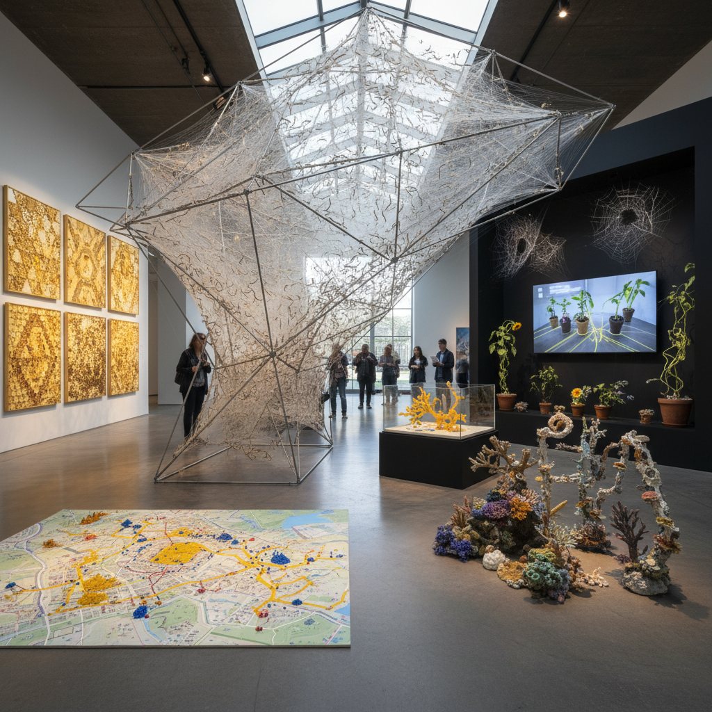

# Multispecies Art 多物种艺术

> "Multispecies art refuses the loneliness of the human — it insists that we have never been alone, that every human body is a multispecies community of bacteria, fungi, and viruses, that every landscape is a collaboration between countless organisms, and that art which acknowledges only human creativity is blind to the vast majority of the world's aesthetic production, from the bower bird's architecture to the coral reef's chromatic symphony to the mycelium's underground internet of chemical signals." — Donna Haraway

## 概述

多物种艺术（Multispecies Art）是一种将非人类物种视为合作者、主体和共同创作者的艺术实践。多物种艺术超越了传统的人类中心主义艺术观——不再将动物、植物、真菌和微生物仅仅视为艺术的"材料"或"主题"，而是将它们视为具有自身能动性和创造力的存在。

多物种艺术的实践包括：1）与非人类物种的合作创作——如让蚕吐丝形成雕塑、让真菌生长形成图案、让蜜蜂建造蜂巢结构；2）多物种关系的可视化——展示不同物种之间的共生、竞争和交流；3）非人类感知的探索——尝试理解和表达其他物种的感知世界（Umwelt）；4）生态系统作为艺术——将整个生态系统视为一个多物种的集体创作。多物种艺术与后人类主义、动物研究和微生物组科学密切相关。

## 核心特征

| 特征 | 描述 |
|------|------|
| 合作 | 跨物种合作 |
| 能动 | 非人类能动性 |
| 共生 | 共生关系 |
| 感知 | 多元感知世界 |
| 生态 | 生态系统思维 |
| 去中心 | 去人类中心 |

## 视觉特征

- **生长**：活体生物的生长过程
- **共存**：多物种共存的场景
- **微观**：微生物世界的放大
- **网络**：物种间的关系网络
- **变化**：持续变化的活体作品
- **混合**：人类与非人类的混合

## 代表作品

| 作品 | 艺术家 | 年代 | 意义 |
|------|--------|------|------|
| *Silk Pavilion* | Neri Oxman / MIT | 2013 | 蚕丝建筑 |
| *Microbiome art* | Various | 2010年代 | 微生物组艺术 |
| *Bee installations* | Various | 2010年代 | 蜜蜂装置 |
| *Fungal networks* | Various | 2020年代 | 真菌网络 |
| *Interspecies communication* | Various | 当代 | 跨物种交流 |

## 历史时间线

| 时期 | 事件 |
|------|------|
| 2003 | Donna Haraway《The Companion Species Manifesto》 |
| 2010年代 | 多物种民族志的兴起 |
| 2013 | Neri Oxman的蚕丝建筑 |
| 2016 | Anna Tsing《The Mushroom at the End of the World》 |
| 当代 | 多物种艺术的制度化 |

## 中国语境

多物种艺术在中国有深厚的文化根基。中国传统文化中有丰富的多物种思维——从"天人合一"的哲学观念，到花鸟画中对动植物的细致观察和情感投射，到园林中人与自然的共生设计，到中医中对人体微生态的理解。中国传统的"物我两忘"境界——在自然中消融人与非人的界限——与多物种艺术的去人类中心主义有深刻的共鸣。中国当代的一些艺术家在实践多物种艺术：与蚕丝、茶菌、竹子等生物合作创作，探索人与其他物种的共生关系，以及将传统的自然观与当代生态科学结合。

## AI生成概念图

## 与其他风格的关系

- **Bio Art** → 生物艺术
- **Eco-Art** → 生态艺术
- **Posthumanism** → 后人类主义
- **Animal Art** → 动物艺术
- **Fungal Art** → 真菌艺术
- **Deep Ecology** → 深层生态

---

*浮光艺志 | Chronicle of Artistry*
