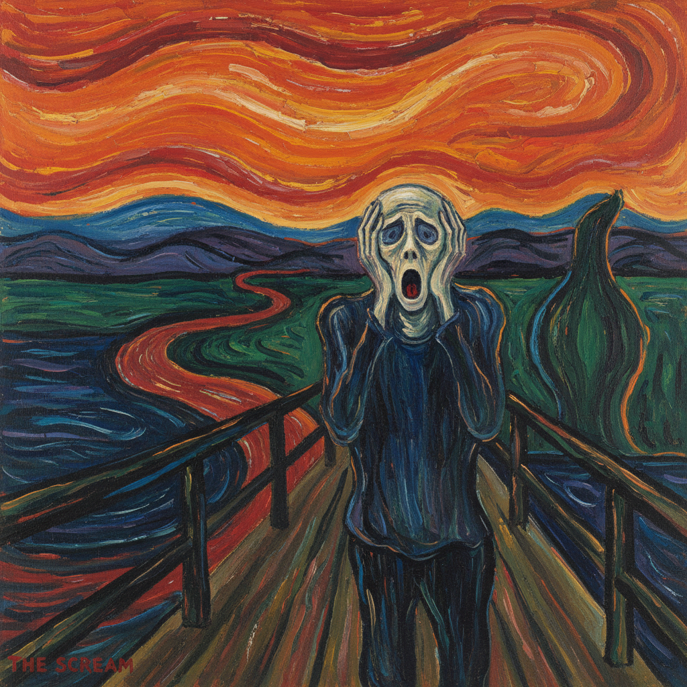

# Edvard Munch 蒙克

> "I do not paint what I see, but what I saw." — Edvard Munch

## 概述

爱德华·蒙克（Edvard Munch，1863–1944）是挪威画家，表现主义的先驱。他以《呐喊》闻名于世，但其整个"生命的饰带"系列都在探索人类最深层的焦虑、孤独、爱欲和死亡。

蒙克将个人的心理创伤转化为普世的视觉语言——扭曲的线条、不安的色彩和空洞的面孔表达了现代人的存在焦虑。

## 核心特征

| 特征 | 描述 |
|------|------|
| 心理表现 | 内在情感的外化——焦虑、恐惧、孤独 |
| 扭曲形体 | 人物和风景的情感化变形 |
| 波动线条 | 如声波般扩散的曲线 |
| 死亡主题 | 疾病、死亡、丧失的反复主题 |
| 色彩象征 | 血红的天空、病态的绿、死亡的黑 |
| 系列创作 | "生命的饰带"——主题的反复探索 |

## 视觉特征

- **线条**：波动的、流动的、不安的曲线
- **色彩**：血红、病态绿、深蓝、苍白
- **人物**：空洞的眼睛、骷髅般的面孔
- **空间**：扭曲的透视——情感化的空间
- **笔触**：粗犷的、有方向性的长笔触
- **氛围**：焦虑的、压抑的、不安的

## 代表作品

| 作品 | 年代 | 意义 |
|------|------|------|
| *The Scream* | 1893 | 现代焦虑的图标 |
| *Madonna* | 1894 | 爱欲与死亡 |
| *The Sick Child* | 1885–86 | 个人创伤的艺术化 |
| *Vampire* | 1895 | 爱的吞噬 |
| *The Dance of Life* | 1899–1900 | 生命的三个阶段 |

## 真实作品（公共领域）

| 作品 | 来源 |
|------|------|
| *The Scream* | [National Museum Norway](https://www.nasjonalmuseet.no/en/) |
| *The Sick Child* | [National Museum Norway](https://www.nasjonalmuseet.no/en/) |
| *The Dance of Life* | [National Museum Norway](https://www.nasjonalmuseet.no/en/) |

> ⚠️ 本条目优先使用真实作品。

## AI生成概念图

## 与其他风格的关系

- **Expressionism** → 表现主义的直接先驱
- **Symbolism** → 象征主义的北欧变体
- **Die Brücke** → 桥社直接受蒙克影响
- **Existentialism** → 存在主义焦虑的视觉化
